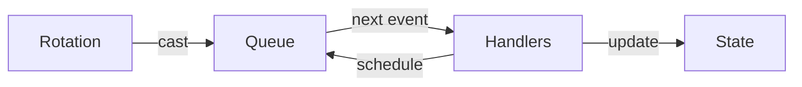
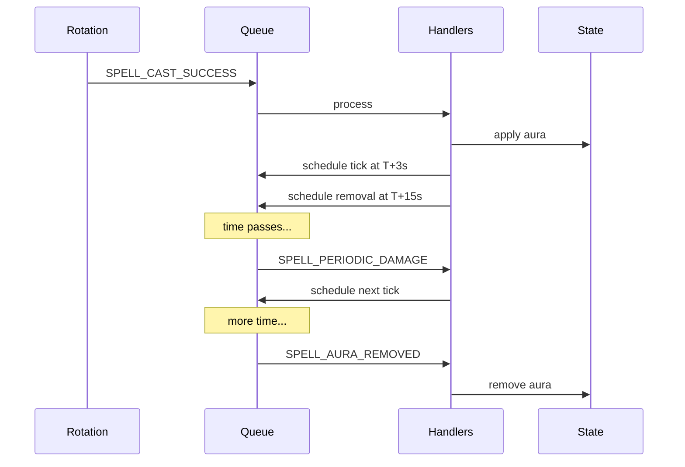

# Architecture

How the simulation works under the hood.

## Events in, events out

The simulation is a loop that processes events in time order. Your rotation emits spell casts, handlers react and schedule more events, repeat until done.

## Combat log events

WoWLab uses the same event types as [WoW's combat log](https://warcraft.wiki.gg/wiki/COMBAT_LOG_EVENT):

- `SPELL_CAST_SUCCESS`
- `SPELL_AURA_APPLIED` / `SPELL_AURA_REMOVED`
- `SPELL_DAMAGE` / `SPELL_PERIODIC_DAMAGE`

When you cast a DoT, the handler schedules the first tick. That tick handler schedules the next tick. The removal gets scheduled when the aura is applied. Everything chains together through events.

## Example: DoT lifecycle

## Refreshing and stale events

When you refresh a DoT, a new removal gets scheduled. The old removal event still fires but handlers check if it's still valid. If the aura was already refreshed, they ignore it. No need to hunt down and cancel old events.

## Static data

Spell and item stats come from WoW's data files, loaded once before simulation starts.
