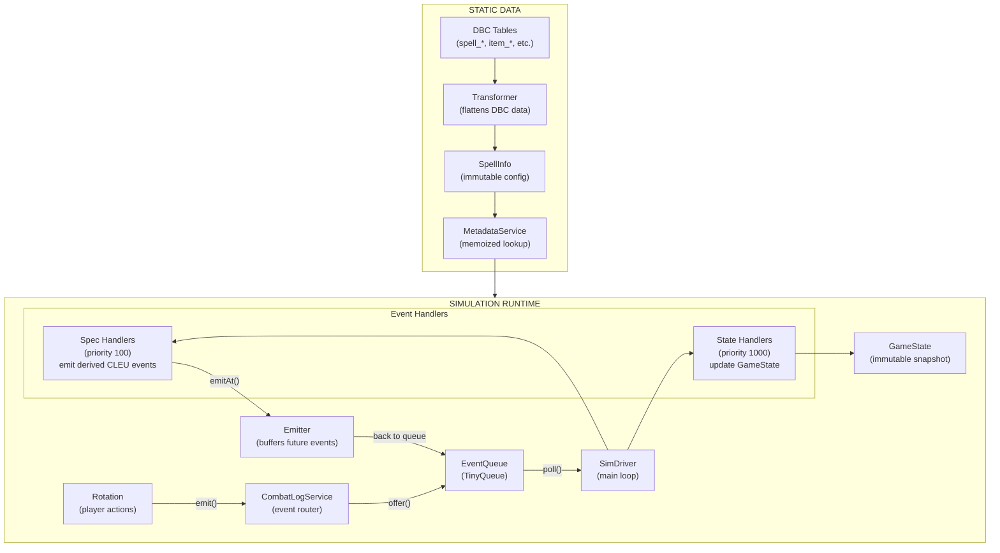
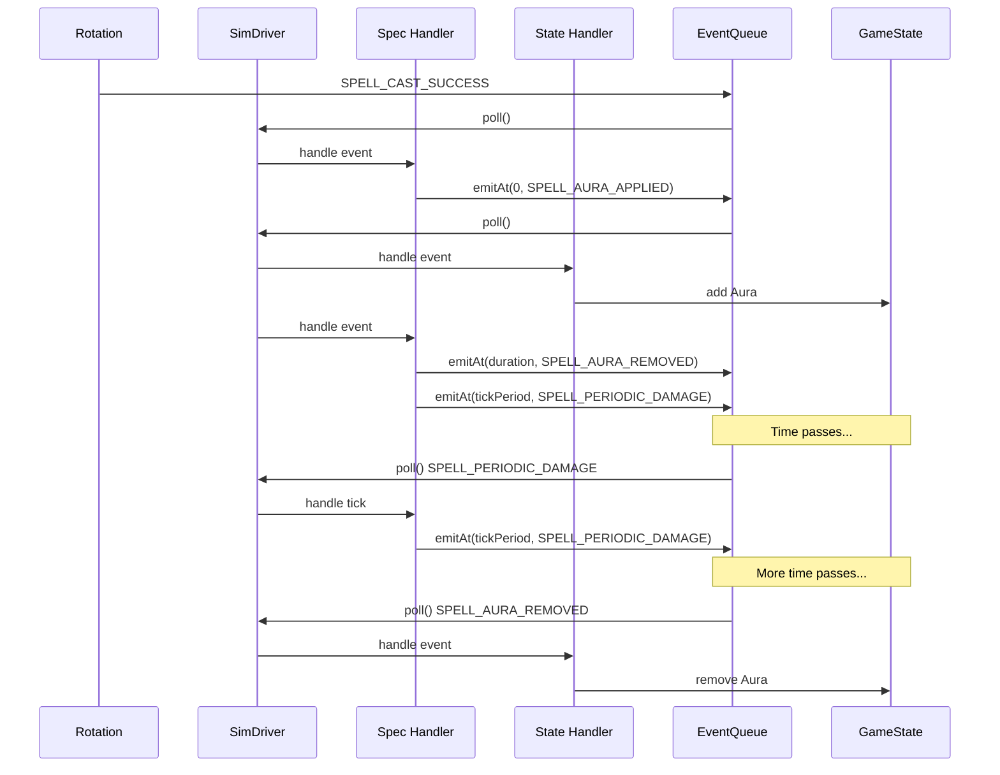

# WoWLab Data Flow

## Core Principle

**The Event Queue is the single source of truth for timing.**

Entities store only CLEU-observable data. Anything about the future (when an aura expires, when the next tick fires, when a cooldown is ready) lives in the scheduler, not on the entity.

## Data Flow Diagram



## The Three Data Domains

### 1. Static Config (DBC / SpellInfo)

Data that never changes during simulation. Loaded once at startup.

| Source               | Transformer        | Output                         |
| -------------------- | ------------------ | ------------------------------ |
| `spell_*` DBC tables | `transformSpell()` | `SpellDataFlat` -> `SpellInfo` |
| `item_*` DBC tables  | `transformItem()`  | `ItemDataFlat` -> `ItemInfo`   |
| Aura DBC data        | `transformAura()`  | `AuraDataFlat`                 |

**Location:** `MetadataService`, `SimulationConfig`

**Examples:**

- Base spell duration (15000ms)
- Tick period (3000ms)
- Max stacks (3)
- Spell school (Fire)

### 2. Runtime State (GameState)

CLEU-observable data only. What you could see by parsing combat log events.

| Entity       | CLEU-Observable Fields                                |
| ------------ | ----------------------------------------------------- |
| `Unit`       | id, name, health, power, position, isCasting          |
| `Aura`       | casterUnitId, spellId, stacks                         |
| `Spell`      | charges (via SPELL_CHARGE_USED/SPELL_CHARGES_CHANGED) |
| `Projectile` | sourceId, targetId, spellId                           |

**Location:** `GameState` (immutable, accessed via `StateService`)

**NOT stored on entities:**

- `expiresAt` - scheduler concern
- `nextTickAt` - scheduler concern
- `cooldownExpiry` - scheduler concern

### 3. Scheduler (EventQueue)

The single source of truth for anything that happens in the future.

| Future Event     | How It's Scheduled                                          |
| ---------------- | ----------------------------------------------------------- |
| Aura expires     | `emitAt(durationMs, SPELL_AURA_REMOVED)` on apply           |
| DoT tick         | `emitAt(tickPeriodMs, SPELL_PERIODIC_DAMAGE)` on apply/tick |
| Cooldown ready   | `emitAt(cooldownMs, LAB_COOLDOWN_READY)` on cast            |
| Projectile lands | `emitAt(travelTimeMs, SPELL_DAMAGE)` on cast                |

**Location:** `EventQueue` (TinyQueue priority queue)

## Event Flow Example: Applying a DoT



## Stale Event Handling

When an aura is refreshed, a new removal event is scheduled. The old one still fires but is ignored:

```typescript
// SPELL_AURA_REMOVED handler
const aura = getAura(unit, spellId);
if (!aura) return; // Already gone - stale event
// Remove aura
```

The queue processes events in timestamp order. If an aura was refreshed at T=5s with a new 10s duration:

- Old removal at T=10s fires, aura still exists, ignored
- New removal at T=15s fires, removes aura

## Handler Priority

Lower number = runs first.

| Priority | Handler Type   | Purpose                         |
| -------- | -------------- | ------------------------------- |
| 100      | Spec handlers  | Game logic, emit derived events |
| 1000     | State handlers | Update GameState from CLEU      |

Spec handlers run first so they can:

1. Read current state
2. Emit new events based on game rules
3. State handlers then persist those events to GameState

## Key Files

| File                                                                  | Purpose                        |
| --------------------------------------------------------------------- | ------------------------------ |
| `packages/wowlab-services/src/internal/combat-log/EventQueue.ts`      | TinyQueue wrapper              |
| `packages/wowlab-services/src/internal/combat-log/Emitter.ts`         | Buffers events with timestamps |
| `packages/wowlab-services/src/internal/combat-log/SimDriver.ts`       | Main simulation loop           |
| `packages/wowlab-services/src/internal/combat-log/HandlerRegistry.ts` | Routes events to handlers      |
| `packages/wowlab-services/src/internal/state/StateService.ts`         | GameState Ref wrapper          |
| `packages/wowlab-core/src/internal/entities/GameState.ts`             | Immutable state record         |
