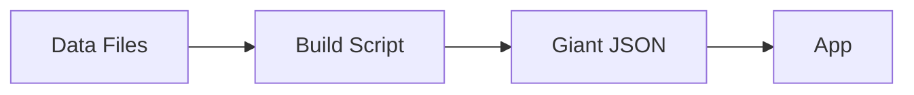
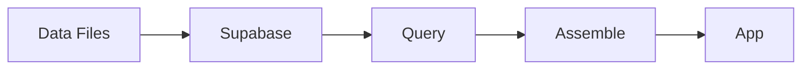
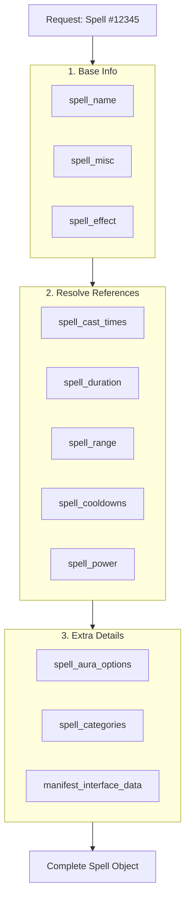
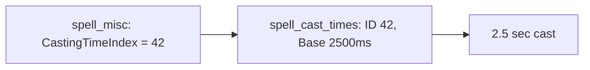
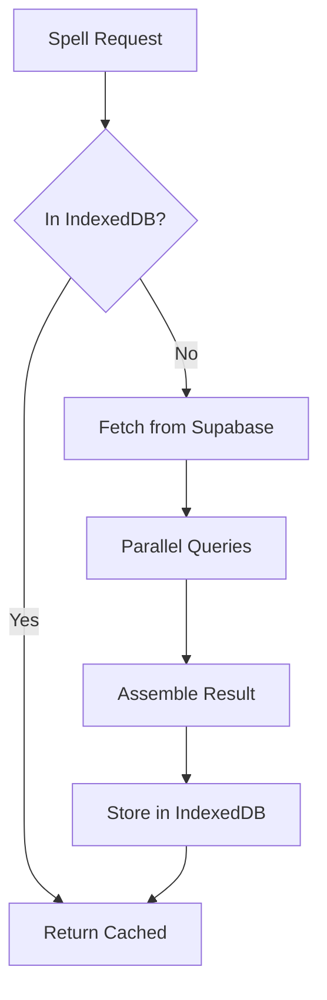

# Data Model

WoW Lab builds spell and item data the moment you ask for it instead of lugging around pre-built databases. Think of it as a kitchen stocked with raw ingredients rather than trays of pre-cooked meals.

If you want to explore the raw WoW data tables yourself, [wago.tools/db2](https://wago.tools/db2) is an excellent browser for all the DBC files.

## The simple version

Need every detail about a spell or item? Most tools hand you a canned encyclopedia entry someone generated hours or patches ago. WoW Lab instead keeps the original data files close at hand, grabs only the pieces you ask for, and plates them on demand.

One pre-bakes everything into a blob, the other keeps tables normalized and assembles on the fly.

## Why this matters

**Traditional tools** run a heavy build job that shovels every WoW relationship into a single flattened blob per spell. Updating anything means re-running the whole pipeline and redeploying the results.

**WoW Lab** leaves the data normalized. Each request touches only the ~50 tables that matter, stitches the records together, and returns a fresh object. Edits to the underlying data land instantly because there is nothing to rebuild.

## The LEGO analogy

Picture spell data as LEGO instructions:

- **Pre-parsed approach**: Someone already assembled the set and snapped a photo. It is quick to reference, but if you want a variation you have to start from square one.
- **WoW Lab approach**: All the bricks live in labeled bins. When you need a spaceship, you grab the pieces and build it on the spot. It might take a beat longer, yet you always use the latest bricks and can customize the build.

## How a spell gets assembled

A request flows through three passes: base info, reference lookups, and optional extras. Each pass simply grabs the next table and follows the pointers.

Each box is its own table. The arrows show how we jump from one reference to the next until the spell payload is complete.

## The 50+ tables

WoW spreads spell knowledge across a web of normalized tables. WoW Lab simply mirrors those tables in Supabase and queries whichever rows a spell references. Here are the usual suspects:

| Table                | What it stores                                          |
| -------------------- | ------------------------------------------------------- |
| `spell`              | Base spell record                                       |
| `spell_name`         | Localized spell names                                   |
| `spell_misc`         | Attributes, school, icon reference                      |
| `spell_effect`       | What the spell actually does (damage, heal, apply aura) |
| `spell_power`        | Resource costs (mana, energy, etc.)                     |
| `spell_cooldowns`    | GCD and recovery times                                  |
| `spell_duration`     | How long effects last                                   |
| `spell_range`        | Min/max range for allies and enemies                    |
| `spell_radius`       | AoE radius values                                       |
| `spell_cast_times`   | Base and minimum cast times                             |
| `spell_aura_options` | Max stacks, proc charges                                |
| `spell_categories`   | Spell school, charge category                           |
| `spell_empower`      | Evoker empower spell data                               |
| `item`               | Base item record                                        |
| `item_sparse`        | Item level, quality, stats                              |
| `item_effect`        | Spell effects attached to items                         |

## Following the breadcrumbs

References in these tables are numeric breadcrumbs. If `spell_misc` lists `CastingTimeIndex = 42`, that number is just a pointer to `spell_cast_times`. We follow the pointer, pull row 42, and now we know the actual milliseconds.

The same hop-and-resolve pattern repeats everywhere: `DurationIndex` → `spell_duration`, `RangeIndex` → `spell_range`, `EffectRadiusIndex` → `spell_radius`, `SpellIconFileDataID` → `manifest_interface_data`, and so on.

## Caching keeps it fast

Fetching a dozen tables per spell sounds expensive, so we layer caching and concurrency to hide the cost:

1. **Persistent browser cache** - We use [IndexedDB](https://developer.mozilla.org/en-US/docs/Web/API/IndexedDB_API) to permanently cache all spell data for a patch. Once fetched, data stays local until a new patch drops.
2. **Parallel fetching** - Independent lookups run side by side, so we do not wait for `spell_duration` before checking `spell_range`.

## Comparison

Here is the quick scoreboard between dumping everything ahead of time and building results in real time:

| Aspect              | Pre-parsed             | WoW Lab               |
| ------------------- | ---------------------- | --------------------- |
| **First request**   | Instant (pre-computed) | ~100ms (assembled)    |
| **Repeat requests** | Instant                | Instant (cached)      |
| **Data freshness**  | Stale until rebuild    | Always current        |
| **Memory usage**    | All spells loaded      | Only requested spells |
| **Update process**  | Rebuild + redeploy     | Automatic             |
| **Storage size**    | 50-200MB JSON          | Database native       |

## When each approach wins

**Pre-parsed shines when:**

- Every spell must be ready the moment the app boots
- The very first request cannot afford even ~100ms latency
- You need an offline snapshot with zero runtime dependencies

**Runtime assembly shines when:**

- People inspect only a handful of spells per session
- Game patches land regularly and you cannot ship stale data
- You want to mix and match queries without regenerating everything

WoW Lab targets that second bucket. Most users browse a few spells, and with caching the repeats return instantly while still staying fresh.

## The code path

If you want to peek at the implementation, here is the rough stack:

1. **DbcService** - Talks to Supabase and handles the shared cache
2. **ExtractorService** - Resolves every index into a concrete record or value
3. **transformSpell()** - Coordinates the assembly pipeline for one spell
4. **loadSpells()** - Performs bulk loads with concurrency limits

The transformation leans on Effect-TS, so each step is typed, composable, and easy to reason about.
