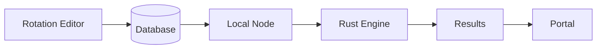

# WoW Lab

WoW Lab is a combat simulation platform for World of Warcraft. Build rotations in a visual editor, run distributed simulations on your own hardware, and query game data programmatically.

## What you can do

**Build rotations** in the [rotation editor](/rotations/editor). A React-based interface lets you define spell priorities and conditions, which serialize to JSON and save to the database.

**Run simulations** on your own hardware. Start a local node (on your PC, Docker, or cloud) and simulation jobs get distributed there. The Rust engine uses JIT compilation for maximum performance.

**Query game data** with the MCP server. Any tool (Claude, Cursor, your own scripts) can pull spell and item data from WoW's DBC files.

## How it works

1. **Create rotations** in the editor UI at [/rotations/editor](/rotations/editor)
2. **Start a local node** to receive simulation jobs
3. **Run simulations** - jobs get distributed to your node(s)
4. **View results** back in the portal

The portal imports the engine as WASM for type sharing and rotation validation, but actual simulation runs on your local node where JIT compilation is possible.

## Getting started

### Create a rotation

1. Open the [rotation editor](/rotations/editor)
2. Select your spec
3. Add actions and conditions using the UI
4. Save to the database

### Run simulations

1. Install and start a local node
2. Open the [simulate page](/simulate)
3. Select your rotation and configure the fight
4. View results when complete

### Query WoW data

The [MCP Server](/docs/reference/07-mcp-server) exposes WoW spell/item data to AI assistants and other tools. Useful for theorycrafting, building tools, or looking up game mechanics.

## Going deeper

- [Writing Rotations](/docs/guides/00-writing-rotations) - Rotation format and conditions
- [System Architecture](/docs/reference/00-system-architecture) - How the platform works
- [Contributing](/docs/development/00-contributing) - Dev setup
