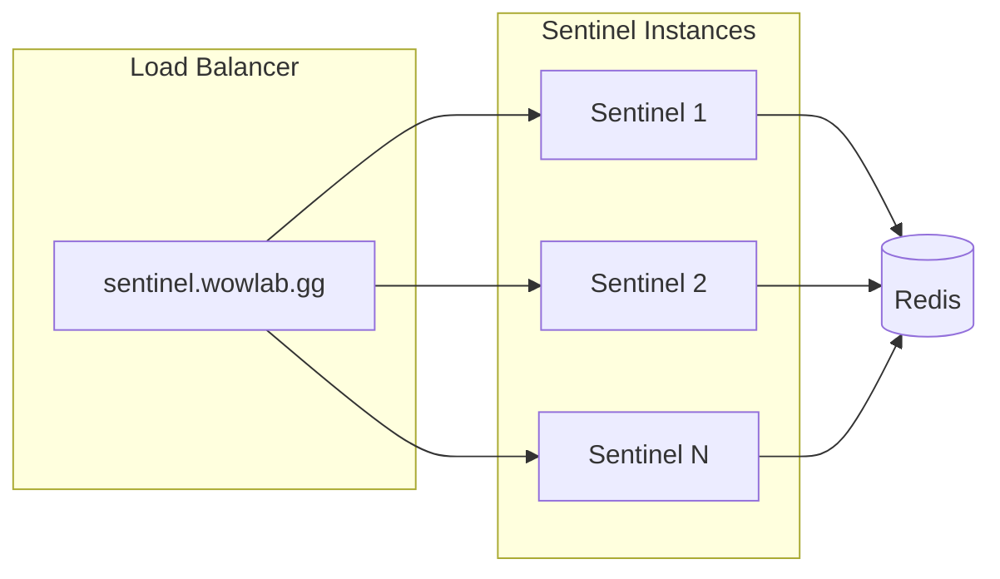
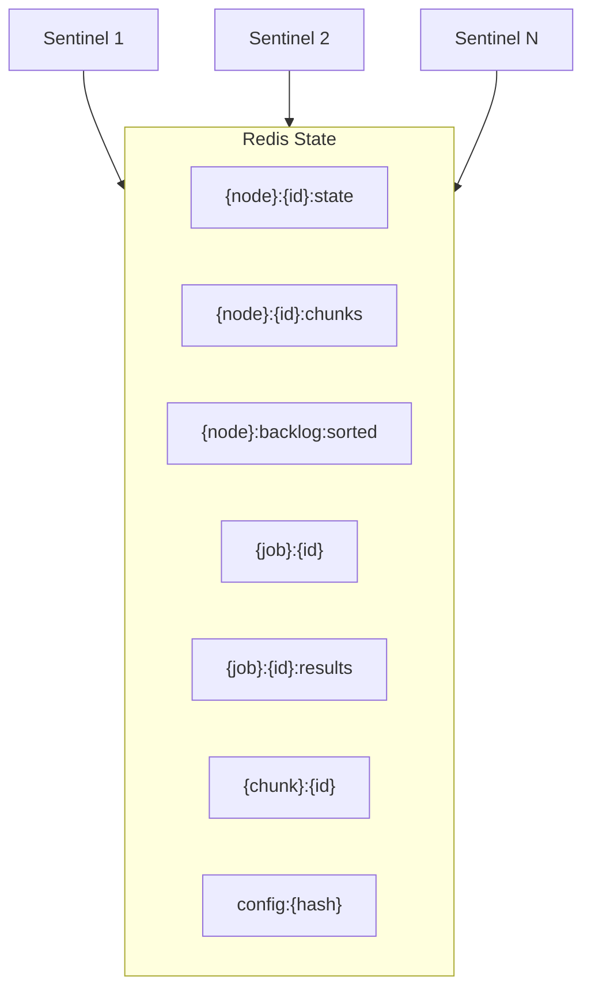
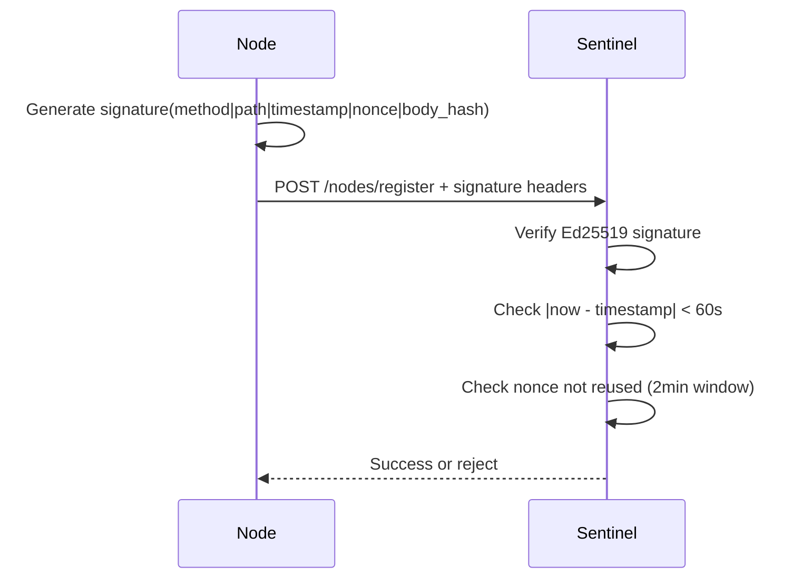
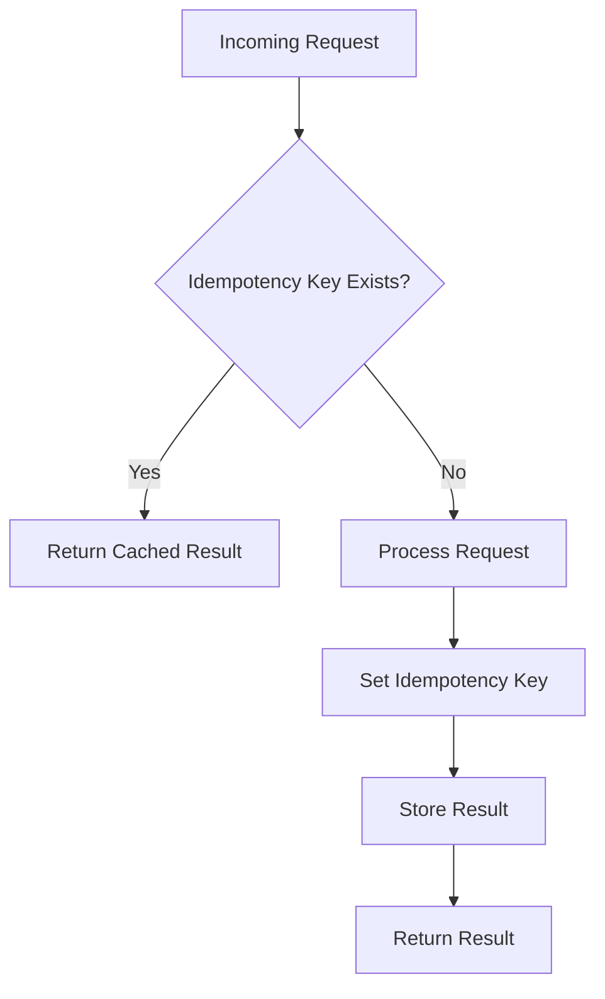
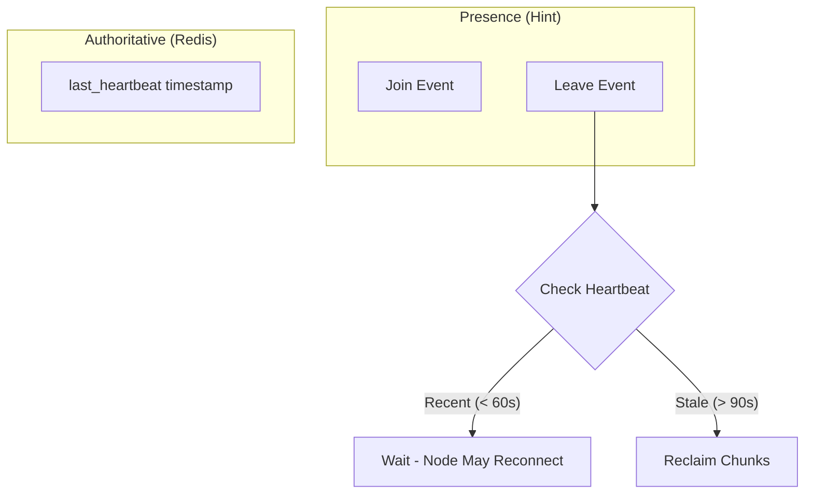

# Design Principles

The realtime architecture is built on seven fundamental principles that ensure scalability, reliability, and maintainability.

## 1. Stateless Sentinels

Sentinel instances hold no in-memory state. Any instance can handle any request, enabling horizontal scaling and zero-downtime deployments.

**Restart Safety:** Any sentinel can crash at any point and another instance (or the same after restart) can continue. All in-flight operations are either:

- Completed atomically (Lua scripts)
- Idempotent and safe to retry
- Recoverable from Redis state

Specifically:

- **Chunk assignments:** Written to Redis before WS push. If push fails, resync recovers.
- **Chunk completions:** Idempotency key prevents double-counting.
- **Job aggregation:** Lock with timestamp allows stuck lock recovery.
- **Background tasks:** Leader election prevents duplicate work, but tasks are idempotent if it fails.

## 2. Redis is the Brain

All coordination state lives in Redis. This includes:

- Node health and backlog counts
- Chunk assignments and status
- Job progress and results
- Rate limiting counters
- Idempotency keys

**Important:** We use Redis single instance or Redis Sentinel (for HA), NOT Redis Cluster. Lua scripts require multi-key atomicity which Cluster cannot provide without hash tags on ALL keys.

## 3. Centrifugo Owns Connections

Centrifugo (beacon) handles all WebSocket connection lifecycle:

- Connection management and ping/pong
- Presence tracking
- Message routing and delivery
- History for at-least-once delivery

Sentinel never manages WebSocket connections directly.

## 4. Ed25519 for Node Authentication

Nodes authenticate via cryptographic signatures, not just JWT trust:

**Signature Components:**

- `method` - HTTP method
- `path` - Request path
- `timestamp` - Unix milliseconds
- `nonce` - UUID (unique per request)
- `body_hash` - SHA-256 of request body (for state-modifying requests)

Server rejects requests where `|now - timestamp| > 60s` and tracks used nonces for 2 minutes to prevent replay attacks.

## 5. Supabase for Durability

Supabase is the persistence layer for:

- Final job results
- User accounts and settings
- Node registration data
- Audit logs

It is NOT used for real-time coordination or transient state.

## 6. Idempotency Everywhere

Every operation must be safe to retry:

**Key patterns:**

- Chunk completions use `idempotency:{chunk}:{node}` with 10-minute TTL
- Job aggregation uses `HSETNX` for lock acquisition
- All Lua scripts check state before modifying

## 7. Heartbeats over Presence

Presence (Centrifugo join/leave events) is used as a **hint**, not the source of truth:

**Why this matters:**

- Presence events can be lost (at-most-once delivery)
- Network partitions may fire presence but node is still working
- Nodes might connect but never heartbeat

Redis heartbeat timestamp is the authoritative health indicator.

## Dynamic Key Construction

Some Lua scripts construct keys dynamically from data read within the script. This is explicitly discouraged by Redis for Cluster compatibility, but is intentional here because:

1. We are committed to single instance/Sentinel (no Cluster)
2. It simplifies the caller interface (fewer KEYS to pass)
3. All dynamically-accessed keys use consistent hash tags (`{node}:`, `{job}:`) for future reference
4. This decision is documented and understood - do not "fix" it without architectural changes
