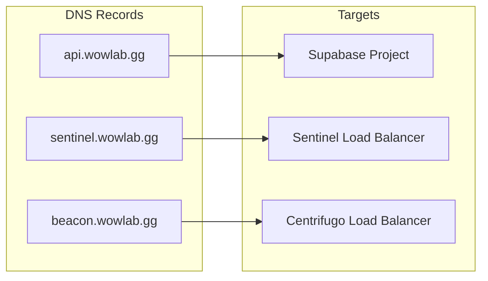
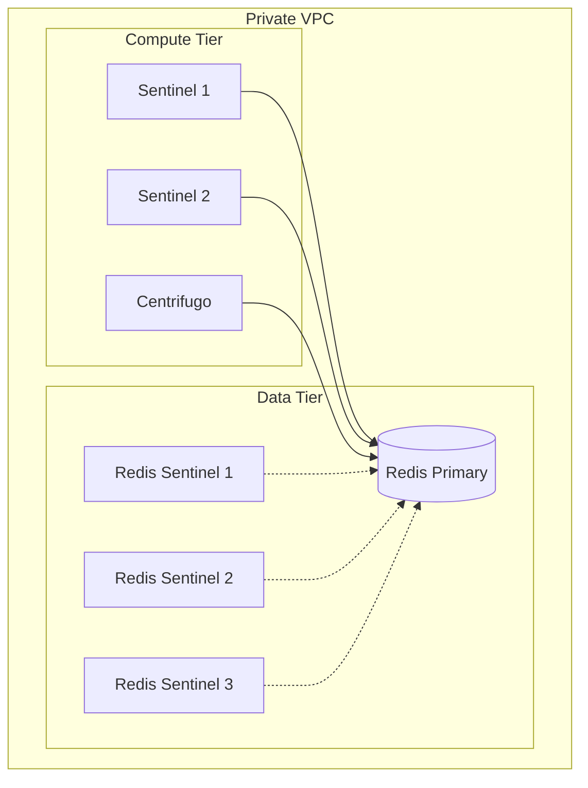

# Network Topology

This document provides a comprehensive view of how all components connect and communicate.

## High-Level Topology

```mermaid
flowchart TB
    subgraph Internet["INTERNET"]
        Portal[Portal Web App]
        Node1[Compute Node 1]
        NodeN[Compute Node N]
    end

    subgraph Public["Public Endpoints"]
        API[api.wowlab.gg<br/>Supabase]
        SentinelLB[sentinel.wowlab.gg<br/>Load Balancer]
        BeaconLB[beacon.wowlab.gg<br/>Centrifugo]
    end

    subgraph Private["Private Infrastructure"]
        S1[Sentinel 1]
        S2[Sentinel 2]
        SN[Sentinel N]
        Redis[(Redis)]
        Supabase[(Supabase)]
        Centrifugo[Centrifugo<br/>Instance]
    end

    %% Portal connections
    Portal -->|HTTPS| API
    Portal -->|WSS subscribe<br/>jobs:{id}| BeaconLB

    %% Node connections
    Node1 -->|HTTP: register, token| SentinelLB
    Node1 -->|WSS: subscribe, publish| BeaconLB
    NodeN -->|HTTP: register, token| SentinelLB
    NodeN -->|WSS: subscribe, publish| BeaconLB

    %% Load balancer routing
    SentinelLB --> S1
    SentinelLB --> S2
    SentinelLB --> SN
    BeaconLB --> Centrifugo

    %% Proxy callbacks
    Centrifugo -->|Proxy callbacks| SentinelLB

    %% Backend connections
    S1 --> Redis
    S2 --> Redis
    SN --> Redis
    S1 --> Supabase
    S2 --> Supabase
    SN --> Supabase
    S1 -->|HTTP API| Centrifugo
    S2 -->|HTTP API| Centrifugo
    SN -->|HTTP API| Centrifugo
    Centrifugo --> Redis

    %% Forbidden connections
    Node1 -.->|NEVER| API
    Node1 -.->|NEVER| Redis
    NodeN -.->|NEVER| API
    NodeN -.->|NEVER| Redis
```

## Connection Matrix

| Source     | Destination         | Protocol | Purpose                        |
| ---------- | ------------------- | -------- | ------------------------------ |
| Portal     | api.wowlab.gg       | HTTPS    | Database, auth, user data      |
| Portal     | beacon.wowlab.gg    | WSS      | Job progress updates           |
| Node       | sentinel.wowlab.gg  | HTTP     | Registration, token            |
| Node       | beacon.wowlab.gg    | WSS      | Chunk assignments, completions |
| Centrifugo | sentinel (internal) | HTTP     | Proxy callbacks                |
| Sentinel   | Redis               | TCP      | State coordination             |
| Sentinel   | Supabase            | HTTPS    | Persistence                    |
| Sentinel   | Centrifugo          | HTTP     | Publish messages               |
| Centrifugo | Redis               | TCP      | Pub/sub engine                 |

## Forbidden Connections

Nodes must **NEVER** connect to:

| Target                     | Reason                                    |
| -------------------------- | ----------------------------------------- |
| `api.wowlab.gg` (Supabase) | Nodes cannot access user data or database |
| Redis                      | All state access goes through Sentinel    |

This boundary ensures:

- Security isolation between compute and data
- Consistent state management through Sentinel
- Ability to audit all node operations

## DNS Resolution



## Internal Network



**Redis HA Configuration:** For production, deploy 3+ Sentinel nodes with `min-replicas-to-write 1` and `min-replicas-max-lag 10` on the master to prevent data loss during failover.
