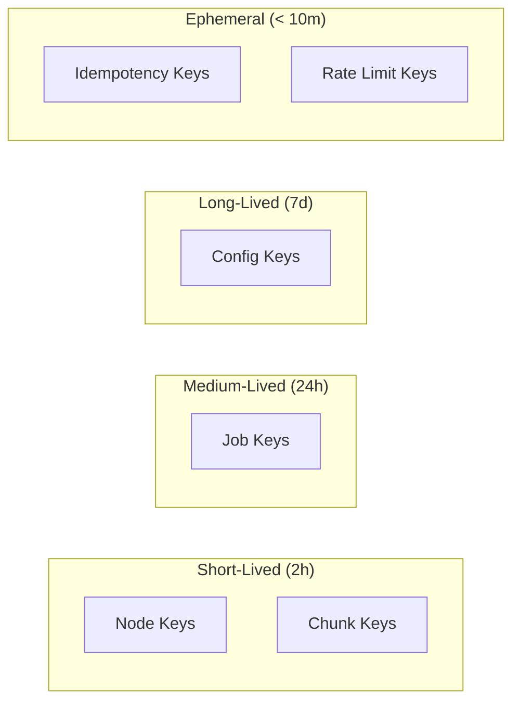

# System Architecture

This document provides the definitive view of the complete system architecture.

## Full Architecture Diagram

```mermaid
flowchart TB
    subgraph Clients["CLIENTS"]
        Portal[Portal]
        Node1[Node 1]
        NodeN[Node N]
    end

    subgraph Centrifugo["beacon.wowlab.gg (Centrifugo)"]
        Auth[JWT Verification]
        Refresh[Token Refresh Callback]
        Channels[Channels]
        Proxy[Proxy Handlers]
    end

    subgraph Channels
        NodesOnline["nodes:online<br/>(presence, hint only)"]
        NodesId["nodes:{id}<br/>(→ node)"]
        JobsId["jobs:{id}<br/>(→ portal)"]
    end

    subgraph Proxy
        ProxyConnect["POST /proxy/connect"]
        ProxySubscribe["POST /proxy/subscribe"]
        ProxyPublish["POST /proxy/publish"]
        ProxyRefresh["POST /proxy/refresh"]
    end

    subgraph LoadBalancer["sentinel.wowlab.gg"]
        LB[Load Balancer]
    end

    subgraph Sentinels["Sentinel Instances (stateless)"]
        S1[Sentinel 1]
        S2[Sentinel 2]
        SN[Sentinel N]
    end

    subgraph Redis["Redis (Single Instance or Sentinel)"]
        NodeState["{node}:{id}:state<br/>Hash: backlog, last_heartbeat"]
        NodeChunks["{node}:{id}:chunks<br/>Set: chunk_ids"]
        JobData["{job}:{id}<br/>Hash: total, completed, config_hash, lock"]
        JobResults["{job}:{id}:results<br/>List: results..."]
        ChunkData["{chunk}:{id}<br/>Hash: job_id, node_id, iterations"]
        BacklogSorted["{node}:backlog:sorted<br/>ZSet: node_id → backlog"]
        ConfigCache["config:{hash}<br/>String: serialized config"]
        RateLimit["ratelimit:{node}:{window}<br/>Integer: counter"]
    end

    subgraph Supabase["Supabase"]
        Jobs[jobs table]
        Nodes[nodes table]
    end

    %% Client connections
    Portal -->|WSS subscribe<br/>jobs:{id}| Centrifugo
    Node1 -->|WSS subscribe<br/>nodes:{id}| Centrifugo
    Node1 -->|publish<br/>chunks:complete| Centrifugo
    NodeN -->|WSS subscribe<br/>nodes:{id}| Centrifugo
    NodeN -->|publish<br/>chunks:complete| Centrifugo

    %% Proxy callbacks
    Centrifugo -->|proxy callbacks<br/>(authenticated via secret)| LB

    %% Load balancing
    LB --> S1
    LB --> S2
    LB --> SN

    %% Sentinel to Redis
    S1 --> Redis
    S2 --> Redis
    SN --> Redis

    %% Final results to Supabase
    S1 -.->|final results only| Supabase
    S2 -.->|final results only| Supabase
    SN -.->|final results only| Supabase

    %% Portal direct to Supabase
    Portal -->|direct| Supabase
```

## Component Responsibilities

### Portal

- User interface for creating and monitoring jobs
- Connects to Supabase for data persistence
- Subscribes to `jobs:{id}` for real-time progress

### Compute Nodes

- Execute simulation chunks
- Connect to Sentinel for registration and tokens
- Subscribe to `nodes:{id}` for chunk assignments
- Publish to `chunks:complete` for results

### Centrifugo (beacon.wowlab.gg)

- All WebSocket connection management
- JWT verification for authentication
- Channel authorization via subscribe proxy
- Message routing and delivery
- Presence tracking (hint only)
- History for recovery

### Sentinel (sentinel.wowlab.gg)

- Stateless request handlers
- Node registration and token issuance
- Proxy callback handlers
- Chunk scheduling and load balancing
- Job aggregation
- Health monitoring

### Redis

- Single source of truth for coordination state
- Atomic operations via Lua scripts
- Pub/sub for Centrifugo engine
- NOT using Cluster mode

### Supabase

- Final job results persistence
- Node configuration storage
- User data and authentication
- Audit trail

## Redis Key Schema

| Key Pattern                         | Type    | TTL | Purpose                                                      |
| ----------------------------------- | ------- | --- | ------------------------------------------------------------ |
| `{node}:{id}:state`                 | Hash    | 2h  | `{backlog, last_heartbeat}`                                  |
| `{node}:{id}:chunks`                | Set     | 2h  | Chunk IDs assigned (for reclaim)                             |
| `{node}:backlog:sorted`             | ZSet    | -   | Node selection by lowest backlog                             |
| `{job}:{id}`                        | Hash    | 24h | `{total, completed, config_hash, lock, lock_at, created_at}` |
| `{job}:{id}:results`                | List    | 24h | Chunk results for aggregation                                |
| `{chunk}:{id}`                      | Hash    | 2h  | `{job_id, node_id, iterations, seed_offset, assigned_at}`    |
| `config:{hash}`                     | String  | 7d  | Cached config JSON                                           |
| `ratelimit:publish:{node}:{window}` | Integer | 2s  | Rate limit counter                                           |
| `idempotency:{chunk}:{node}`        | String  | 10m | Prevents duplicate completions                               |

## TTL Strategy



| Category         | TTL | Refresh Strategy                                                   |
| ---------------- | --- | ------------------------------------------------------------------ |
| Node keys        | 2h  | Refreshed on every heartbeat. Dead nodes naturally expire.         |
| Job keys         | 24h | Long enough for any reasonable job. Refreshed on chunk completion. |
| Chunk keys       | 2h  | Should complete within this window. If not, something is wrong.    |
| Config keys      | 7d  | Long-lived, many jobs may reference same config.                   |
| Idempotency keys | 10m | Covers retry window, then auto-cleanup.                            |

## Centrifugo Redis Sharing

```mermaid
flowchart TB
    subgraph Centrifugo["Centrifugo Usage"]
        PubSub[Pub/Sub Engine]
        PresenceStore[Presence Storage]
        HistoryStore[History Storage]
    end

    subgraph Sentinel["Sentinel Usage"]
        CoordinationState[Coordination State]
        LuaScripts[Lua Scripts]
    end

    Redis[(Redis)]

    PubSub -->|prefix: centrifugo| Redis
    PresenceStore -->|prefix: centrifugo| Redis
    HistoryStore -->|prefix: centrifugo| Redis

    CoordinationState -->|prefix: {node}, {job}, {chunk}| Redis
    LuaScripts --> Redis
```

Both Centrifugo and Sentinel share the same Redis instance but use different key prefixes to avoid collisions.
