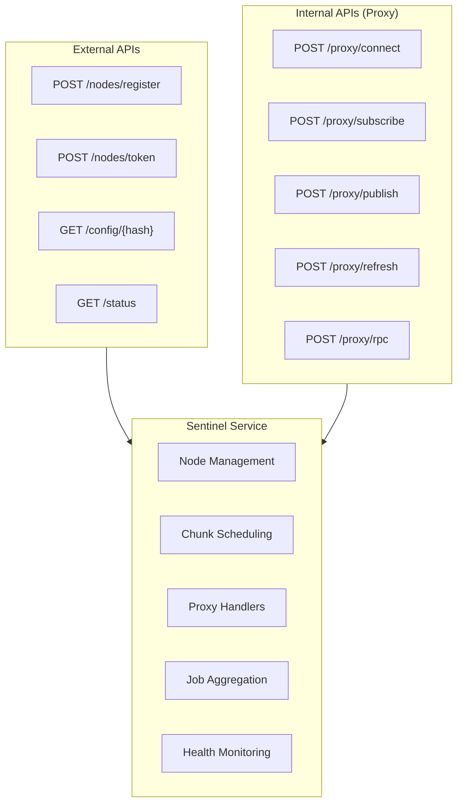
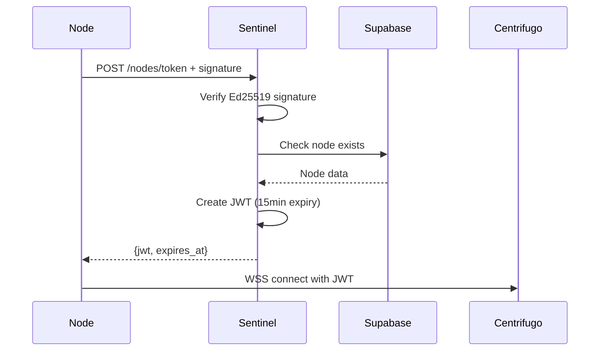
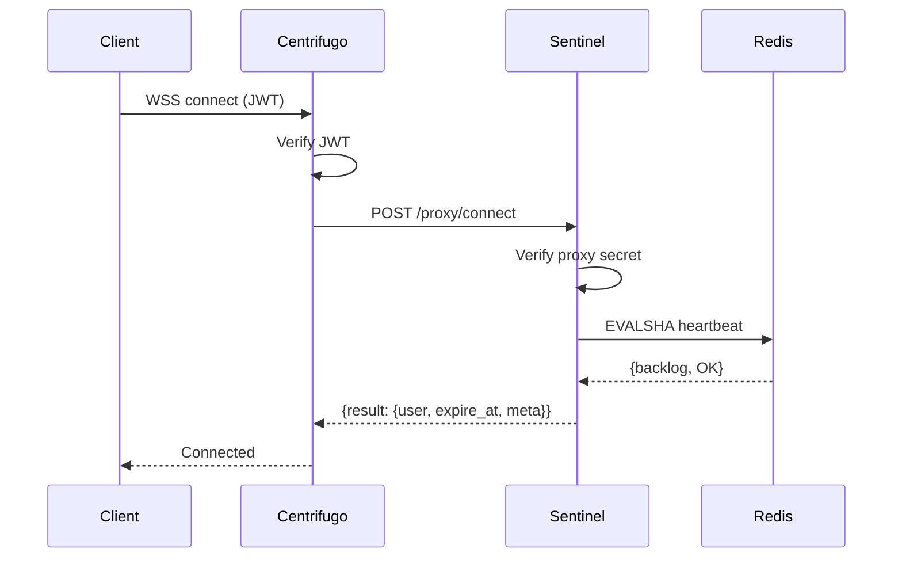
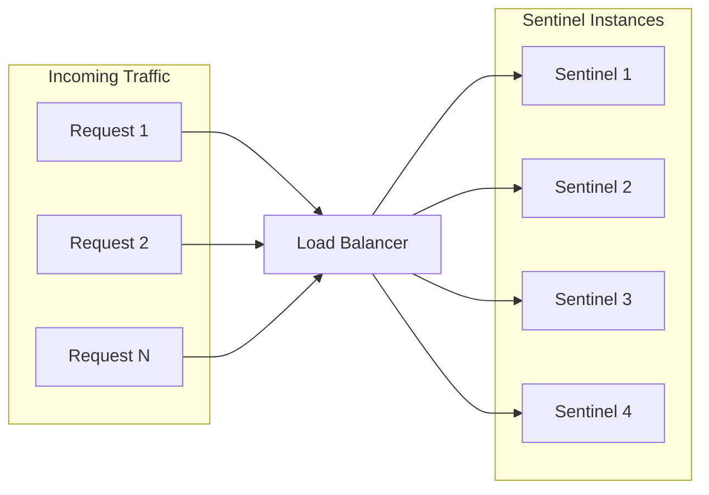

# Sentinel Service

The Sentinel service is the coordination layer between compute nodes, Centrifugo, and the data stores. It is completely stateless, enabling horizontal scaling.

## Core Responsibilities



## External HTTP Endpoints

### Node Registration

```
POST /nodes/register
Auth: Ed25519 Signature
```

Registers a new compute node with the system.

**Request Headers:**

```
X-Signature: <ed25519-signature>
X-Timestamp: <unix-ms>
X-Nonce: <uuid>
```

**Request Body:**

```json
{
  "pubkey": "base64-encoded-ed25519-public-key"
}
```

**Response:**

```json
{
  "id": "node-uuid",
  "claimCode": "XXXX-XXXX"
}
```

### Token Acquisition

```
POST /nodes/token
Auth: Ed25519 Signature
```

Issues a short-lived Centrifugo JWT for WebSocket connection.



**Response:**

```json
{
  "jwt": "eyJhbGciOiJIUzI1NiIs...",
  "expiresAt": 1234567890
}
```

### Config Retrieval

```
GET /config/{hash}
Auth: Ed25519 Signature
```

Fetches a simulation configuration by its content hash.

## Proxy Endpoints

These endpoints are called by Centrifugo, not directly by clients.

### Connect Proxy

```
POST /proxy/connect
Auth: X-Centrifugo-Proxy-Secret header
```

Validates new WebSocket connections and sets connection metadata.



### Subscribe Proxy

```
POST /proxy/subscribe
Auth: X-Centrifugo-Proxy-Secret header
```

Authorizes channel subscriptions based on user identity.

### Publish Proxy

```
POST /proxy/publish
Auth: X-Centrifugo-Proxy-Secret header
```

Handles chunk completion messages from nodes.

### Refresh Proxy

```
POST /proxy/refresh
Auth: X-Centrifugo-Proxy-Secret header
```

Issues refreshed JWTs and updates heartbeat timestamps.

### RPC Proxy

```
POST /proxy/rpc
Auth: X-Centrifugo-Proxy-Secret header
```

Handles RPC requests like `getConfig` and `getAssignedChunks`.

## Proxy Secret Validation

Every proxy endpoint MUST verify the secret:

```rust
fn verify_proxy_secret(req: &Request) -> Result<()> {
    let secret = req.headers()
        .get("X-Centrifugo-Proxy-Secret")
        .ok_or(AuthError::MissingSecret)?;

    if secret != env::var("CENTRIFUGO_PROXY_SECRET")? {
        return Err(AuthError::InvalidSecret);
    }
    Ok(())
}
```

This prevents:

- Direct HTTP access to proxy endpoints
- Spoofing the `user` field

## Background Tasks

Background tasks run on a single leader instance to avoid duplicate work:

```mermaid
flowchart TD
    subgraph Leader["Leader Election"]
        Check{Acquire Lock?}
        Check -->|Yes| Leader[Run as Leader]
        Check -->|No| Follower[Skip]
    end

    subgraph Tasks["Background Tasks"]
        Health[Health Monitor]
        LockRecovery[Stuck Lock Recovery]
        ChunkReclaim[Chunk Reclamation]
    end

    Leader --> Tasks
```

```rust
// Leader election for background tasks (30s lease)
let leader_key = "background:leader";
let acquired = redis.set_nx_ex(leader_key, instance_id, 30).await?;
if acquired {
    // This instance is the leader - run background tasks
    run_health_monitor().await;
    run_lock_recovery().await;
    // Refresh lease periodically while running
}
```

## Health Check

```
GET /status
Auth: None
```

Returns system health information:

```json
{
  "status": "healthy",
  "redis": "connected",
  "centrifugo": "connected",
  "supabase": "connected",
  "metrics": {
    "active_nodes": 42,
    "active_jobs": 5,
    "chunks_per_minute": 1200
  }
}
```

## Scaling

Sentinels scale horizontally with no coordination:



Add or remove instances at any time. No warm-up required.
