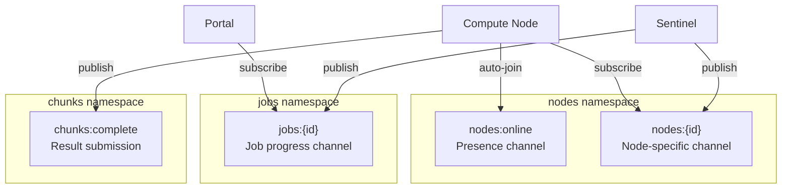

# Centrifugo (Beacon)

Centrifugo operates as `beacon.wowlab.gg`, handling all WebSocket connections for both nodes and the portal.

## Core Features Used

| Feature             | Purpose                                   |
| ------------------- | ----------------------------------------- |
| JWT Authentication  | Standard auth for WebSocket connections   |
| Token Refresh Proxy | Keep long-lived connections alive         |
| Connect Proxy       | Validate connections, set connection meta |
| Subscribe Proxy     | Channel-level authorization               |
| Publish Proxy       | Process chunk completions server-side     |
| RPC Proxy           | Config fetching over WebSocket            |
| Presence            | Hint for online nodes (not authoritative) |
| Join/Leave Events   | Optimization for disconnect detection     |
| History + Recovery  | At-least-once delivery within window      |
| Connection Meta     | Server-side metadata for security         |
| Redis Engine        | Scalable pub/sub backend                  |

## Configuration (v5 Format)

```json
{
  "engine": {
    "type": "redis",
    "redis": {
      "address": "redis:6379",
      "prefix": "centrifugo",
      "presence_hash_field_ttl": true
    }
  },

  "client": {
    "token": {
      "hmac_secret_key": "${CENTRIFUGO_TOKEN_SECRET}"
    },
    "expired_close_delay": "25s",
    "expired_sub_close_delay": "25s",
    "proxy": {
      "connect": {
        "enabled": true,
        "endpoint": "http://sentinel-lb/proxy/connect",
        "timeout": "3s"
      },
      "refresh": {
        "enabled": true,
        "endpoint": "http://sentinel-lb/proxy/refresh",
        "timeout": "3s"
      }
    },
    "include_connection_meta": true
  },

  "channel": {
    "namespaces": [
      {
        "name": "nodes",
        "presence": true,
        "join_leave": true,
        "force_push_join_leave": true,
        "allow_subscribe_for_client": false,
        "subscribe_proxy_enabled": true,
        "allow_presence_for_subscriber": true,
        "history_size": 10,
        "history_ttl": "60s",
        "force_recovery": true
      },
      {
        "name": "jobs",
        "allow_subscribe_for_client": false,
        "subscribe_proxy_enabled": true,
        "history_size": 100,
        "history_ttl": "600s",
        "force_recovery": true
      },
      {
        "name": "chunks",
        "allow_publish_for_client": false,
        "publish_proxy_enabled": true
      }
    ]
  },

  "rpc": {
    "proxy": {
      "enabled": true,
      "endpoint": "http://sentinel-lb/proxy/rpc",
      "timeout": "5s",
      "include_connection_meta": true
    }
  }
}
```

## Channel Namespaces



### nodes Namespace

| Setting                      | Value | Purpose                           |
| ---------------------------- | ----- | --------------------------------- |
| `presence`                   | true  | Track online nodes (hint only)    |
| `join_leave`                 | true  | Fire events on connect/disconnect |
| `force_push_join_leave`      | true  | Push to all presence subscribers  |
| `allow_subscribe_for_client` | false | Require proxy authorization       |
| `subscribe_proxy_enabled`    | true  | Route to Sentinel                 |
| `history_size`               | 10    | Messages retained                 |
| `history_ttl`                | 60s   | History retention                 |
| `force_recovery`             | true  | Auto-recover missed messages      |

### jobs Namespace

| Setting                      | Value | Purpose                      |
| ---------------------------- | ----- | ---------------------------- |
| `allow_subscribe_for_client` | false | Require proxy authorization  |
| `subscribe_proxy_enabled`    | true  | Route to Sentinel            |
| `history_size`               | 100   | More history for job updates |
| `history_ttl`                | 600s  | 10 minutes retention         |
| `force_recovery`             | true  | Auto-recover missed messages |

### chunks Namespace

| Setting                    | Value | Purpose                          |
| -------------------------- | ----- | -------------------------------- |
| `allow_publish_for_client` | false | All publishes must be proxied    |
| `publish_proxy_enabled`    | true  | Route to Sentinel for processing |

## Proxy Configuration

```mermaid
flowchart LR
    subgraph Client["Client Events"]
        Connect[Connect]
        Subscribe[Subscribe]
        Publish[Publish]
        Refresh[Refresh]
        RPC[RPC Call]
    end

    subgraph Proxy["Proxy Endpoints"]
        PC[/proxy/connect]
        PS[/proxy/subscribe]
        PP[/proxy/publish]
        PR[/proxy/refresh]
        PRPC[/proxy/rpc]
    end

    Connect -->|3s timeout| PC
    Subscribe -->|3s timeout| PS
    Publish -->|10s timeout| PP
    Refresh -->|3s timeout| PR
    RPC -->|5s timeout| PRPC
```

Different timeouts for different operations:

- **Subscribe/Connect/Refresh:** 3s (fast operations)
- **RPC:** 5s (may involve Redis lookups)
- **Publish:** 10s (chunk processing is heavier)

## Disconnect Codes

Use these codes in proxy error responses:

| Code Range | Type          | Use Case                      |
| ---------- | ------------- | ----------------------------- |
| 4000-4499  | Reconnectable | Temporary errors, rate limits |
| 4500-4999  | Terminal      | Auth failures, invalid state  |

Examples:

- `4429` - Rate limit exceeded (reconnect with backoff)
- `4500` - Chunk not found (terminal, don't retry)
- `4501` - Authentication failed (terminal)

## Redis HA Configuration

For production with Redis Sentinel:

```json
{
  "engine": {
    "type": "redis",
    "redis": {
      "sentinel_addresses": [
        "sentinel1:26379",
        "sentinel2:26379",
        "sentinel3:26379"
      ],
      "sentinel_master_name": "mymaster",
      "prefix": "centrifugo",
      "presence_hash_field_ttl": true
    }
  }
}
```

**Note:** `presence_hash_field_ttl: true` requires Redis 7.4+, improves presence cleanup.

## Features NOT Used

| Feature                   | Why Not                                               |
| ------------------------- | ----------------------------------------------------- |
| Delta Compression         | Messages are discrete events, not incremental updates |
| Unidirectional (SSE)      | All clients need bidirectional communication          |
| Server-Side Subscriptions | We use subscribe proxy for dynamic authorization      |
| Redis Cluster             | Lua scripts need multi-key atomicity                  |
| User Connections API      | Don't need to manage connections server-side          |
| Channel Patterns          | Explicit channel names are clearer                    |

## Metrics

Centrifugo exposes Prometheus metrics:

| Metric                                                | Alert Threshold | Meaning              |
| ----------------------------------------------------- | --------------- | -------------------- |
| `centrifugo_node_num_clients`                         | drop > 20%      | Mass disconnect      |
| `centrifugo_proxy_duration_seconds{type="publish"}`   | p99 > 5s        | Publish proxy slow   |
| `centrifugo_proxy_duration_seconds{type="subscribe"}` | p99 > 1s        | Subscribe proxy slow |
| `centrifugo_proxy_errors_total`                       | > 100/min       | Proxy failures       |
| `centrifugo_broker_redis_pub_sub_errors_total`        | > 0             | Redis pub/sub issues |
| `centrifugo_node_pub_sub_lag_seconds`                 | > 1s            | Message delivery lag |
