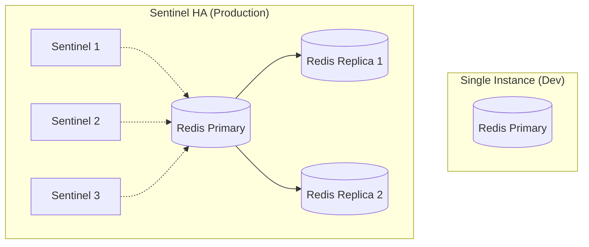
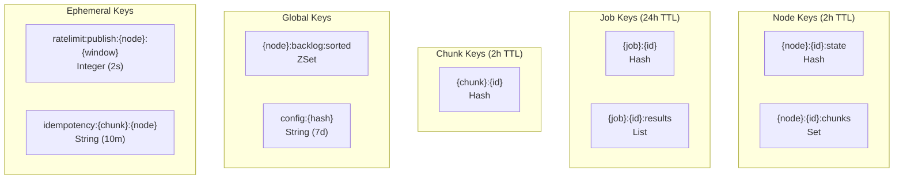
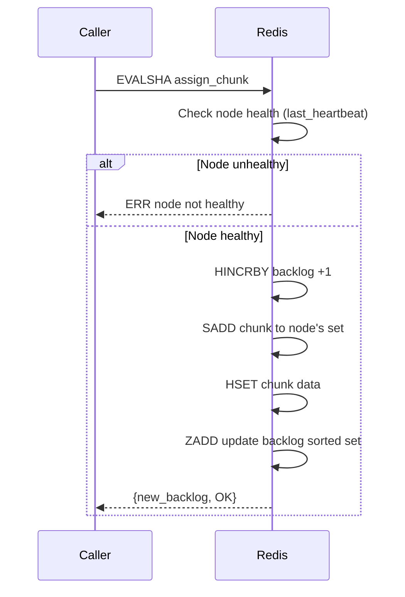
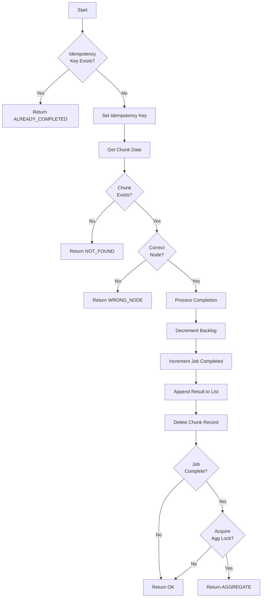
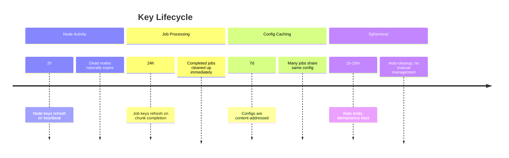

# Redis

Redis serves as the coordination brain for the entire system. All transient state lives here.

## Deployment Mode

**IMPORTANT:** We use Redis single instance or Redis Sentinel (for HA), **NOT Redis Cluster**.



**Why not Cluster?** Lua scripts require multi-key atomicity which Cluster cannot provide without hash tags on ALL keys. Our Lua scripts dynamically construct keys from data read within the script.

## Key Schema

All keys use hash tags (`{node}`, `{job}`, `{chunk}`) for potential future Cluster migration:



### Key Details

| Key                                 | Type    | TTL | Fields/Content                                                       |
| ----------------------------------- | ------- | --- | -------------------------------------------------------------------- |
| `{node}:{id}:state`                 | Hash    | 2h  | `backlog`, `last_heartbeat`                                          |
| `{node}:{id}:chunks`                | Set     | 2h  | Chunk IDs assigned to this node                                      |
| `{node}:backlog:sorted`             | ZSet    | -   | Node ID → backlog count                                              |
| `{job}:{id}`                        | Hash    | 24h | `total`, `completed`, `config_hash`, `lock`, `lock_at`, `created_at` |
| `{job}:{id}:results`                | List    | 24h | JSON chunk results                                                   |
| `{chunk}:{id}`                      | Hash    | 2h  | `job_id`, `node_id`, `iterations`, `seed_offset`, `assigned_at`      |
| `config:{hash}`                     | String  | 7d  | Serialized config JSON                                               |
| `ratelimit:publish:{node}:{window}` | Integer | 2s  | Rate limit counter                                                   |
| `idempotency:{chunk}:{node}`        | String  | 10m | Prevents duplicate completions                                       |

## Lua Scripts

All coordination logic uses Lua scripts for atomicity.

### assign_chunk.lua

Assigns a chunk to a node, updating all relevant state atomically.



```lua
-- KEYS[1] = {node}:{node_id}:state
-- KEYS[2] = {node}:{node_id}:chunks
-- KEYS[3] = {chunk}:{chunk_id}
-- KEYS[4] = {node}:backlog:sorted
-- ARGV[1-6] = node_id, chunk_id, job_id, iterations, seed_offset, timestamp

-- Check node is alive (last heartbeat within 2 minutes)
local last_hb = redis.call('HGET', KEYS[1], 'last_heartbeat')
if not last_hb or (now - tonumber(last_hb)) > 120 then
    return redis.error_reply('ERR node not healthy')
end

-- Increment backlog
local new_backlog = redis.call('HINCRBY', KEYS[1], 'backlog', 1)
redis.call('EXPIRE', KEYS[1], 7200) -- 2h

-- Track chunk assignment
redis.call('SADD', KEYS[2], chunk_id)
redis.call('EXPIRE', KEYS[2], 7200)

-- Create chunk record
redis.call('HSET', KEYS[3], 'job_id', job_id, 'node_id', node_id, ...)
redis.call('EXPIRE', KEYS[3], 7200)

-- Update sorted set for node selection
redis.call('ZADD', KEYS[4], new_backlog, node_id)

return {new_backlog, 'OK'}
```

### complete_chunk.lua

Processes a chunk completion with full idempotency and aggregation lock handling.



**Key points:**

- Idempotency key acquired FIRST using `SET NX`
- Chunk's assigned node verified against claiming node
- Dynamic key construction for job/node state updates
- Aggregation lock uses `HSETNX` with timestamp for stuck lock recovery

### select_nodes.lua

Selects N healthy nodes with lowest backlog.

```lua
-- KEYS[1] = {node}:backlog:sorted
-- ARGV[1] = count, ARGV[2] = timestamp, ARGV[3] = max_backlog

-- Get nodes sorted by backlog (lowest first)
local candidates = redis.call('ZRANGE', KEYS[1], 0, max_backlog, 'BYSCORE', 'LIMIT', 0, count * 2)

local selected = {}
for _, node_id in ipairs(candidates) do
    if #selected >= count then break end

    -- Check node health (dynamic key access)
    local last_hb = redis.call('HGET', '{node}:' .. node_id .. ':state', 'last_heartbeat')
    if last_hb and (now - tonumber(last_hb)) <= 120 then
        table.insert(selected, node_id)
    else
        -- Remove unhealthy node from sorted set
        redis.call('ZREM', KEYS[1], node_id)
    end
end

return selected
```

### heartbeat.lua

Updates node heartbeat timestamp and ensures backlog tracking.

```lua
-- KEYS[1] = {node}:{node_id}:state
-- KEYS[2] = {node}:backlog:sorted
-- ARGV[1] = node_id, ARGV[2] = timestamp

redis.call('HSET', KEYS[1], 'last_heartbeat', now)
redis.call('EXPIRE', KEYS[1], 7200)

-- Initialize backlog if not exists
redis.call('HSETNX', KEYS[1], 'backlog', 0)
local backlog = tonumber(redis.call('HGET', KEYS[1], 'backlog')) or 0

-- Update sorted set
redis.call('ZADD', KEYS[2], backlog, node_id)

return {backlog, 'OK'}
```

### reclaim_chunks.lua

Reclaims chunks from a dead node for reassignment.

```lua
-- KEYS[1] = {node}:{node_id}:state
-- KEYS[2] = {node}:{node_id}:chunks
-- KEYS[3] = {node}:backlog:sorted
-- ARGV[1] = node_id

-- Get all chunks assigned to this node
local chunks = redis.call('SMEMBERS', KEYS[2])

-- Clear node state
redis.call('DEL', KEYS[1])
redis.call('DEL', KEYS[2])

-- Remove from backlog sorted set
redis.call('ZREM', KEYS[3], node_id)

-- Return chunks for reassignment
-- Caller must verify each chunk still exists before reassigning
return chunks
```

### rate_limit.lua

Atomic rate limit check with auto-expire.

```lua
-- KEYS[1] = rate limit key
-- ARGV[1] = TTL in seconds
-- ARGV[2] = max requests

local count = redis.call('INCR', KEYS[1])
if count == 1 then
    redis.call('EXPIRE', KEYS[1], tonumber(ARGV[1]))
end
return count
```

**Note:** Using a Lua script ensures atomicity. A separate INCR + EXPIRE has a race condition where EXPIRE could fail after INCR succeeds.

## TTL Strategy



## Redis Sentinel HA

For production, deploy 3+ Sentinel nodes:

```
min-replicas-to-write 1
min-replicas-max-lag 10
```

**Note:** In-flight Lua scripts during failover may be lost. Idempotency keys handle this gracefully - operations can be safely retried.
