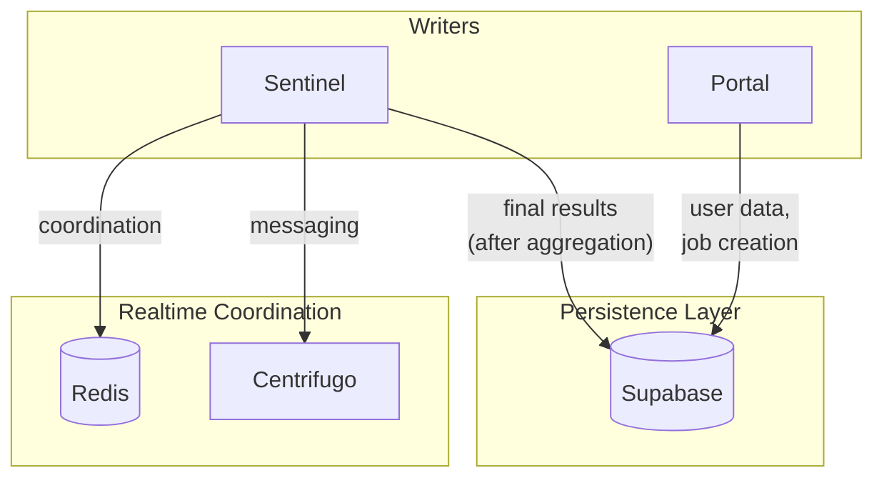
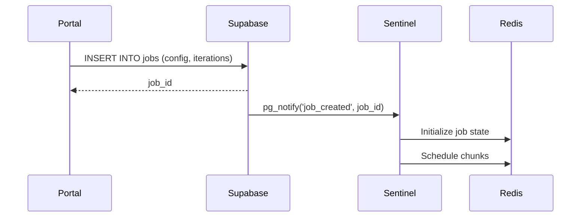
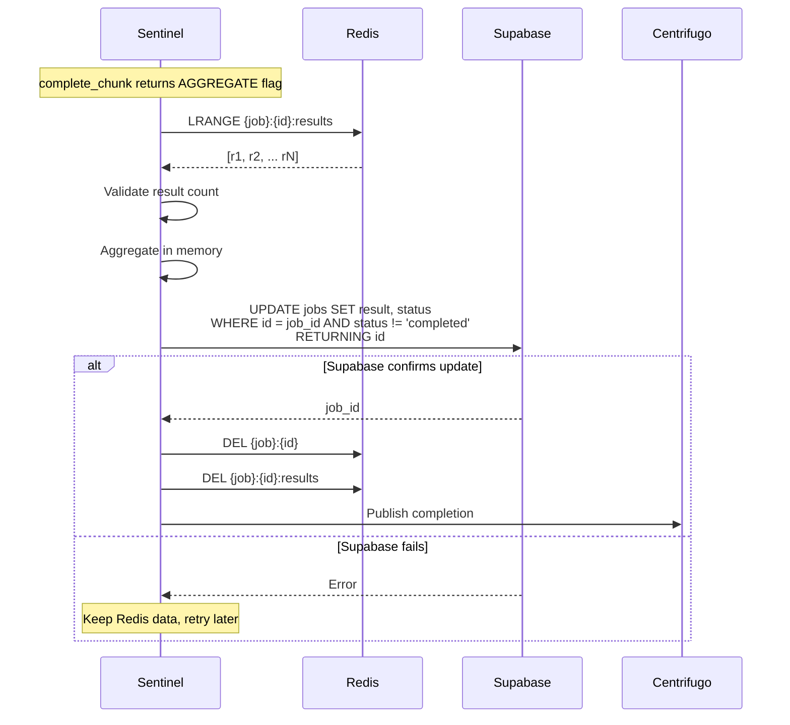
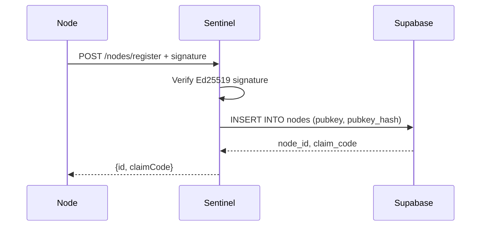

# Supabase

Supabase serves as the durability layer, storing final job results and user data. It is **NOT** used for real-time coordination.

## Role in Architecture



## Data Stored

| Table      | Purpose                        | Written By                           |
| ---------- | ------------------------------ | ------------------------------------ |
| `jobs`     | Job metadata and final results | Portal (create), Sentinel (complete) |
| `nodes`    | Node registration and config   | Portal (claim), Sentinel (register)  |
| `users`    | User accounts and settings     | Supabase Auth                        |
| `profiles` | User profile data              | Portal                               |

## Write Patterns

### Job Creation

Portal creates jobs directly in Supabase:



### Job Completion (Saga Pattern)

Sentinel writes final results only after successful aggregation:



**Critical:** Only delete Redis keys AFTER Supabase confirms the write. If Supabase fails, keep Redis data and retry.

### Node Registration

Sentinel registers nodes in Supabase after signature verification:



## Access Patterns

### Portal Access

Portal connects directly to Supabase with user JWT:

- RLS policies enforce user-level access
- Users can only see their own jobs
- Users can only claim their own nodes

### Sentinel Access

Sentinel uses service role key:

- Bypasses RLS for administrative operations
- Writes final job results
- Registers new nodes
- Updates node status

### Node Access

**Nodes NEVER access Supabase directly.**

All node operations go through Sentinel:

- Registration → Sentinel HTTP → Supabase
- Token refresh → Sentinel validates via Supabase lookup
- Config fetch → Sentinel RPC → Redis (cached) or Supabase

## Idempotent Writes

Job completion uses idempotent update:

```sql
UPDATE jobs
SET result = $1, status = 'completed', completed_at = now()
WHERE id = $2 AND status != 'completed'
RETURNING id
```

This ensures:

- Double-writes are safe (no duplicate updates)
- Concurrent completions (edge case) don't corrupt data
- RETURNING confirms the write actually happened

## Data Not Stored

The following are **NOT** stored in Supabase:

| Data                     | Where It Lives   | Why                            |
| ------------------------ | ---------------- | ------------------------------ |
| Node health/heartbeats   | Redis            | Transient, high-frequency      |
| Chunk assignments        | Redis            | Short-lived, coordination only |
| Job progress (in-flight) | Redis            | Transient state                |
| WebSocket presence       | Centrifugo/Redis | Ephemeral                      |
| Rate limiting            | Redis            | Ephemeral counters             |
| Idempotency keys         | Redis            | Short TTL                      |

## Triggers

Supabase uses pg_notify to trigger Sentinel actions:

```sql
-- On job creation
CREATE OR REPLACE FUNCTION notify_job_created()
RETURNS TRIGGER AS $$
BEGIN
  PERFORM pg_notify('job_created', NEW.id::text);
  RETURN NEW;
END;
$$ LANGUAGE plpgsql;

CREATE TRIGGER job_created_trigger
AFTER INSERT ON jobs
FOR EACH ROW
EXECUTE FUNCTION notify_job_created();
```

Sentinel listens for these notifications to initiate job scheduling.
