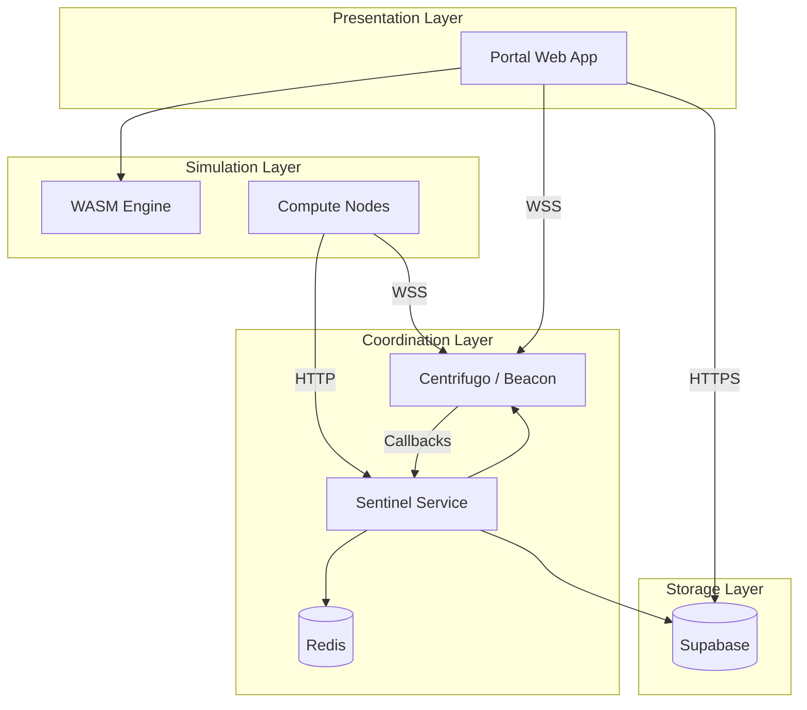

# System Architecture

WowLab's architecture separates concerns across three distinct layers: simulation, coordination, and presentation.

## Component Overview

## Layer Responsibilities

| Layer        | Component | Responsibility                                         |
| ------------ | --------- | ------------------------------------------------------ |
| Presentation | Portal    | User interface, local simulation, result visualization |
| Coordination | Sentinel  | Node registration, job scheduling, health monitoring   |
| Coordination | Beacon    | WebSocket connections, realtime messaging, presence    |
| Coordination | Redis     | Distributed state, job queues, coordination primitives |
| Simulation   | Engine    | Deterministic combat simulation, stat calculation      |
| Simulation   | Nodes     | Distributed chunk processing, parallel execution       |
| Storage      | Supabase  | User data, rotation storage, aggregated results        |

## Data Flow

Lorem ipsum dolor sit amet, consectetur adipiscing elit. Sed do eiusmod tempor incididunt ut labore et dolore magna aliqua. Ut enim ad minim veniam, quis nostrud exercitation ullamco laboris.

### Simulation Request

1. User submits simulation parameters through Portal
2. Portal creates job record in Supabase
3. Sentinel distributes chunks to available nodes via Beacon
4. Nodes process chunks and report progress
5. Sentinel aggregates results and stores in Supabase
6. Portal receives realtime updates and displays results

## Domain Services

| Domain               | Service    | Purpose                                   |
| -------------------- | ---------- | ----------------------------------------- |
| `api.wowlab.gg`      | Supabase   | Portal database, auth, user data          |
| `sentinel.wowlab.gg` | Sentinel   | Node HTTP API (register, token)           |
| `beacon.wowlab.gg`   | Centrifugo | WebSocket connections, realtime messaging |
