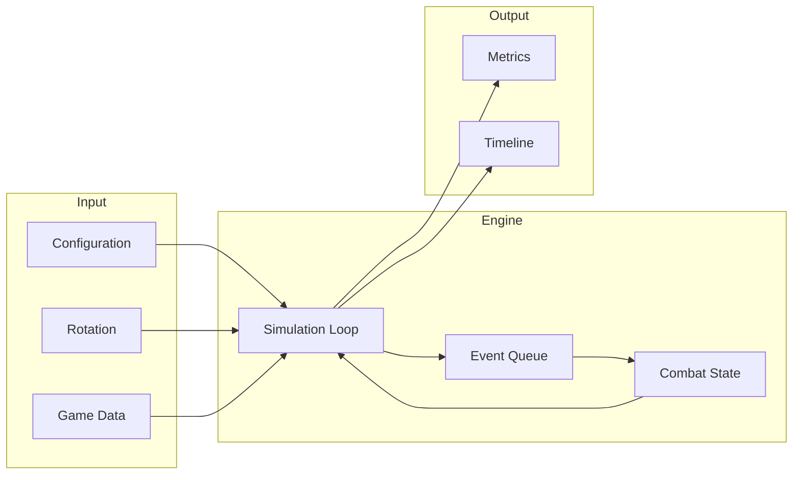

# Simulation Core

The simulation engine is written in Rust and compiles to both native binaries and WebAssembly for browser execution.

## Architecture Overview

Lorem ipsum dolor sit amet, consectetur adipiscing elit. Sed do eiusmod tempor incididunt ut labore et dolore magna aliqua. Ut enim ad minim veniam, quis nostrud exercitation ullamco laboris nisi ut aliquip ex ea commodo consequat.



## Core Components

| Component     | Responsibility                                       |
| ------------- | ---------------------------------------------------- |
| Configuration | Character stats, talents, gear, encounter parameters |
| Rotation      | Priority list defining ability usage                 |
| Game Data     | Spell definitions, coefficients, scaling formulas    |
| Event Queue   | Priority queue of pending game events                |
| Combat State  | Current buffs, debuffs, resources, cooldowns         |
| Metrics       | DPS, resource usage, ability breakdowns              |

## Determinism

The engine produces identical results given identical inputs:

- Seeded random number generator for all stochastic events
- Deterministic floating-point operations
- Sorted iteration over collections
- No dependency on system time or external state

This enables distributed simulation where chunks can be processed by any node and results aggregated reliably.

## WASM Integration

Lorem ipsum dolor sit amet, consectetur adipiscing elit. Duis aute irure dolor in reprehenderit in voluptate velit esse cillum dolore eu fugiat nulla pariatur. Excepteur sint occaecat cupidatat non proident.

<Collapsible title="Build process">
The engine compiles to WebAssembly using wasm-pack:

```bash
cd crates/engine
wasm-pack build --target web --out-dir ../../packages/wowlab-engine/wasm
```

The generated WASM module is loaded asynchronously in the browser and provides the same API as the native binary.

</Collapsible>
