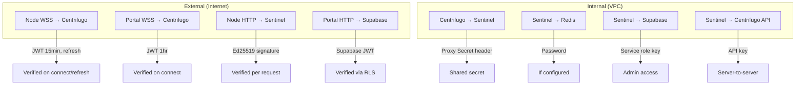
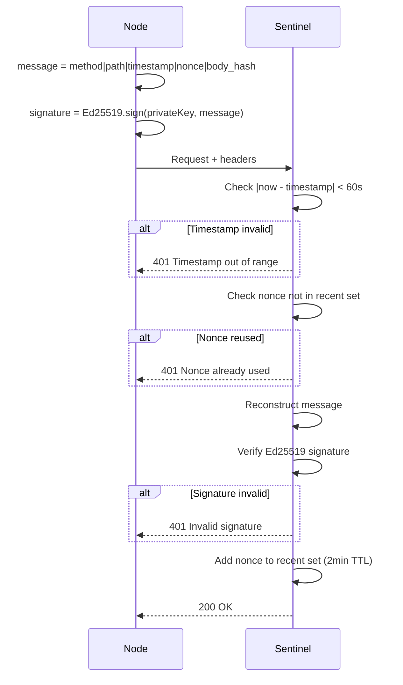
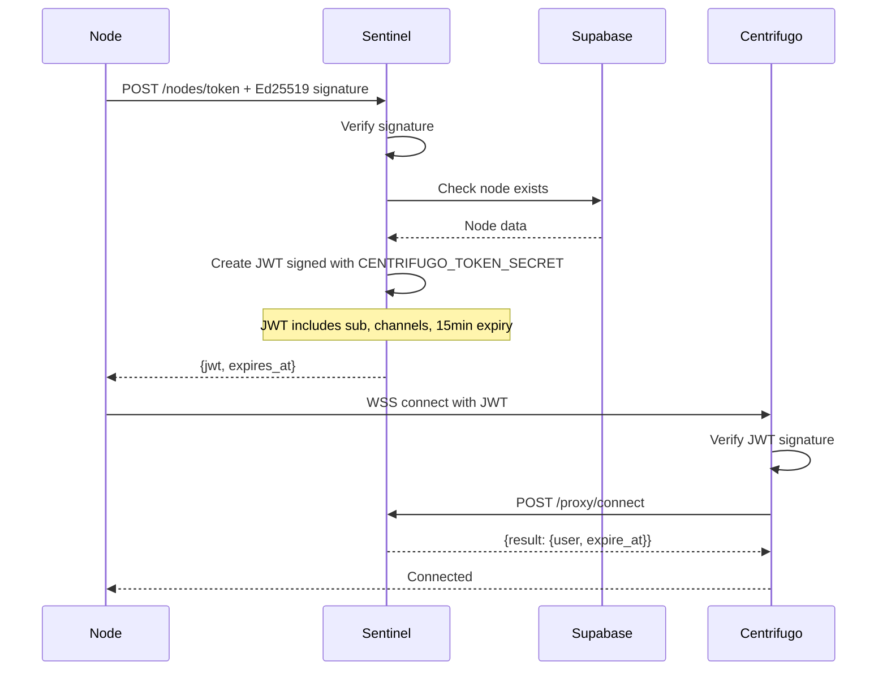
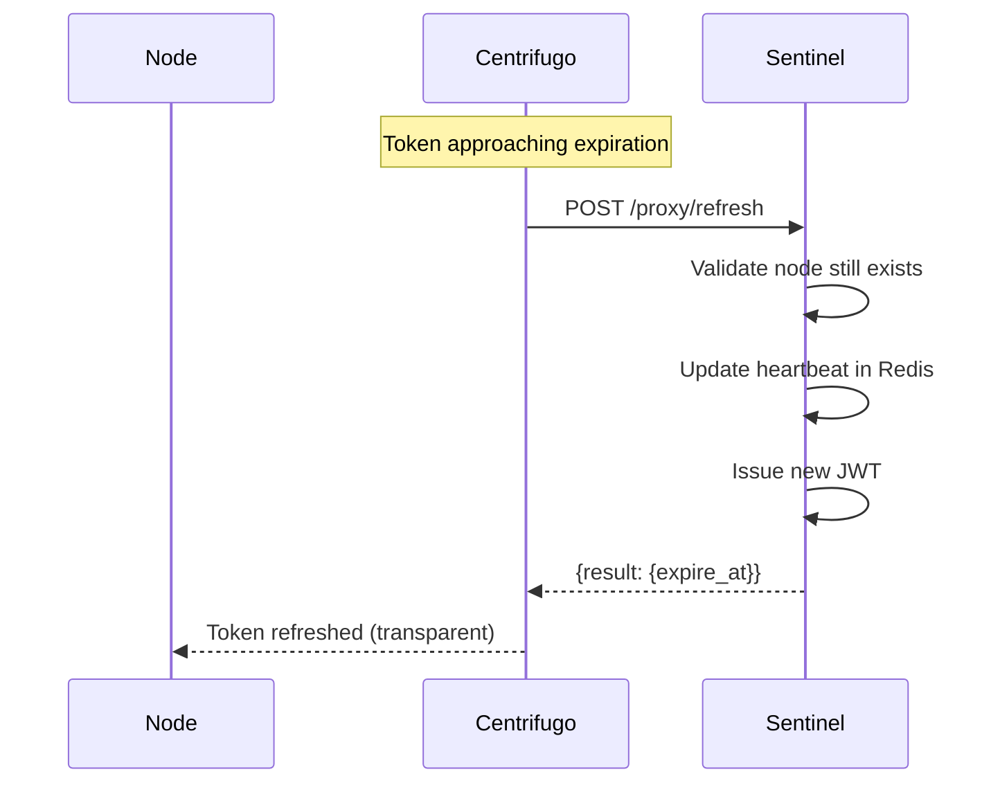

# Authentication

The system uses two authentication mechanisms: Ed25519 signatures for node HTTP requests and JWT tokens for WebSocket connections.

## Authentication Layers



## Ed25519 Node Authentication

Nodes authenticate HTTP requests using Ed25519 signatures.

### Signature Format

```
signature = Ed25519.sign(privateKey, message)
message = method|path|timestamp|nonce|body_hash
```

| Component   | Description                                     |
| ----------- | ----------------------------------------------- |
| `method`    | HTTP method (GET, POST, etc.)                   |
| `path`      | Request path (e.g., `/nodes/register`)          |
| `timestamp` | Unix milliseconds                               |
| `nonce`     | UUID v4 (unique per request)                    |
| `body_hash` | SHA-256 of request body (hex), or empty for GET |

### Request Headers

```http
POST /nodes/register HTTP/1.1
Host: sentinel.wowlab.gg
Content-Type: application/json
X-Signature: <base64-ed25519-signature>
X-Timestamp: 1234567890123
X-Nonce: 550e8400-e29b-41d4-a716-446655440000
X-Public-Key: <base64-ed25519-public-key>
```

### Verification Flow



### Replay Attack Prevention

- **Timestamp window:** Rejects requests where `|now - timestamp| > 60s`
- **Nonce tracking:** Tracks used nonces for 2 minutes
- **Body hash:** Prevents tampering with request body

## JWT Token Authentication

WebSocket connections use JWT tokens issued by Sentinel.

### Node JWT Structure

```json
{
  "sub": "node-uuid",
  "exp": 1234567890,
  "iat": 1234567800,
  "nbf": 1234567800,
  "jti": "unique-token-id",
  "channels": ["nodes:node-uuid"],
  "info": {
    "type": "node",
    "pubkey_hash": "sha256-of-pubkey"
  }
}
```

| Claim              | Purpose                                     |
| ------------------ | ------------------------------------------- |
| `sub`              | Node ID                                     |
| `exp`              | Expiration (15 minutes)                     |
| `iat`              | Issued at                                   |
| `nbf`              | Not before                                  |
| `jti`              | Unique token ID                             |
| `channels`         | Auto-subscribe channels                     |
| `info.type`        | Client type identifier                      |
| `info.pubkey_hash` | SHA-256 of public key (verification anchor) |

**`pubkey_hash` computation:** SHA-256 of the raw 32-byte Ed25519 public key bytes (not the encoded/armored form), hex-encoded.

**Auto-subscription:** The `channels` claim triggers server-side auto-subscription on connect. Nodes don't need client-side subscription calls.

### Portal JWT Structure

```json
{
  "sub": "user-uuid",
  "exp": 1234567890,
  "iat": 1234567800,
  "nbf": 1234567800,
  "jti": "unique-token-id",
  "info": {
    "type": "portal"
  }
}
```

Portal JWTs have 1-hour expiry (vs 15 minutes for nodes).

### Token Issuance Flow



**Important:** Supabase anon tokens are NOT valid for Centrifugo. Nodes MUST obtain tokens from Sentinel.

### Token Refresh Flow



## Connection Meta

Connection meta is server-side data attached to a connection. It's included in all proxy requests but NOT exposed to the client.

### Setting Meta in Connect Proxy

```json
{
  "result": {
    "user": "node-uuid",
    "expire_at": 1234567890,
    "meta": {
      "pubkey_hash": "sha256-of-ed25519-pubkey",
      "node_type": "compute",
      "registered_at": 1234567800
    }
  }
}
```

### Meta in Proxy Requests

All subsequent proxy requests include the meta:

```json
{
  "client": "client-uuid",
  "user": "node-uuid",
  "meta": {
    "pubkey_hash": "sha256...",
    "node_type": "compute",
    "registered_at": 1234567800
  },
  "channel": "chunks:complete",
  "data": { ... }
}
```

### Security Benefits

1. **Not exposed to client** - Sensitive data like pubkey hash isn't sent to browser/node
2. **Set once, used everywhere** - Don't need to include in every JWT
3. **Server-controlled** - Client can't tamper with meta values
4. **Audit trail** - Include `registered_at` for anomaly detection

## Proxy Secret

Centrifugo → Sentinel communication uses a shared secret:

```http
POST /proxy/connect HTTP/1.1
Host: sentinel-lb
X-Centrifugo-Proxy-Secret: ${CENTRIFUGO_PROXY_SECRET}
```

This prevents:

- Direct HTTP access to proxy endpoints
- Spoofing the `user` field in proxy requests
