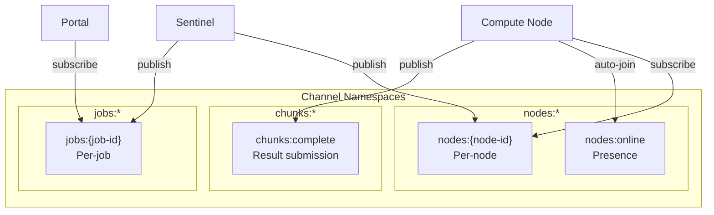
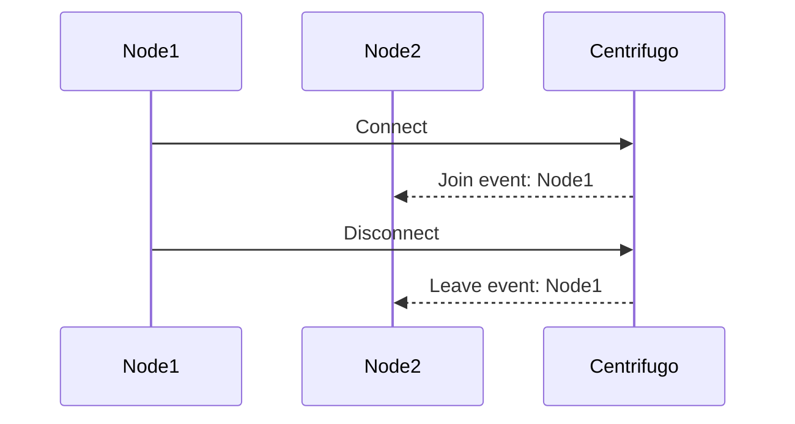
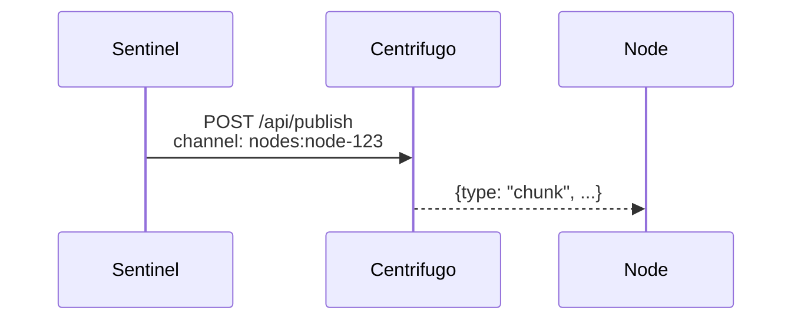
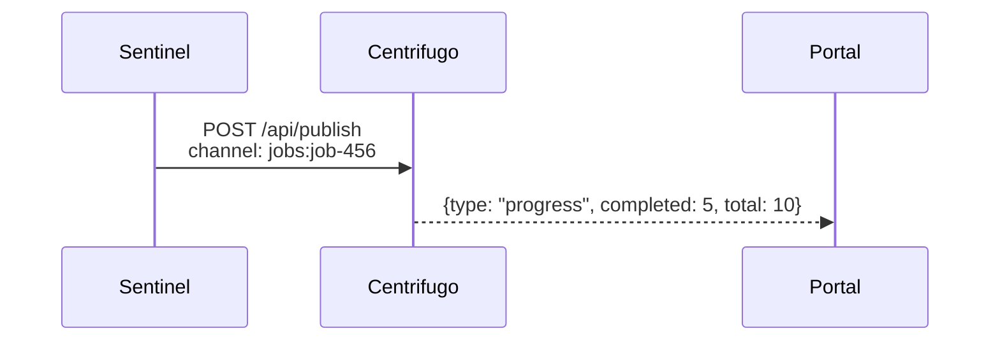
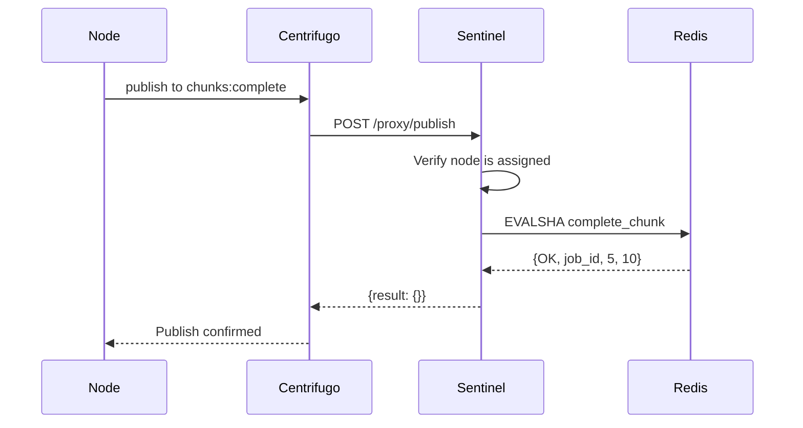
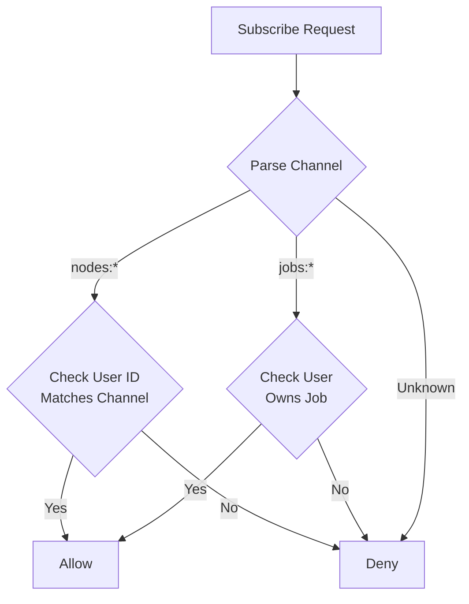
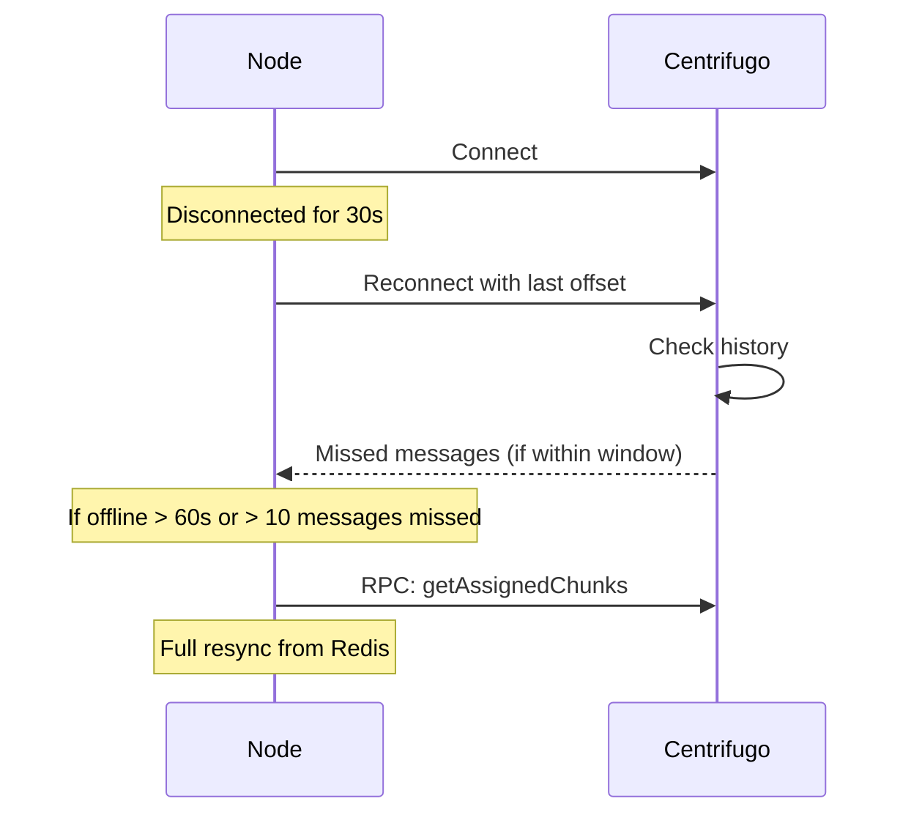

# Channels

Centrifugo channels are namespaced paths that control message routing and authorization.

## Channel Overview



## Channel Details

### nodes:online

**Purpose:** Presence tracking for online nodes (hint only, not authoritative)

| Property  | Value                         |
| --------- | ----------------------------- |
| Type      | Presence                      |
| Direction | Automatic (join/leave events) |
| Subscribe | All authenticated nodes       |
| Publish   | Nobody (presence only)        |



**Important:** Presence is a HINT, not authoritative. Use Redis heartbeat timestamps for health decisions.

### nodes:\{id\}

**Purpose:** Node-specific channel for chunk assignments and config updates

| Property  | Value                        |
| --------- | ---------------------------- |
| Type      | Subscribe                    |
| Direction | Sentinel → Node              |
| Subscribe | Only that specific node      |
| Publish   | Only Sentinel (via HTTP API) |



**Messages sent:**

- Chunk assignments
- Config updates
- Heartbeat pings

### jobs:\{id\}

**Purpose:** Job-specific channel for progress updates to portal

| Property  | Value                        |
| --------- | ---------------------------- |
| Type      | Subscribe                    |
| Direction | Sentinel → Portal            |
| Subscribe | Job owner only               |
| Publish   | Only Sentinel (via HTTP API) |



**Messages sent:**

- Progress updates
- Job completion with results

### chunks:complete

**Purpose:** Chunk result submission from nodes

| Property  | Value                                  |
| --------- | -------------------------------------- |
| Type      | Publish (proxied)                      |
| Direction | Node → Sentinel                        |
| Subscribe | Nobody                                 |
| Publish   | Assigned node only (verified in proxy) |



## Authorization Matrix

| Channel           | Who Can Subscribe | Who Can Publish    | Enforced By     |
| ----------------- | ----------------- | ------------------ | --------------- |
| `nodes:{id}`      | Only that node    | Only Sentinel      | Subscribe proxy |
| `jobs:{id}`       | Job owner only    | Only Sentinel      | Subscribe proxy |
| `nodes:online`    | All authenticated | Nobody             | Presence only   |
| `chunks:complete` | Nobody            | Assigned node only | Publish proxy   |

## Subscribe Authorization

All subscriptions go through the subscribe proxy:



**Subscribe proxy logic:**

```rust
fn authorize_subscribe(user: &str, channel: &str) -> Result<()> {
    if channel.starts_with("nodes:") {
        let node_id = channel.strip_prefix("nodes:").unwrap();
        if node_id == "online" {
            // All authenticated users can join presence
            return Ok(());
        }
        // Node can only subscribe to their own channel
        if node_id != user {
            return Err(AuthError::NotAuthorized);
        }
    } else if channel.starts_with("jobs:") {
        let job_id = channel.strip_prefix("jobs:").unwrap();
        // Verify user owns this job (query Supabase)
        if !user_owns_job(user, job_id).await? {
            return Err(AuthError::NotAuthorized);
        }
    } else {
        return Err(AuthError::UnknownChannel);
    }
    Ok(())
}
```

## History and Recovery

Centrifugo maintains message history for at-least-once delivery:

| Namespace | history_size | history_ttl | force_recovery |
| --------- | ------------ | ----------- | -------------- |
| nodes     | 10           | 60s         | true           |
| jobs      | 100          | 600s        | true           |
| chunks    | -            | -           | -              |



**Recovery limits:**

- If offline > history_ttl, must resync
- If missed > history_size, must resync
- Nodes should always call `getAssignedChunks` on connect
