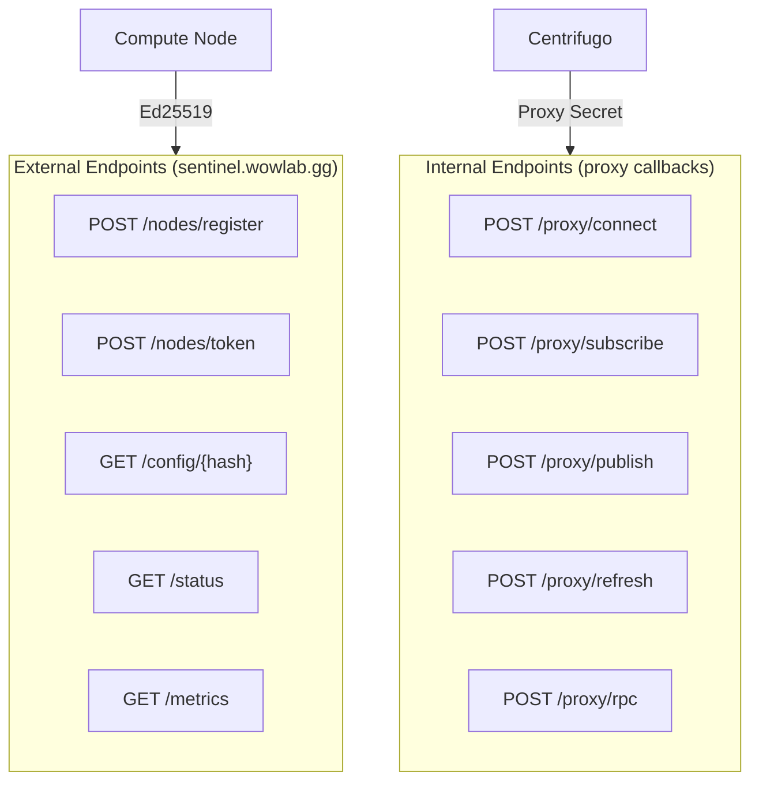

# HTTP Endpoints

The Sentinel service exposes both external (node-facing) and internal (Centrifugo proxy) HTTP endpoints.

## Endpoint Map



## External Endpoints

### POST /nodes/register

Registers a new compute node.

**Authentication:** Ed25519 signature

**Request:**

```http
POST /nodes/register HTTP/1.1
Host: sentinel.wowlab.gg
Content-Type: application/json
X-Signature: <base64-signature>
X-Timestamp: 1234567890123
X-Nonce: <uuid>
X-Public-Key: <base64-pubkey>

{
  "pubkey": "base64-encoded-ed25519-public-key",
  "name": "My Node"
}
```

**Response (201 Created):**

```json
{
  "id": "550e8400-e29b-41d4-a716-446655440000",
  "claimCode": "XXXX-XXXX"
}
```

**Errors:**
| Status | Reason |
|--------|--------|
| 400 | Invalid request body |
| 401 | Invalid signature |
| 409 | Public key already registered |

### POST /nodes/token

Issues a Centrifugo JWT for WebSocket connection.

**Authentication:** Ed25519 signature

**Request:**

```http
POST /nodes/token HTTP/1.1
Host: sentinel.wowlab.gg
X-Signature: <base64-signature>
X-Timestamp: 1234567890123
X-Nonce: <uuid>
X-Public-Key: <base64-pubkey>
```

**Response (200 OK):**

```json
{
  "jwt": "eyJhbGciOiJIUzI1NiIs...",
  "expiresAt": 1234567890
}
```

**Errors:**
| Status | Reason |
|--------|--------|
| 401 | Invalid signature |
| 404 | Node not found |

### GET /config/\{hash\}

Retrieves a simulation configuration by content hash.

**Authentication:** Ed25519 signature

**Request:**

```http
GET /config/sha256abc123... HTTP/1.1
Host: sentinel.wowlab.gg
X-Signature: <base64-signature>
X-Timestamp: 1234567890123
X-Nonce: <uuid>
X-Public-Key: <base64-pubkey>
```

**Response (200 OK):**

```json
{
  "config": {
    "character": { ... },
    "gear": { ... },
    "talents": { ... }
  },
  "hash": "sha256abc123..."
}
```

**Errors:**
| Status | Reason |
|--------|--------|
| 401 | Invalid signature |
| 404 | Config not found |

### GET /status

Health check endpoint.

**Authentication:** None

**Response (200 OK):**

```json
{
  "status": "healthy",
  "redis": "connected",
  "centrifugo": "connected",
  "supabase": "connected",
  "metrics": {
    "active_nodes": 42,
    "active_jobs": 5,
    "chunks_per_minute": 1200
  }
}
```

### GET /metrics

Prometheus metrics endpoint.

**Authentication:** None

**Response:** Prometheus text format

## Internal Proxy Endpoints

These endpoints are called by Centrifugo. Direct access is blocked by proxy secret validation.

### POST /proxy/connect

Validates new WebSocket connections.

**Headers:**

```
X-Centrifugo-Proxy-Secret: ${CENTRIFUGO_PROXY_SECRET}
```

**Request:**

```json
{
  "client": "client-uuid",
  "transport": "websocket",
  "protocol": "json",
  "encoding": "json",
  "user": "node-uuid",
  "data": {}
}
```

**Response (allow):**

```json
{
  "result": {
    "user": "node-uuid",
    "expire_at": 1234567890,
    "meta": {
      "pubkey_hash": "sha256...",
      "node_type": "compute",
      "registered_at": 1234567800
    }
  }
}
```

### POST /proxy/subscribe

Authorizes channel subscriptions.

**Request:**

```json
{
  "client": "client-uuid",
  "transport": "websocket",
  "protocol": "json",
  "encoding": "json",
  "user": "node-uuid",
  "channel": "nodes:node-uuid",
  "meta": { ... }
}
```

**Response (allow):**

```json
{
  "result": {}
}
```

**Response (deny):**

```json
{
  "error": {
    "code": 403,
    "message": "not authorized for this channel"
  }
}
```

### POST /proxy/publish

Handles chunk completion messages.

**Request:**

```json
{
  "client": "client-uuid",
  "transport": "websocket",
  "protocol": "json",
  "encoding": "json",
  "user": "node-uuid",
  "channel": "chunks:complete",
  "data": {
    "chunkId": "chunk-uuid",
    "result": {
      "meanDps": 12500.5,
      "stdDps": 250.3,
      "minDps": 11800.0,
      "maxDps": 13200.0,
      "iterations": 1000
    }
  },
  "meta": { ... }
}
```

**Response (success):**

```json
{
  "result": {}
}
```

**Response (error):**

```json
{
  "error": {
    "code": 1000,
    "message": "chunk not found"
  }
}
```

### POST /proxy/refresh

Issues refreshed JWTs.

**Request:**

```json
{
  "client": "client-uuid",
  "transport": "websocket",
  "protocol": "json",
  "encoding": "json",
  "user": "node-uuid",
  "meta": { ... }
}
```

**Response:**

```json
{
  "result": {
    "expire_at": 1234568790
  }
}
```

### POST /proxy/rpc

Handles RPC requests.

**Request (getConfig):**

```json
{
  "client": "client-uuid",
  "transport": "websocket",
  "protocol": "json",
  "encoding": "json",
  "user": "node-uuid",
  "method": "getConfig",
  "data": {
    "hash": "sha256..."
  },
  "meta": { ... }
}
```

**Response:**

```json
{
  "result": {
    "data": {
      "config": { ... },
      "hash": "sha256..."
    }
  }
}
```

**Request (getAssignedChunks):**

```json
{
  "client": "client-uuid",
  "user": "node-uuid",
  "method": "getAssignedChunks",
  "data": {},
  "meta": { ... }
}
```

**Response:**

```json
{
  "result": {
    "data": {
      "chunks": [
        {
          "id": "chunk-1",
          "jobId": "job-1",
          "iterations": 1000,
          "configHash": "...",
          "seedOffset": 0
        }
      ]
    }
  }
}
```

## Error Response Format

All proxy endpoints return errors in Centrifugo format:

```json
{
  "error": {
    "code": <number>,
    "message": "<string>"
  },
  "disconnect": {
    "code": <number>,
    "reason": "<string>"
  }
}
```

The optional `disconnect` field forces client disconnection.
