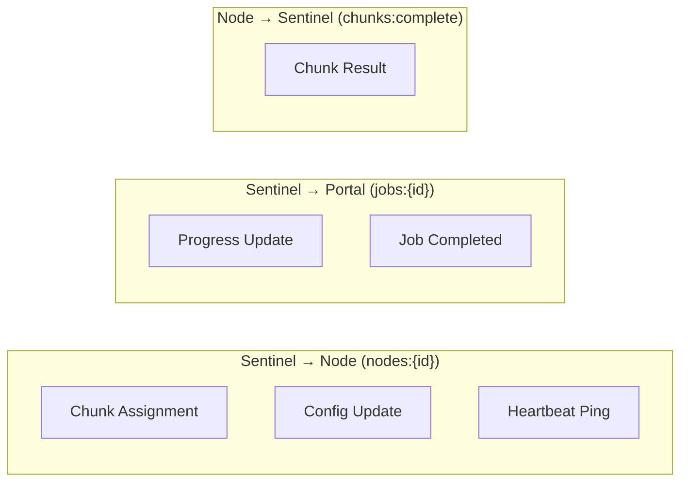
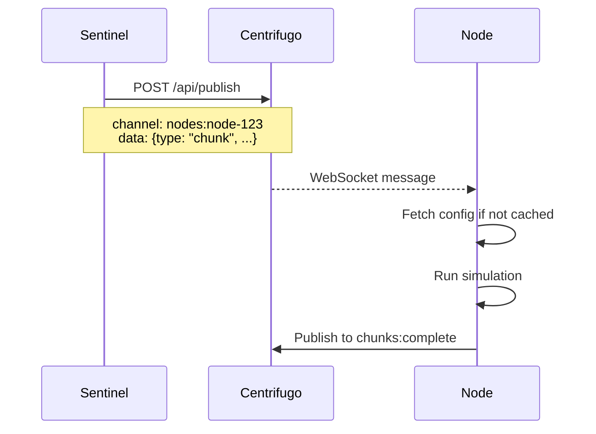
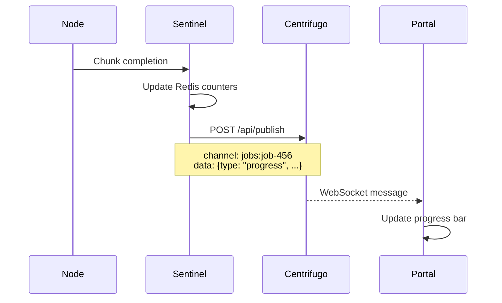
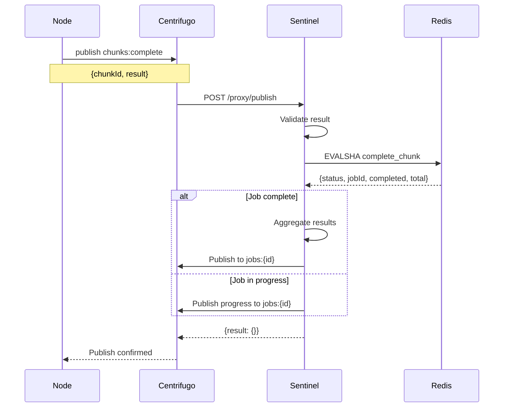

# Message Payloads

This document defines all WebSocket message formats used in the system.

## Message Flow Overview



## Node Channel Messages (nodes:{id})

### Chunk Assignment

Sent when a new chunk is assigned to a node.

```json
{
  "type": "chunk",
  "id": "chunk-uuid",
  "jobId": "job-uuid",
  "iterations": 1000,
  "configHash": "sha256...",
  "seedOffset": 0
}
```

| Field        | Type   | Description                       |
| ------------ | ------ | --------------------------------- |
| `type`       | string | Always `"chunk"`                  |
| `id`         | string | Unique chunk identifier           |
| `jobId`      | string | Parent job identifier             |
| `iterations` | number | Number of iterations to simulate  |
| `configHash` | string | SHA-256 hash of simulation config |
| `seedOffset` | number | Starting seed offset for RNG      |



### Heartbeat Ping

Sent periodically to verify node connectivity.

```json
{
  "type": "ping",
  "timestamp": 1234567890
}
```

| Field       | Type   | Description                |
| ----------- | ------ | -------------------------- |
| `type`      | string | Always `"ping"`            |
| `timestamp` | number | Server timestamp (Unix ms) |

### Config Update

Sent when node configuration changes.

```json
{
  "type": "config",
  "userId": "user-uuid",
  "name": "My Node",
  "maxParallel": 4
}
```

| Field         | Type   | Description           |
| ------------- | ------ | --------------------- |
| `type`        | string | Always `"config"`     |
| `userId`      | string | Owner user ID         |
| `name`        | string | Node display name     |
| `maxParallel` | number | Max concurrent chunks |

## Job Channel Messages (jobs:{id})

### Progress Update

Sent when a chunk completes.

```json
{
  "type": "progress",
  "completed": 5,
  "total": 10,
  "timestamp": 1234567890
}
```

| Field       | Type   | Description                |
| ----------- | ------ | -------------------------- |
| `type`      | string | Always `"progress"`        |
| `completed` | number | Chunks completed so far    |
| `total`     | number | Total chunks in job        |
| `timestamp` | number | Server timestamp (Unix ms) |



### Job Completed

Sent when all chunks are complete and results are aggregated.

```json
{
  "type": "completed",
  "result": {
    "meanDps": 12500.5,
    "stdDps": 250.3,
    "minDps": 11800.0,
    "maxDps": 13200.0,
    "totalIterations": 10000
  }
}
```

| Field                    | Type   | Description                    |
| ------------------------ | ------ | ------------------------------ |
| `type`                   | string | Always `"completed"`           |
| `result.meanDps`         | number | Mean DPS across all iterations |
| `result.stdDps`          | number | Standard deviation of DPS      |
| `result.minDps`          | number | Minimum DPS observed           |
| `result.maxDps`          | number | Maximum DPS observed           |
| `result.totalIterations` | number | Total iterations completed     |

## Chunk Completion (chunks:complete)

### Result Submission

Published by nodes when a chunk simulation completes.

```json
{
  "chunkId": "chunk-uuid",
  "result": {
    "meanDps": 12500.5,
    "stdDps": 250.3,
    "minDps": 11800.0,
    "maxDps": 13200.0,
    "iterations": 1000
  }
}
```

| Field               | Type   | Description              |
| ------------------- | ------ | ------------------------ |
| `chunkId`           | string | Chunk being completed    |
| `result.meanDps`    | number | Mean DPS for this chunk  |
| `result.stdDps`     | number | Standard deviation       |
| `result.minDps`     | number | Minimum DPS              |
| `result.maxDps`     | number | Maximum DPS              |
| `result.iterations` | number | Iterations in this chunk |



## RPC Messages

### getConfig Request

```json
{
  "method": "getConfig",
  "data": {
    "hash": "sha256..."
  }
}
```

### getConfig Response

```json
{
  "config": {
    "character": { ... },
    "gear": { ... },
    "talents": { ... }
  },
  "hash": "sha256..."
}
```

### getAssignedChunks Request

```json
{
  "method": "getAssignedChunks",
  "data": {}
}
```

### getAssignedChunks Response

```json
{
  "chunks": [
    {
      "id": "chunk-1",
      "jobId": "job-1",
      "iterations": 1000,
      "configHash": "sha256...",
      "seedOffset": 0
    },
    {
      "id": "chunk-2",
      "jobId": "job-1",
      "iterations": 1000,
      "configHash": "sha256...",
      "seedOffset": 1000
    }
  ]
}
```

## Message Type Summary

| Channel           | Message Type | Direction         | Trigger         |
| ----------------- | ------------ | ----------------- | --------------- |
| `nodes:{id}`      | chunk        | Sentinel → Node   | Job scheduled   |
| `nodes:{id}`      | ping         | Sentinel → Node   | Periodic        |
| `nodes:{id}`      | config       | Sentinel → Node   | Config changed  |
| `jobs:{id}`       | progress     | Sentinel → Portal | Chunk completed |
| `jobs:{id}`       | completed    | Sentinel → Portal | All chunks done |
| `chunks:complete` | (result)     | Node → Sentinel   | Chunk finished  |
