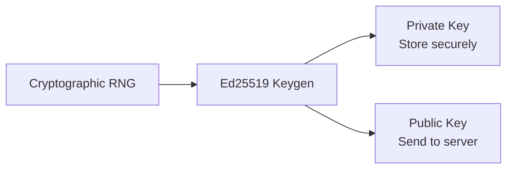
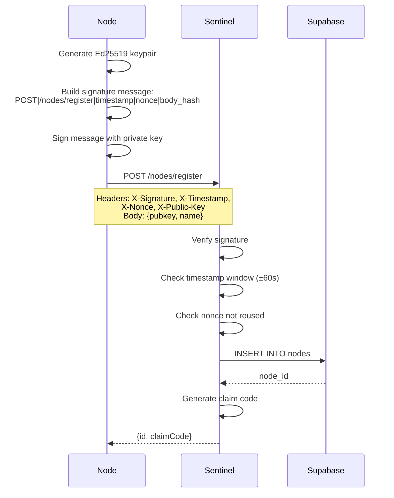
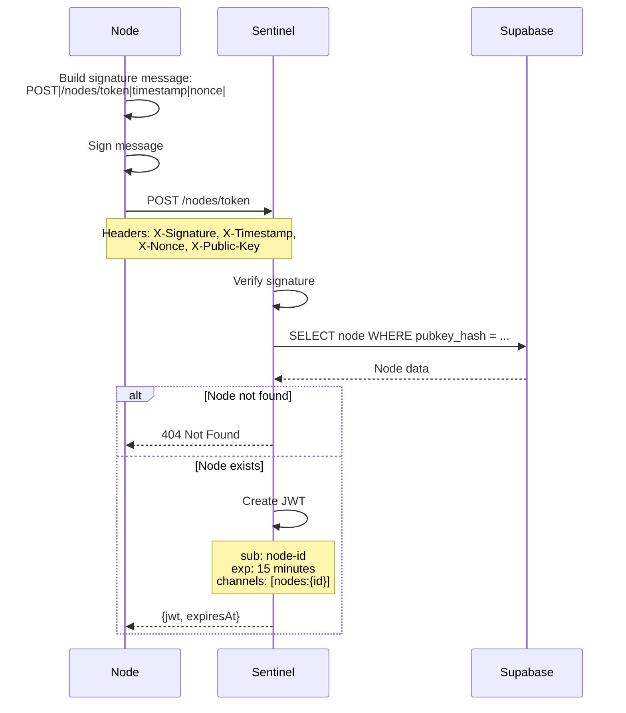
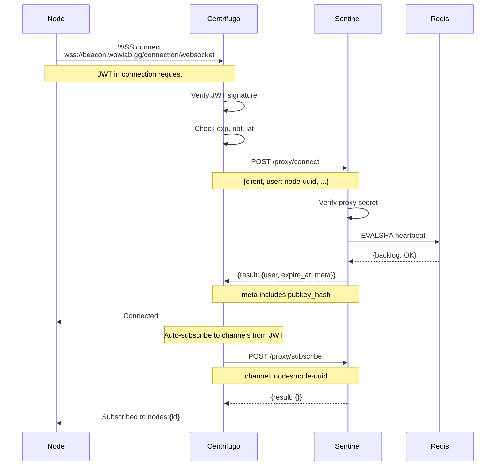
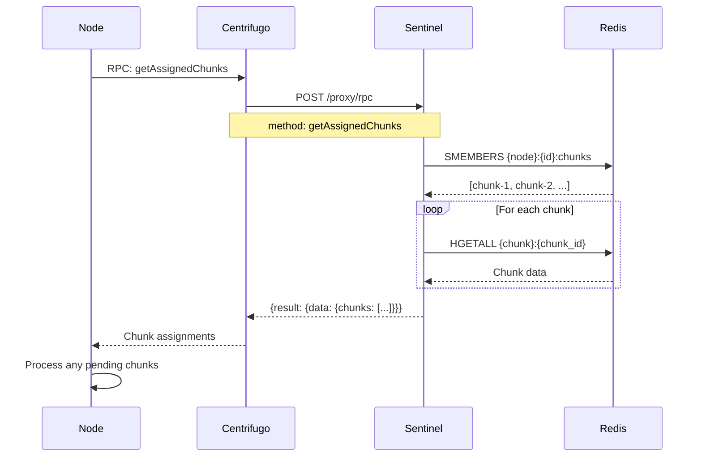
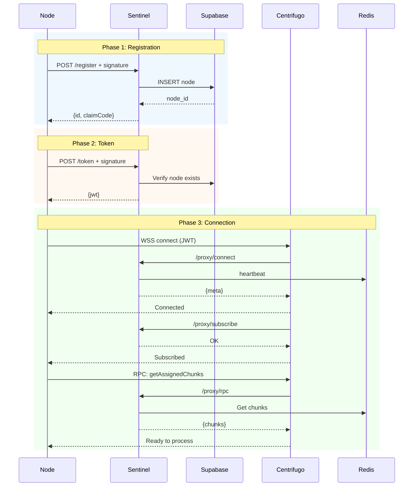

# Node Registration

This document covers the complete flow from node registration to active WebSocket connection.

## Overview

```mermaid
flowchart TD
    subgraph Phase1["Phase 1: Registration"]
        A1[Generate Ed25519 keypair]
        A2[POST /nodes/register]
        A3[Receive node ID + claim code]
    end

    subgraph Phase2["Phase 2: Token Acquisition"]
        B1[POST /nodes/token]
        B2[Receive Centrifugo JWT]
    end

    subgraph Phase3["Phase 3: WebSocket Connection"]
        C1[Connect to beacon.wowlab.gg]
        C2[JWT verification]
        C3[Connect proxy callback]
        C4[Auto-subscribe to nodes:{id}]
        C5[Resync assigned chunks]
    end

    A1 --> A2 --> A3
    A3 --> B1 --> B2
    B2 --> C1 --> C2 --> C3 --> C4 --> C5
```

## Phase 1: Registration

### Generate Keypair

Node generates an Ed25519 keypair on first run:



### Registration Request



### Claim Code

The claim code allows users to associate a node with their account:

```
XXXX-XXXX
```

User enters this code in the portal to claim ownership.

## Phase 2: Token Acquisition

### Request JWT



### JWT Structure

```json
{
  "sub": "node-uuid",
  "exp": 1234567890,
  "iat": 1234567800,
  "nbf": 1234567800,
  "jti": "unique-token-id",
  "channels": ["nodes:node-uuid"],
  "info": {
    "type": "node",
    "pubkey_hash": "sha256-of-pubkey"
  }
}
```

**Important:** The `channels` claim enables auto-subscription on connect.

## Phase 3: WebSocket Connection

### Connection Establishment



### Resync on Connect

After connection, node should resync to recover any missed assignments:



## Complete Flow Diagram



## Error Handling

| Phase        | Error               | Recovery                      |
| ------------ | ------------------- | ----------------------------- |
| Registration | Invalid signature   | Check key generation          |
| Registration | 409 Conflict        | Public key already registered |
| Token        | 404 Not Found       | Re-register node              |
| Token        | 401 Unauthorized    | Check signature               |
| Connect      | JWT expired         | Request new token             |
| Connect      | Connect proxy error | Retry with backoff            |
| Subscribe    | 403 Forbidden       | Node ID mismatch in JWT       |
