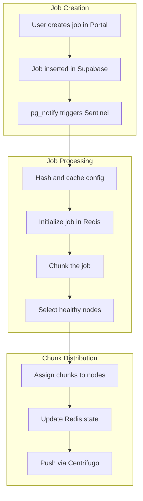
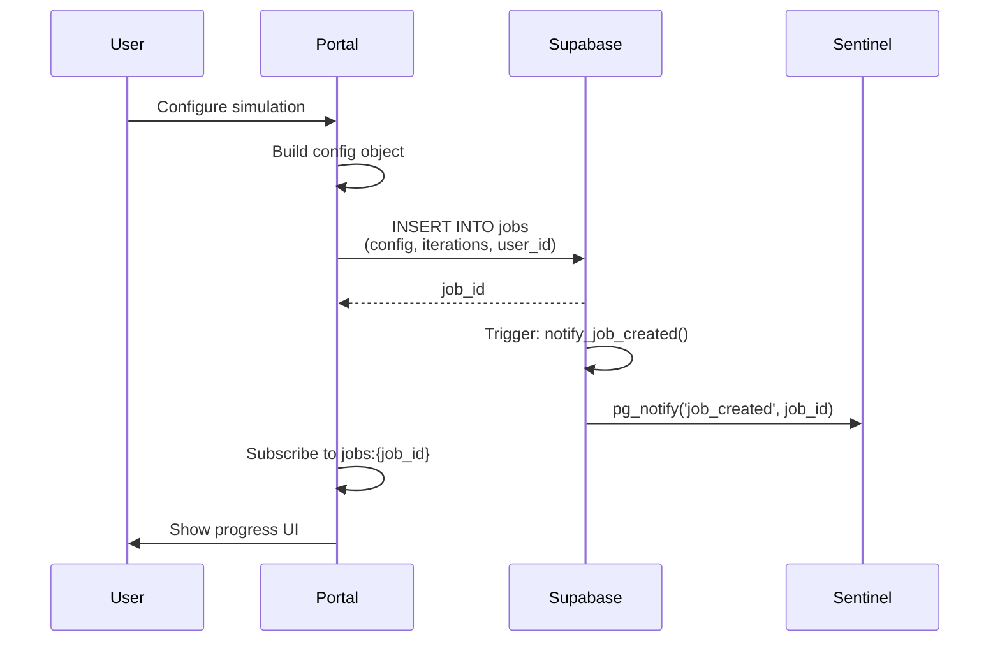
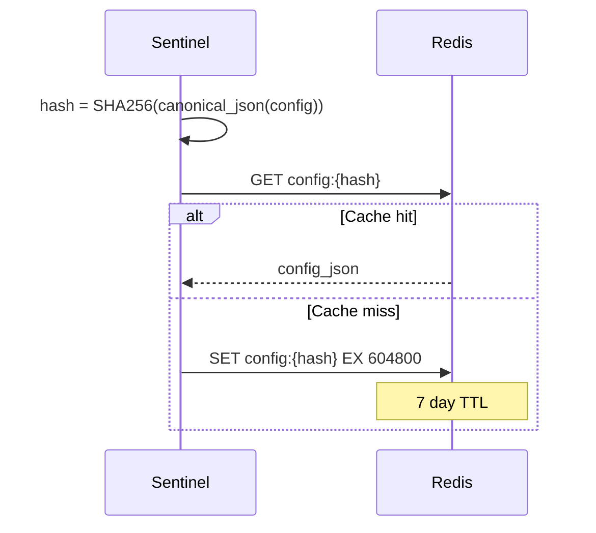
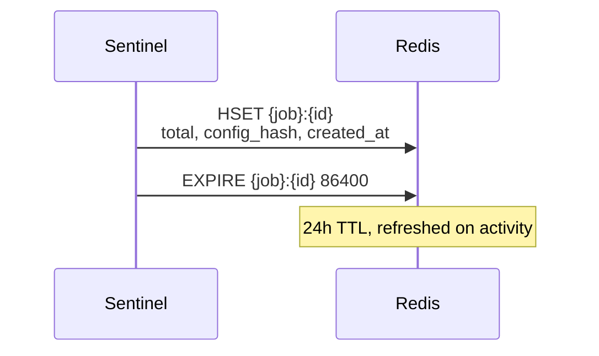
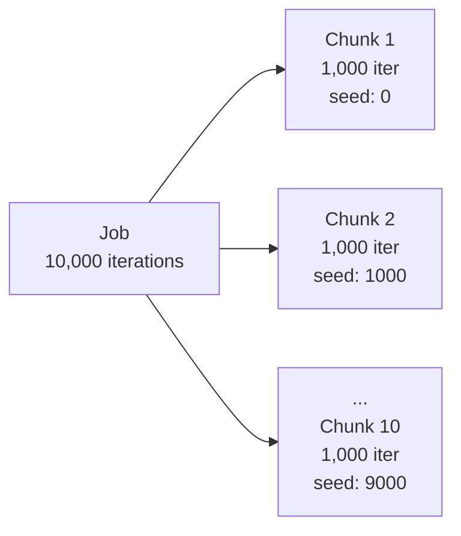
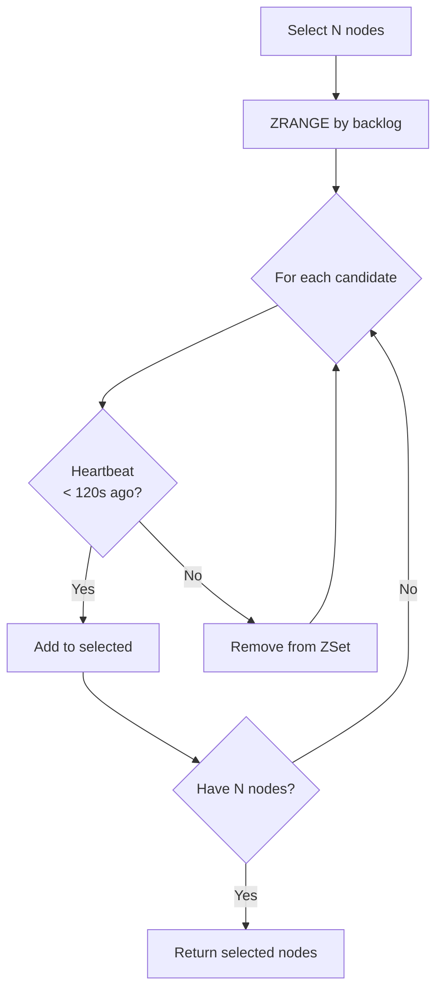
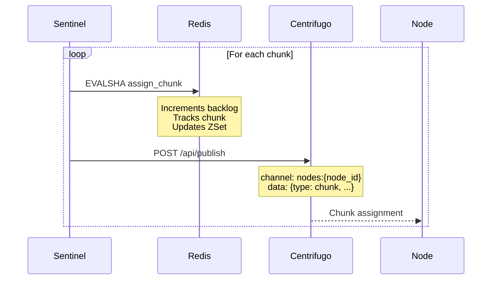
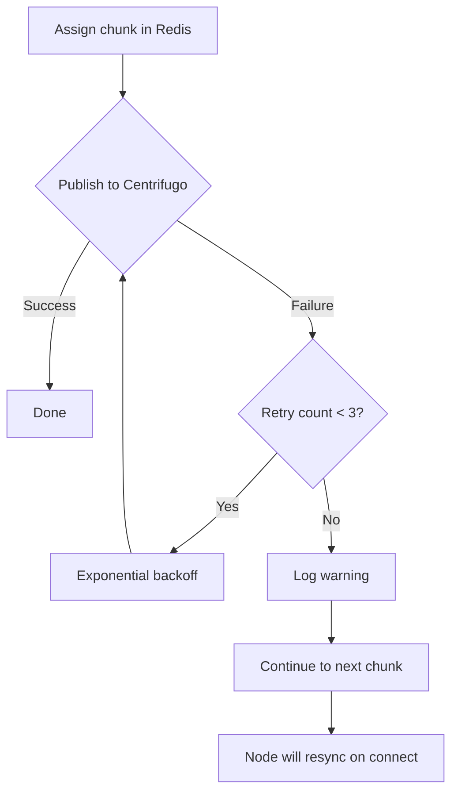
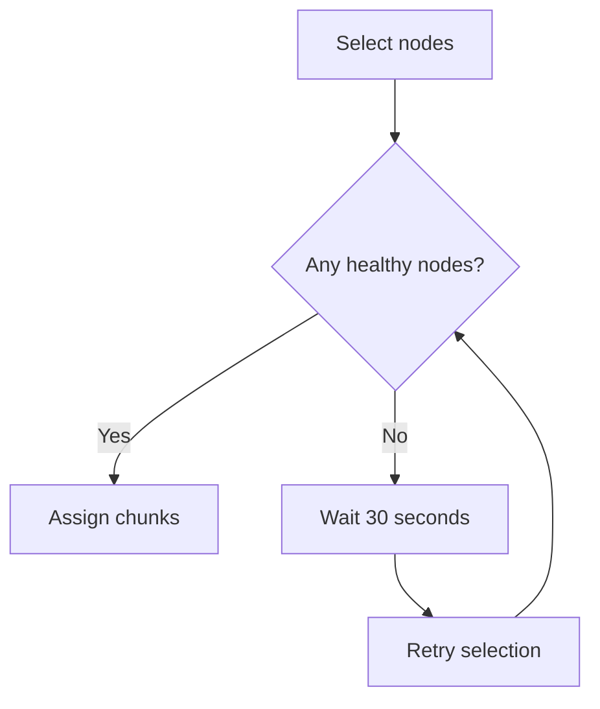
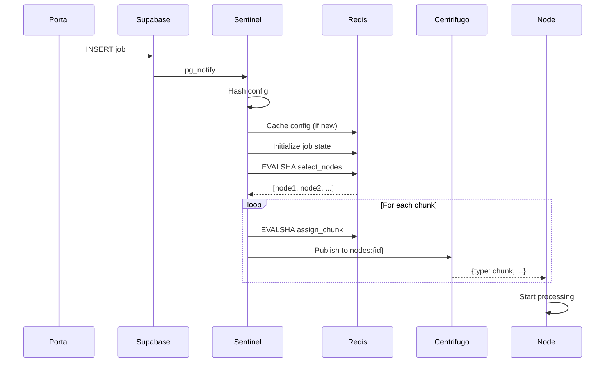

# Job Scheduling

This document covers how jobs are created, chunked, and distributed to compute nodes.

## Overview



## Job Creation

### Portal → Supabase



### Job Record

```sql
INSERT INTO jobs (
    id,
    user_id,
    config,
    iterations,
    status,
    created_at
) VALUES (
    gen_random_uuid(),
    $user_id,
    $config_json,
    $iterations,
    'pending',
    now()
)
```

## Config Caching

Configs are content-addressed for deduplication:



**Why content-addressed?**

- Multiple jobs with same config share one cache entry
- Nodes fetch config by hash, not by job
- Reduces storage and network overhead

## Job Initialization



### Redis Job State

```json
{
  "total": 10,
  "completed": 0,
  "config_hash": "sha256...",
  "created_at": 1234567890
}
```

## Chunking Strategy

Jobs are split into fixed-size chunks:



| Parameter   | Value                     | Notes                       |
| ----------- | ------------------------- | --------------------------- |
| Chunk size  | 1,000 iterations          | Configurable per deployment |
| Seed offset | chunk_index \* chunk_size | Ensures reproducibility     |

## Node Selection

Sentinel selects nodes using the `select_nodes.lua` script:



### Selection Criteria

1. **Lowest backlog** - Nodes with fewer pending chunks
2. **Healthy** - Last heartbeat within 2 minutes
3. **Available** - Not at max capacity

```lua
-- ZRANGE with BYSCORE gets nodes with lowest backlog
local candidates = redis.call('ZRANGE', backlog_zset,
    0, max_backlog, 'BYSCORE', 'LIMIT', 0, count * 2)

for _, node_id in ipairs(candidates) do
    -- Check node health
    local last_hb = redis.call('HGET',
        '{node}:' .. node_id .. ':state', 'last_heartbeat')
    if last_hb and (now - tonumber(last_hb)) <= 120 then
        table.insert(selected, node_id)
    end
end
```

## Chunk Assignment

For each chunk, Sentinel runs `assign_chunk.lua`:



### Batch Publishing

For efficiency, Sentinel batches publishes:

```json
{
  "commands": [
    {"publish": {"channel": "nodes:node-1", "data": {...}}},
    {"publish": {"channel": "nodes:node-2", "data": {...}}},
    {"publish": {"channel": "nodes:node-3", "data": {...}}}
  ]
}
```

## Failure Handling

### Publish Failure



**Critical:** If Centrifugo publish fails, the chunk assignment in Redis is still valid. The node will resync on next connect or heartbeat.

### No Healthy Nodes



## Complete Flow


