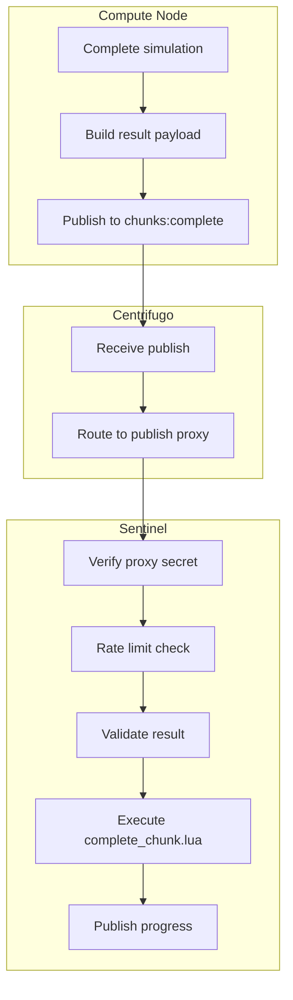
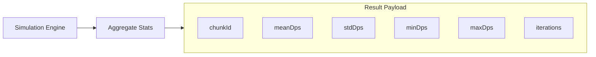
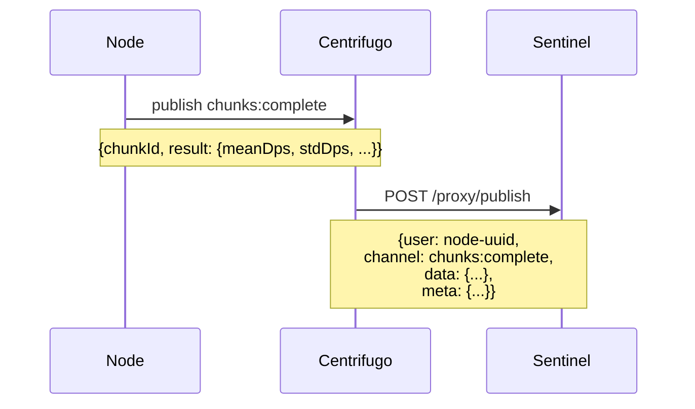
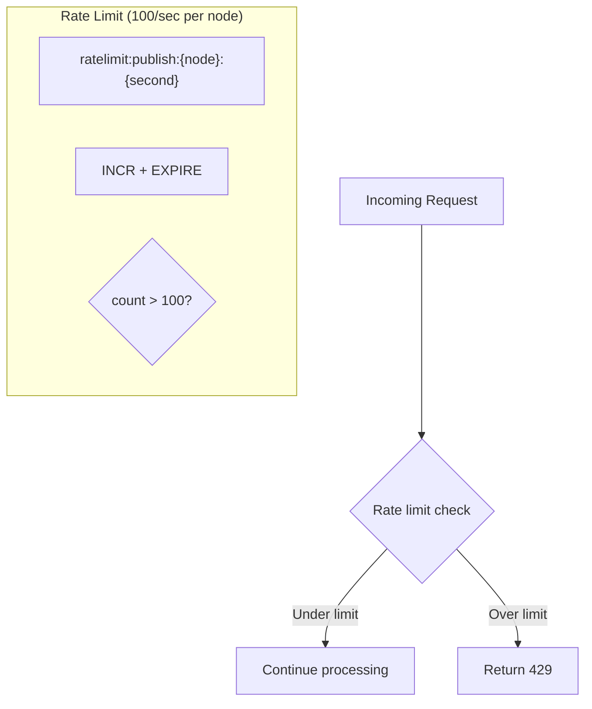
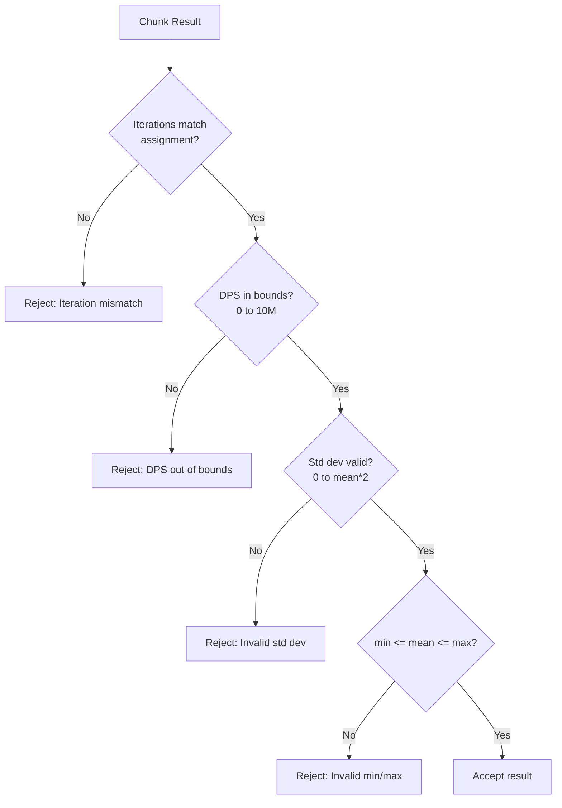
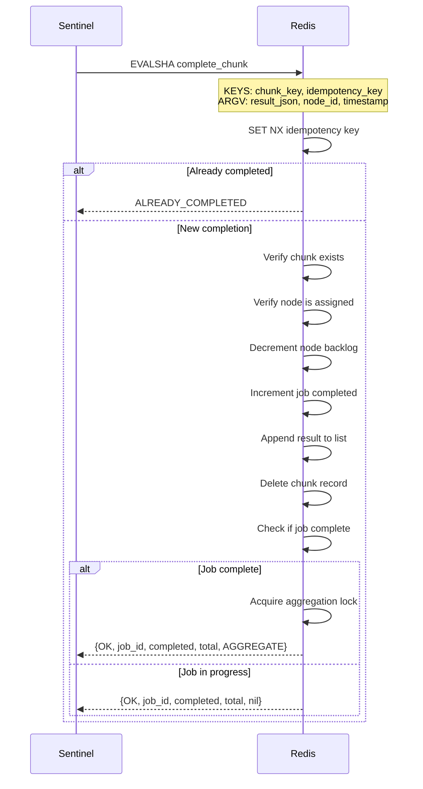
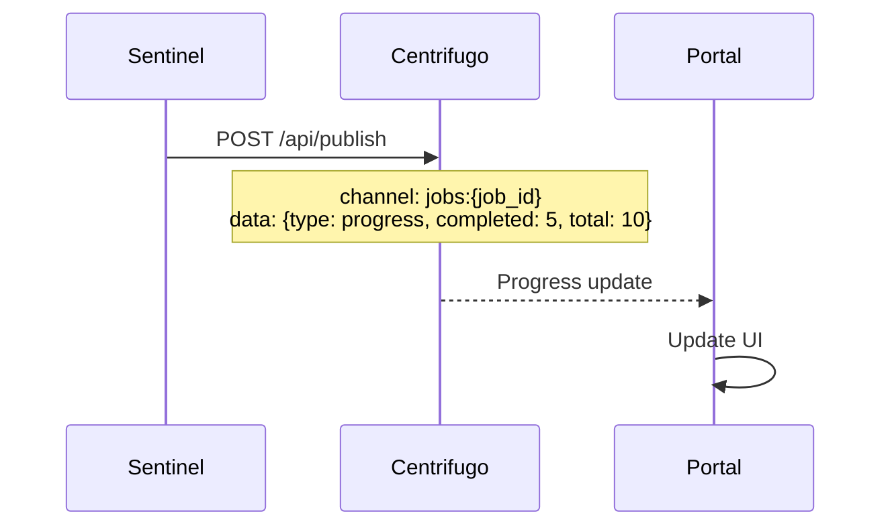
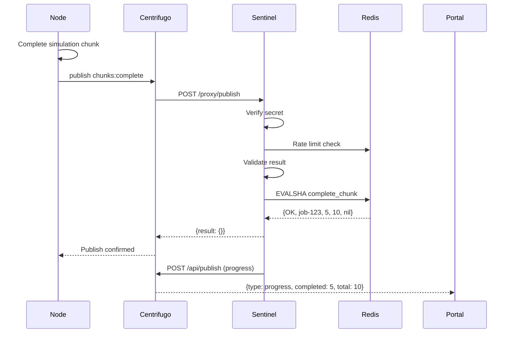

# Chunk Completion

This document covers how nodes submit chunk results and how Sentinel processes them.

## Overview



## Node Result Submission

### Building the Result



### Publishing



## Publish Proxy Processing

### 1. Secret Verification

```rust
fn verify_proxy_secret(req: &Request) -> Result<()> {
    let secret = req.headers()
        .get("X-Centrifugo-Proxy-Secret")
        .ok_or(AuthError::MissingSecret)?;

    if secret != env::var("CENTRIFUGO_PROXY_SECRET")? {
        return Err(AuthError::InvalidSecret);
    }
    Ok(())
}
```

### 2. Rate Limit Check



```lua
-- Atomic rate limit check
local count = redis.call('INCR', KEYS[1])
if count == 1 then
    redis.call('EXPIRE', KEYS[1], 2) -- 2 second window
end
return count
```

### 3. Result Validation



```rust
fn validate_result(result: &ChunkResult, expected_iterations: u64) -> Result<()> {
    if result.iterations != expected_iterations {
        return Err(ValidationError::IterationMismatch);
    }

    if result.mean_dps < 0.0 || result.mean_dps > 10_000_000.0 {
        return Err(ValidationError::DpsOutOfBounds);
    }

    if result.std_dps < 0.0 || result.std_dps > result.mean_dps * 2.0 {
        return Err(ValidationError::StdDevInvalid);
    }

    if result.min_dps > result.mean_dps || result.max_dps < result.mean_dps {
        return Err(ValidationError::MinMaxInvalid);
    }

    Ok(())
}
```

### 4. Lua Script Execution



## Response Handling

### Success

```json
{
  "result": {}
}
```

Centrifugo confirms the publish to the node.

### Errors

```mermaid
flowchart TD
    Error[Error Type] --> Already{Already<br/>Completed?}
    Already -->|Yes| Silent[Return success<br/>(idempotent)]

    Error --> NotFound{Chunk Not<br/>Found?}
    NotFound -->|Yes| Error4500[4500: Terminal error]

    Error --> WrongNode{Wrong<br/>Node?}
    WrongNode -->|Yes| Error4501[4501: Terminal error]

    Error --> RateLimit{Rate<br/>Limited?}
    RateLimit -->|Yes| Error4429[4429: Reconnectable]
```

| Error             | Code | Type          | Client Action      |
| ----------------- | ---- | ------------- | ------------------ |
| Already completed | -    | Success       | None (idempotent)  |
| Chunk not found   | 4500 | Terminal      | Don't retry        |
| Wrong node        | 4501 | Terminal      | Don't retry        |
| Rate limited      | 4429 | Reconnectable | Retry with backoff |

## Progress Publishing

After successful completion, Sentinel publishes progress:



## Complete Flow



## Retry Behavior

Node SDK should implement retry with exponential backoff:

```typescript
async publishChunkCompletion(chunkId: string, result: ChunkResult) {
    for (let attempt = 0; attempt < 5; attempt++) {
        try {
            await this.centrifuge.publish('chunks:complete', { chunkId, result });
            return; // Success
        } catch (error) {
            if (this.isRetryable(error)) {
                const baseDelay = Math.min(1000 * Math.pow(2, attempt), 30000);
                const jitter = Math.random() * baseDelay * 0.25;
                await sleep(baseDelay + jitter);
                continue;
            }
            throw error; // Non-retryable
        }
    }
    throw new Error('Max retries exceeded');
}

isRetryable(error: any): boolean {
    return error.code >= 500 || error.code === 429;
}
```
