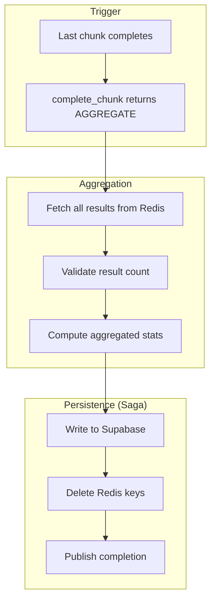
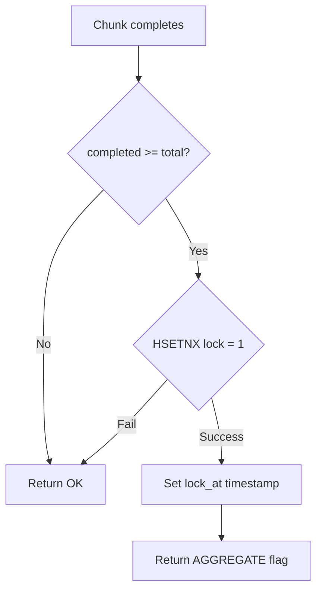
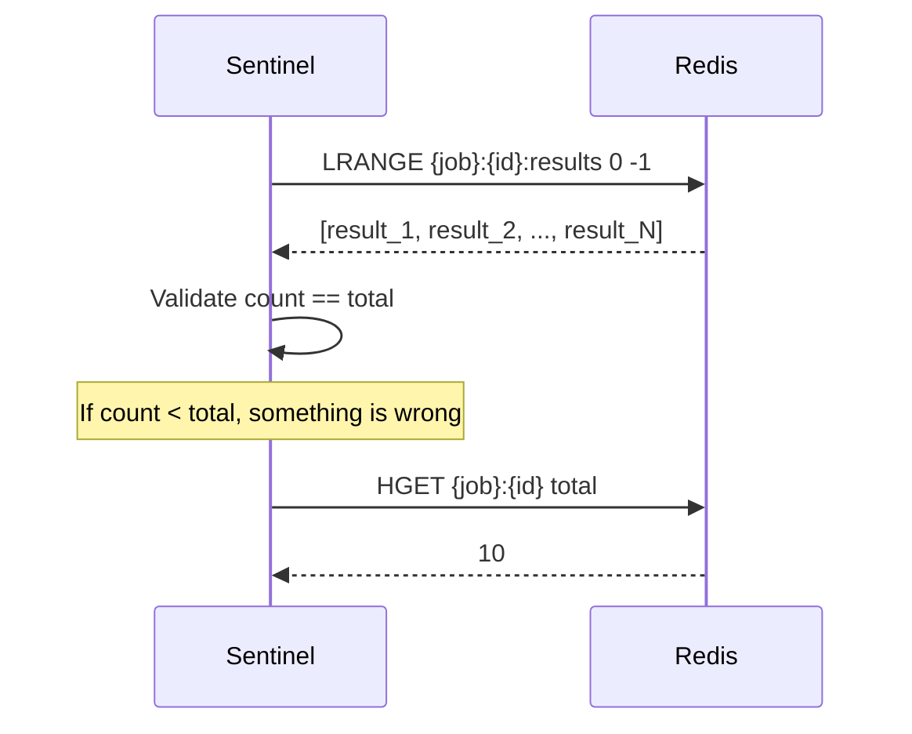
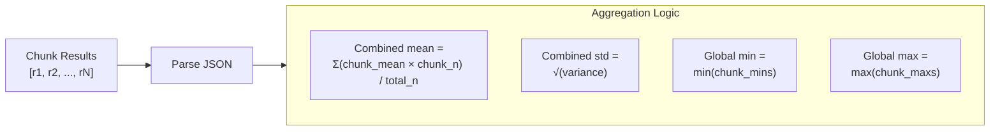
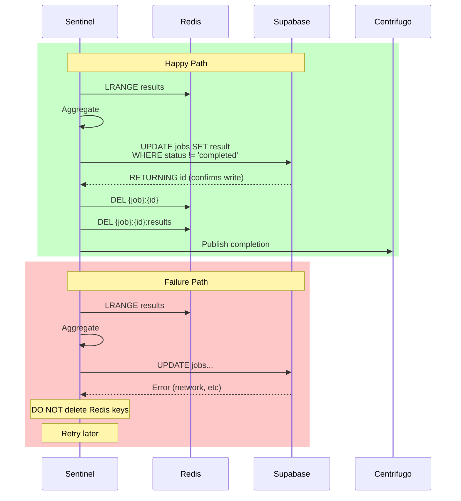
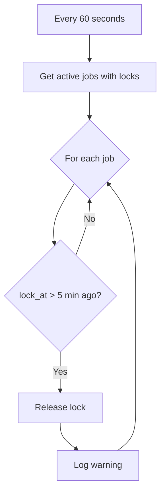
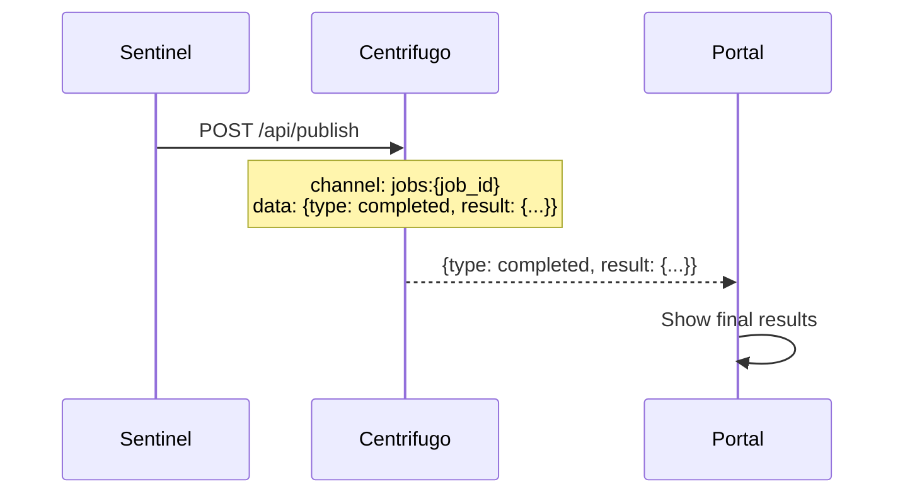
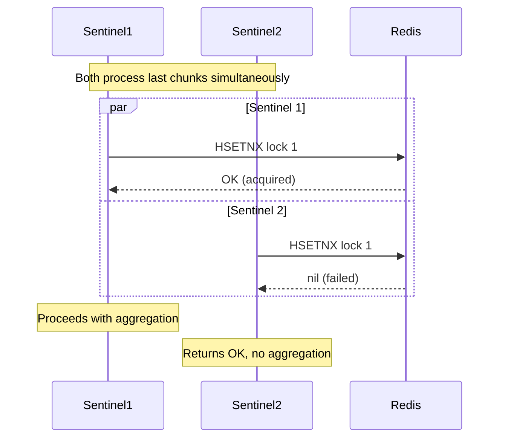

# Job Aggregation

When all chunks complete, Sentinel aggregates results and persists to Supabase using a saga pattern.

## Overview



## Aggregation Lock

The `complete_chunk.lua` script handles lock acquisition:



```lua
if completed >= total and total > 0 then
    local agg_lock = redis.call('HSETNX', job_key, 'lock', '1')
    if agg_lock == 1 then
        redis.call('HSET', job_key, 'lock_at', now)
        should_aggregate = true
    end
end
```

Only ONE sentinel gets the AGGREGATE flag, preventing duplicate aggregation.

## Fetching Results



## Computing Aggregated Stats



### Combining Means

```rust
fn combine_means(results: &[ChunkResult]) -> f64 {
    let total_iterations: u64 = results.iter().map(|r| r.iterations).sum();
    let weighted_sum: f64 = results.iter()
        .map(|r| r.mean_dps * r.iterations as f64)
        .sum();
    weighted_sum / total_iterations as f64
}
```

### Combining Standard Deviations

Using parallel variance combination formula:

```rust
fn combine_std_devs(results: &[ChunkResult], combined_mean: f64) -> f64 {
    let total_n: u64 = results.iter().map(|r| r.iterations).sum();

    // Sum of squared deviations within each chunk
    let within_variance: f64 = results.iter()
        .map(|r| r.std_dps.powi(2) * r.iterations as f64)
        .sum::<f64>() / total_n as f64;

    // Variance between chunk means
    let between_variance: f64 = results.iter()
        .map(|r| {
            let diff = r.mean_dps - combined_mean;
            diff.powi(2) * r.iterations as f64
        })
        .sum::<f64>() / total_n as f64;

    (within_variance + between_variance).sqrt()
}
```

## Saga Pattern

The saga ensures consistency between Redis and Supabase:



### Idempotent Write

```sql
UPDATE jobs
SET
    result = $1,
    status = 'completed',
    completed_at = now()
WHERE id = $2
  AND status != 'completed'
RETURNING id
```

The `WHERE status != 'completed'` ensures:

- Double-writes are safe
- RETURNING confirms the write actually happened

### Key Deletion Order

**Critical:** Only delete Redis keys AFTER Supabase confirms:

```rust
// 1. Write to Supabase
let result = supabase
    .from("jobs")
    .update(update_data)
    .eq("id", job_id)
    .neq("status", "completed")
    .single()
    .await;

match result {
    Ok(row) if row.is_some() => {
        // 2. Only NOW delete Redis keys
        redis.del(&format!("{{job}}:{}:results", job_id)).await?;
        redis.del(&format!("{{job}}:{}", job_id)).await?;

        // 3. Publish completion
        centrifugo.publish(&format!("jobs:{}", job_id), completion_msg).await?;
    }
    Ok(_) => {
        // Row not returned = already completed by another process
        // Safe to delete Redis keys
    }
    Err(e) => {
        // Keep Redis data for retry
        log::error!("Supabase write failed: {}", e);
    }
}
```

## Stuck Lock Recovery

Background task checks for stuck aggregation locks:



```rust
// Check for stuck aggregation locks every 60 seconds
for job_id in active_jobs {
    let lock_at: Option<i64> = redis.hget(&job_key, "lock_at").await?;
    if let Some(lock_time) = lock_at {
        if now - lock_time > 300 { // 5 minutes
            redis.hdel(&job_key, &["lock", "lock_at"]).await?;
            log::warn!("Released stuck aggregation lock for job {}", job_id);
        }
    }
}
```

## Completion Message



```json
{
  "type": "completed",
  "result": {
    "meanDps": 12500.5,
    "stdDps": 250.3,
    "minDps": 11800.0,
    "maxDps": 13200.0,
    "totalIterations": 10000
  }
}
```

## Race Condition Handling

### Multiple Sentinels Detect Completion



Only ONE sentinel wins the lock race. The others see their chunk completion succeed but don't aggregate.
