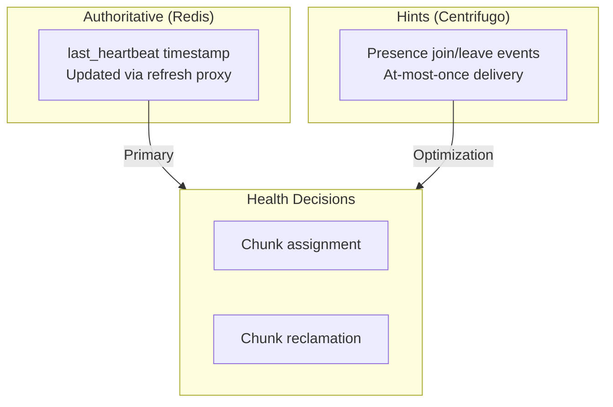
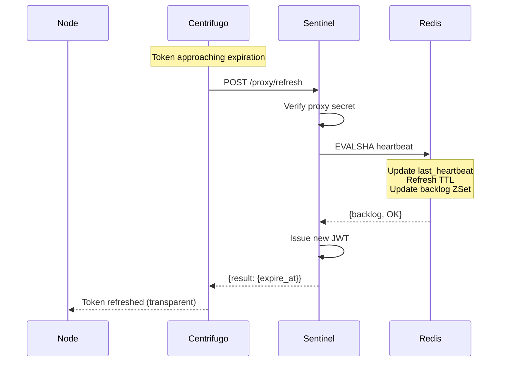
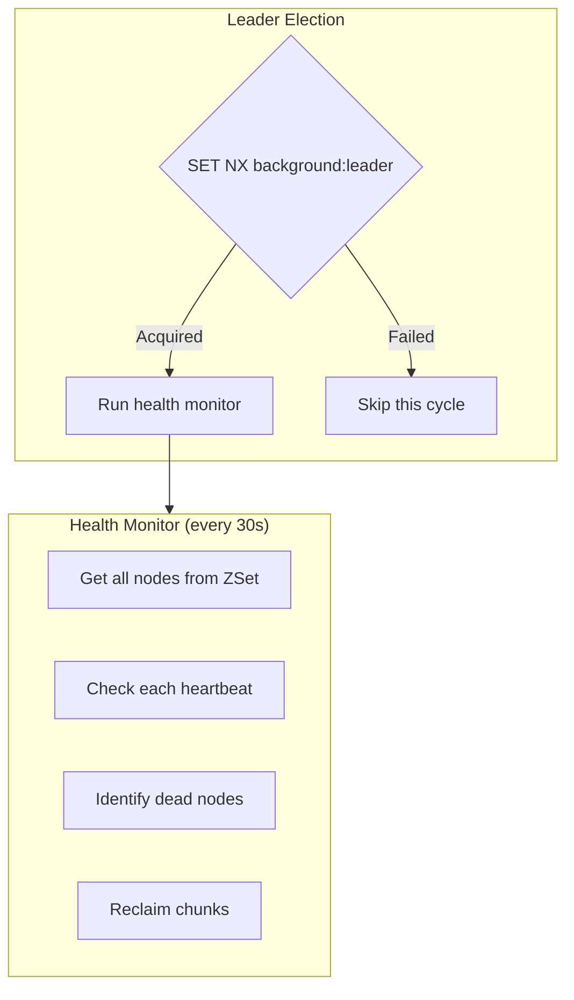
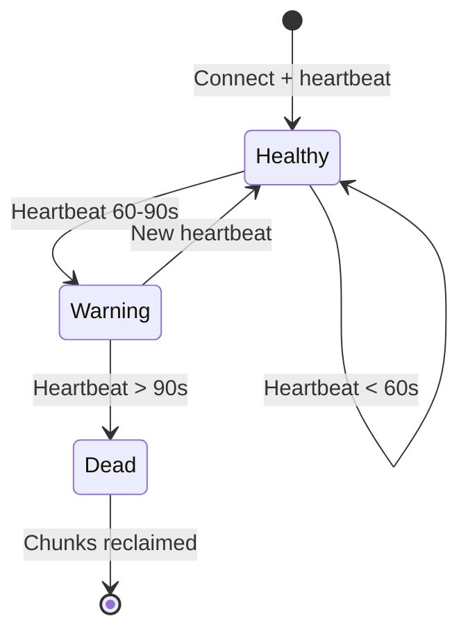
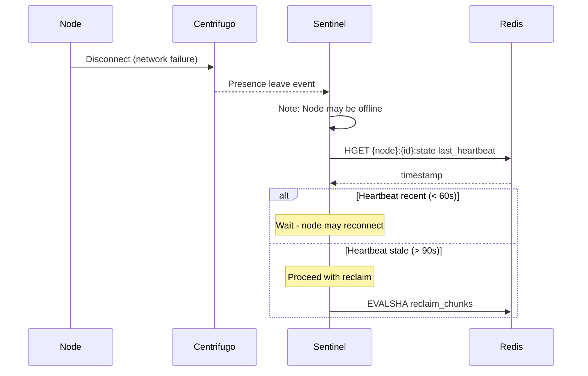
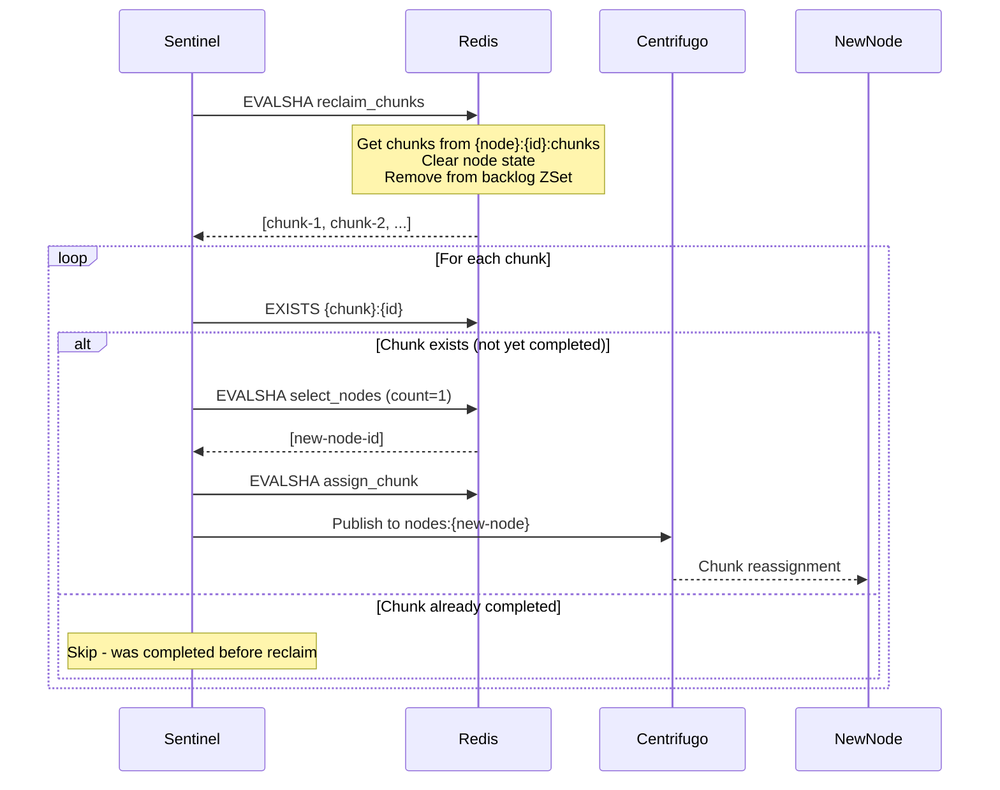
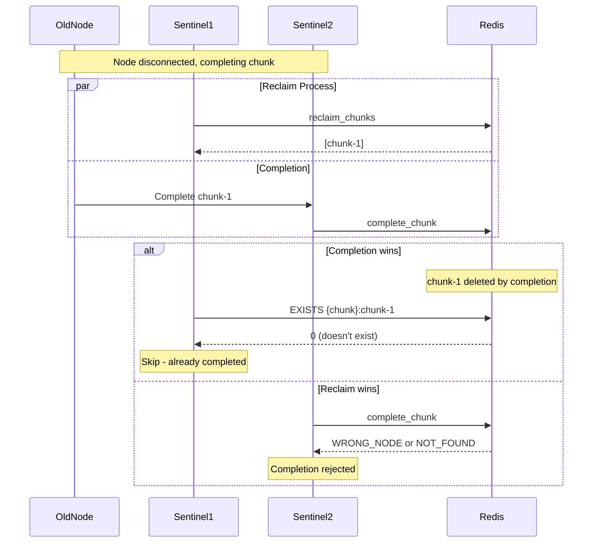
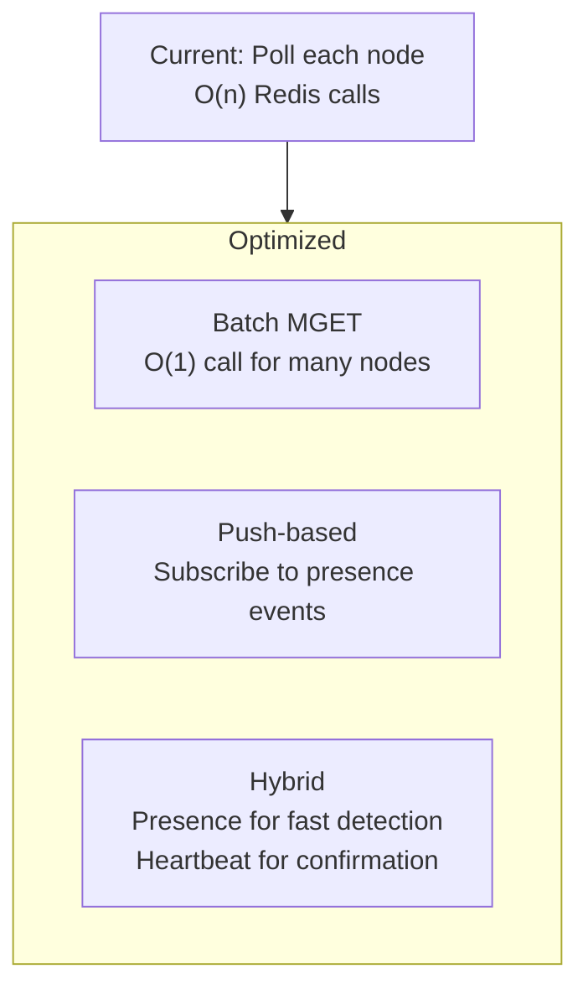

# Health Monitoring

Node health is tracked through heartbeats, with presence events as optimization hints.

## Health Sources



## Heartbeat Flow

Heartbeats happen automatically via Centrifugo's refresh mechanism:



### Heartbeat Lua Script

```lua
-- KEYS[1] = {node}:{node_id}:state
-- KEYS[2] = {node}:backlog:sorted

redis.call('HSET', KEYS[1], 'last_heartbeat', now)
redis.call('EXPIRE', KEYS[1], 7200) -- 2h TTL

-- Ensure node is in backlog ZSet
redis.call('HSETNX', KEYS[1], 'backlog', 0)
local backlog = redis.call('HGET', KEYS[1], 'backlog')
redis.call('ZADD', KEYS[2], backlog, node_id)
```

## Background Health Monitor

A single leader sentinel runs health monitoring:



```rust
// Leader election
let acquired = redis.set_nx_ex("background:leader", instance_id, 30).await?;
if !acquired {
    return Ok(()); // Another instance is leader
}

// Run health checks
loop {
    check_node_health().await?;
    recover_stuck_locks().await?;

    // Refresh leader lease
    redis.expire("background:leader", 30).await?;
    sleep(Duration::from_secs(10)).await;
}
```

## Node Health States



| State   | Heartbeat Age | Action                  |
| ------- | ------------- | ----------------------- |
| Healthy | < 60s         | Eligible for new chunks |
| Warning | 60-90s        | No new chunks, monitor  |
| Dead    | > 90s         | Reclaim all chunks      |

## Presence as Optimization

Presence events can accelerate disconnect detection:



**Important:** Never trust presence alone. Always verify with heartbeat timestamp.

## Chunk Reclamation



### Reclaim Lua Script

```lua
-- KEYS[1] = {node}:{node_id}:state
-- KEYS[2] = {node}:{node_id}:chunks
-- KEYS[3] = {node}:backlog:sorted

local chunks = redis.call('SMEMBERS', KEYS[2])

redis.call('DEL', KEYS[1])
redis.call('DEL', KEYS[2])
redis.call('ZREM', KEYS[3], node_id)

return chunks
```

## Race Condition: Completion vs Reclaim



Both outcomes are correct:

- If completion wins: chunk is done, no reassignment needed
- If reclaim wins: old node's late completion is rejected, new node completes it

## Scalability Considerations

At scale (1000+ nodes), optimize health checks:



### Batch Heartbeat Check

```rust
// Instead of N HGET calls:
let keys: Vec<String> = node_ids.iter()
    .map(|id| format!("{{node}}:{}:state", id))
    .collect();

let heartbeats: Vec<Option<i64>> = redis.mget(&keys).await?;

for (node_id, last_hb) in node_ids.iter().zip(heartbeats) {
    if let Some(hb) = last_hb {
        if now - hb > 90 {
            dead_nodes.push(node_id);
        }
    }
}
```
