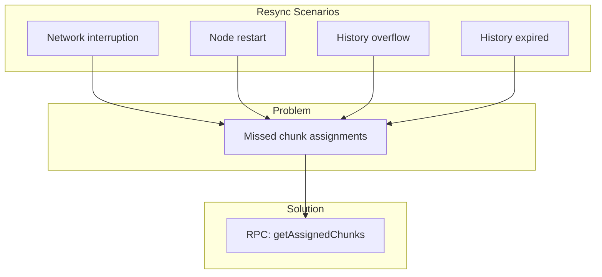
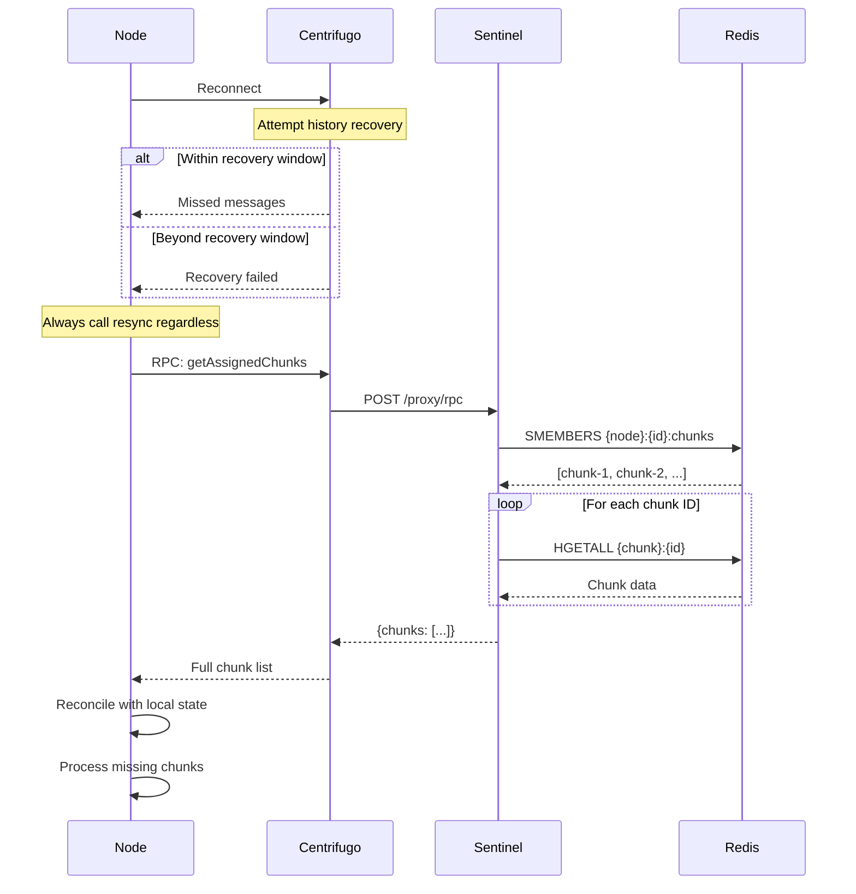
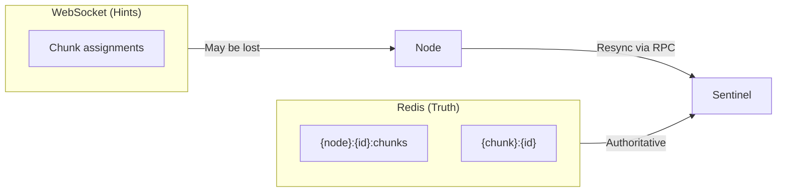
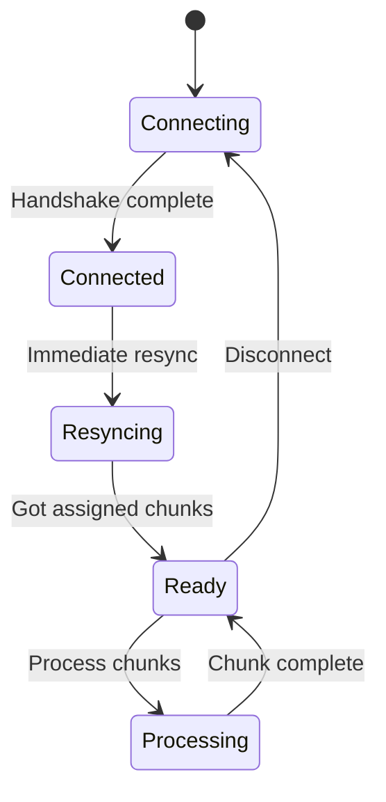
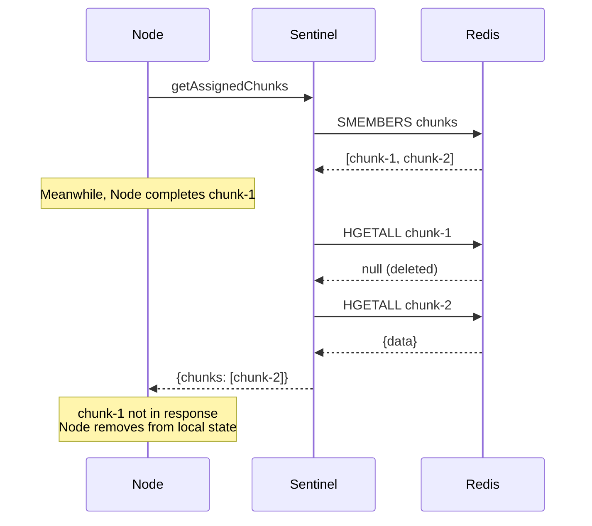
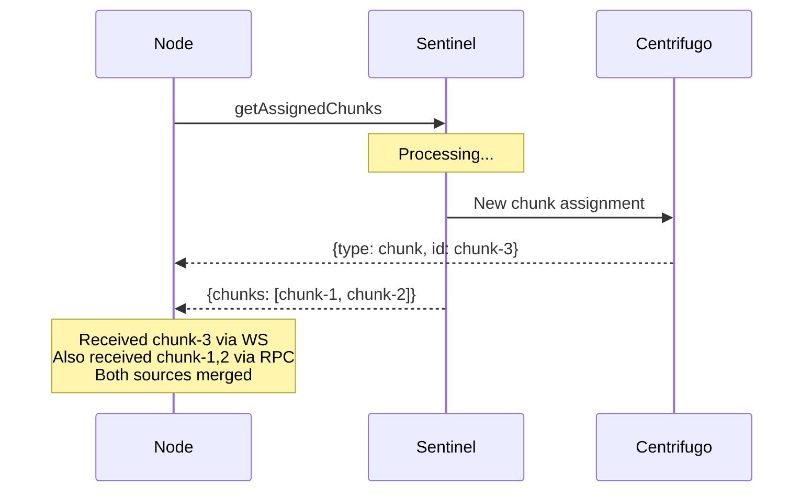

# Node Resync

When nodes reconnect, they must resynchronize to recover any missed chunk assignments.

## Why Resync?



## Centrifugo Recovery Limits

Centrifugo maintains limited message history:

| Namespace | history_size | history_ttl |
| --------- | ------------ | ----------- |
| nodes     | 10           | 60s         |

If a node:

- Misses more than 10 messages, OR
- Is offline for more than 60 seconds

...it cannot recover via Centrifugo history alone.

## Resync Flow



## RPC Handler

```rust
async fn handle_get_assigned_chunks(node_id: &str) -> Result<Vec<ChunkAssignment>> {
    // Get all chunk IDs assigned to this node
    let chunk_ids: Vec<String> = redis
        .smembers(&format!("{{node}}:{}:chunks", node_id))
        .await?;

    let mut chunks = Vec::new();

    for chunk_id in chunk_ids {
        // Get chunk details
        let chunk_data: Option<HashMap<String, String>> = redis
            .hgetall(&format!("{{chunk}}:{}", chunk_id))
            .await?;

        if let Some(data) = chunk_data {
            chunks.push(ChunkAssignment {
                id: chunk_id,
                job_id: data.get("job_id").unwrap().clone(),
                iterations: data.get("iterations").unwrap().parse().unwrap(),
                config_hash: data.get("config_hash").unwrap().clone(),
                seed_offset: data.get("seed_offset").unwrap().parse().unwrap(),
            });
        }
        // If chunk doesn't exist, it was already completed - skip
    }

    Ok(chunks)
}
```

## Node Client Implementation

```typescript
class NodeClient {
  private assignedChunks: Map<string, ChunkAssignment> = new Map();
  private processingChunks: Set<string> = new Set();

  async onConnect() {
    // Always resync on connect, not just reconnect
    await this.resync();
  }

  async resync() {
    const response = await this.centrifuge.rpc("getAssignedChunks", {});
    const serverChunks = response.data.chunks;

    // Find chunks we don't know about
    for (const chunk of serverChunks) {
      if (
        !this.assignedChunks.has(chunk.id) &&
        !this.processingChunks.has(chunk.id)
      ) {
        // New chunk we missed
        this.assignedChunks.set(chunk.id, chunk);
        this.processChunk(chunk);
      }
    }

    // Find chunks we have that server doesn't (already completed/reclaimed)
    const serverChunkIds = new Set(serverChunks.map((c) => c.id));
    for (const [id, chunk] of this.assignedChunks) {
      if (!serverChunkIds.has(id)) {
        // Chunk no longer assigned to us - was reclaimed or completed
        this.assignedChunks.delete(id);
      }
    }
  }

  onMessage(message: any) {
    if (message.type === "chunk") {
      this.assignedChunks.set(message.id, message);
      this.processChunk(message);
    }
  }
}
```

## Design Principles

### WebSocket Messages Are Hints



### Always Resync on Connect



Don't wait for recovery failure - always resync to ensure consistency.

## Edge Cases

### Chunk Completed During Resync



### Chunk Reclaimed During Resync

Same behavior - if chunk was reclaimed to another node, it won't appear in the response.

### New Chunk During Resync



Node should handle receiving assignments from both sources and deduplicate.

## Connection Best Practices

```typescript
const centrifuge = new Centrifuge(
  "wss://beacon.wowlab.gg/connection/websocket",
  {
    token: jwt,
  },
);

centrifuge.on("connected", async () => {
  console.log("Connected to beacon");
  await resync(); // Always resync
});

centrifuge.on("disconnected", (ctx) => {
  console.log("Disconnected:", ctx.reason);
  // Will auto-reconnect based on config
});

// Handle both real-time and resync sources
centrifuge.on("publication", (ctx) => {
  if (ctx.channel.startsWith("nodes:")) {
    handleNodeMessage(ctx.data);
  }
});

centrifuge.connect();
```
