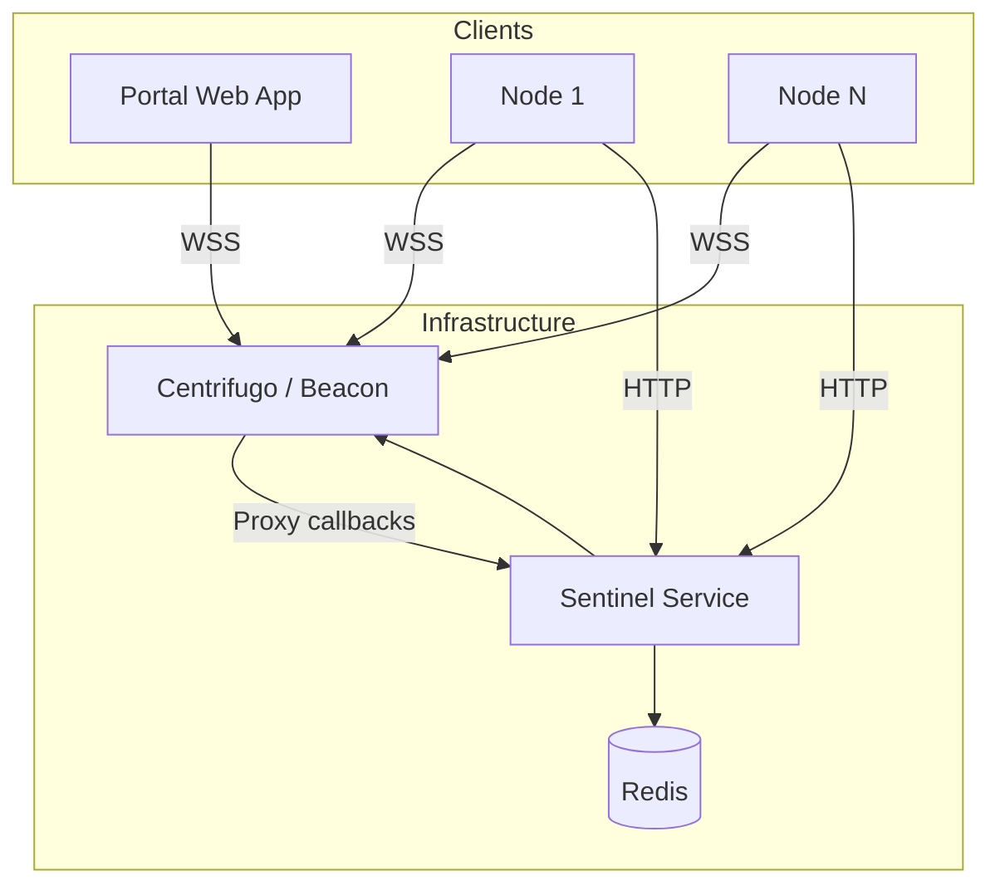

# Realtime Infrastructure

WowLab's realtime infrastructure enables thousands of compute nodes to process simulation chunks while providing instant progress updates to users.

## Connection Architecture

## Channel Structure

<Cite id="centrifugo2024">Centrifugo</Cite> organizes communication through
channels:

| Channel Pattern | Purpose                | Subscribers                 |
| --------------- | ---------------------- | --------------------------- |
| `job:{id}`      | Job progress updates   | Portal clients watching job |
| `node:{id}`     | Node-specific commands | Single compute node         |
| `broadcast`     | System announcements   | All connected clients       |

## Message Flow

Lorem ipsum dolor sit amet, consectetur adipiscing elit. Sed do eiusmod tempor incididunt ut labore et dolore magna aliqua.

### Progress Updates

1. Node completes chunk processing
2. Node publishes progress to `job:{id}` channel
3. Centrifugo delivers to all subscribers
4. Portal updates progress UI in realtime

### Job Assignment

1. Sentinel detects available node via heartbeat
2. Sentinel publishes chunk assignment to `node:{id}`
3. Node receives assignment and begins processing
4. Node acknowledges receipt via HTTP callback

## Scaling Considerations

Lorem ipsum dolor sit amet, consectetur adipiscing elit. Duis aute irure dolor in reprehenderit in voluptate velit esse cillum dolore eu fugiat nulla pariatur.

<CardGrid>
  <Card title="Horizontal Scaling">
    Centrifugo instances share state via Redis. Add instances behind load
    balancer.
  </Card>
  <Card title="Connection Limits">
    Each Centrifugo instance handles ~100k concurrent connections.
  </Card>
</CardGrid>
