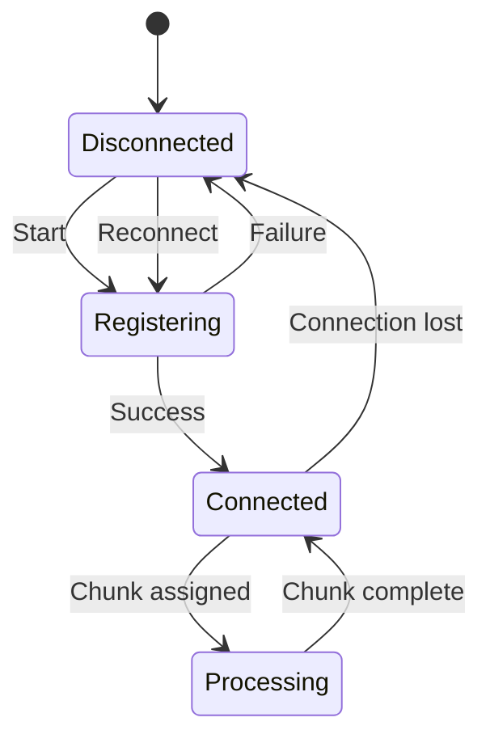

# Node Protocol

Compute nodes communicate with the infrastructure using a combination of HTTP and <Cite id="websocket">WebSocket</Cite> protocols.

## Authentication Flow

Nodes authenticate using <Cite id="ed25519">Ed25519 signatures</Cite>:

<Steps>
  <Step step={1} title="Key Generation">
    Node generates Ed25519 keypair on first run. Private key stored locally.
  </Step>
  <Step step={2} title="Registration">
    Node sends public key to Sentinel via HTTP POST.
  </Step>
  <Step step={3} title="Token Acquisition">
    Sentinel returns signed JWT for Centrifugo connection.
  </Step>
  <Step step={4} title="Connection">
    Node connects to Centrifugo with JWT, subscribes to node channel.
  </Step>
</Steps>

## HTTP Endpoints

| Endpoint          | Method | Purpose                   |
| ----------------- | ------ | ------------------------- |
| `/register`       | POST   | Initial node registration |
| `/token`          | POST   | Refresh Centrifugo JWT    |
| `/heartbeat`      | POST   | Health check with metrics |
| `/chunk/complete` | POST   | Report chunk completion   |

## Message Types

Lorem ipsum dolor sit amet, consectetur adipiscing elit. Sed do eiusmod tempor incididunt ut labore et dolore magna aliqua.

### Inbound (to Node)

```json
{
  "type": "chunk_assign",
  "job_id": "uuid",
  "chunk_id": 42,
  "config": { ... },
  "iterations": 1000
}
```

### Outbound (from Node)

```json
{
  "type": "chunk_progress",
  "job_id": "uuid",
  "chunk_id": 42,
  "completed": 500,
  "total": 1000
}
```

## Error Handling

Lorem ipsum dolor sit amet, consectetur adipiscing elit. Ut enim ad minim veniam, quis nostrud exercitation ullamco laboris.

<Alert title="Retry Policy">
  Nodes retry failed HTTP requests with exponential backoff. Maximum 5 retries
  with 30 second cap.
</Alert>

## Connection Lifecycle


