# Failure Scenarios

This document covers realistic failure scenarios and how the system recovers.

## Failure Categories

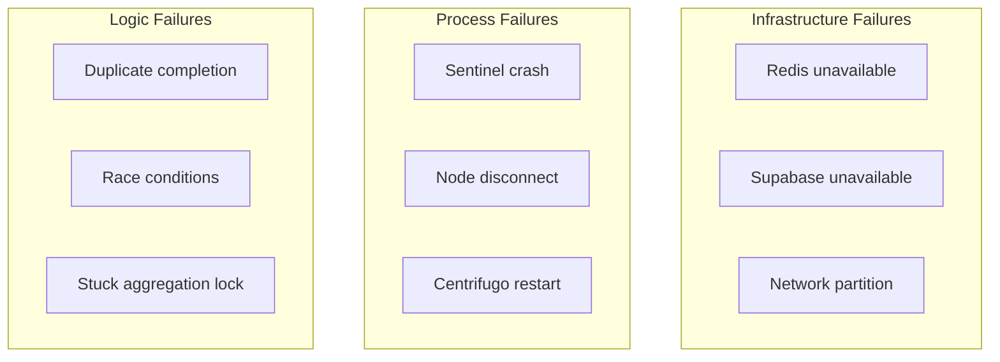

## Sentinel Instance Dies Mid-Request

**Scenario:** Publish proxy request in flight, sentinel crashes.

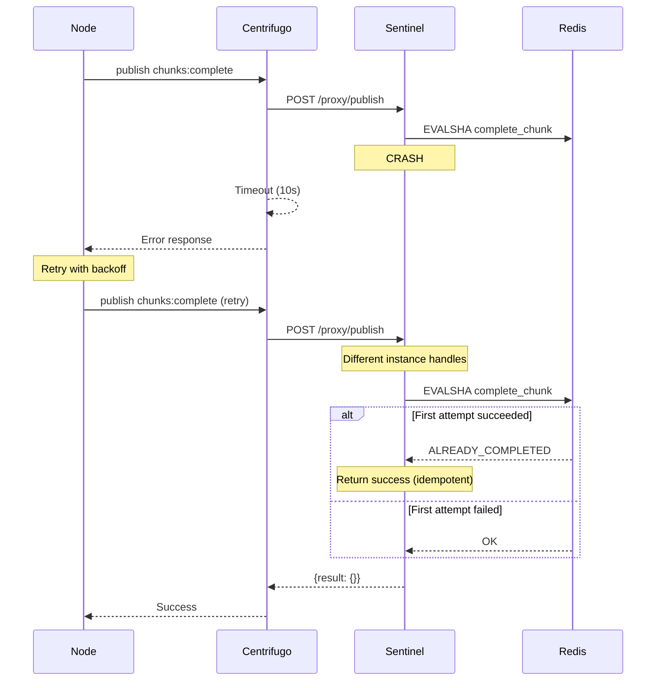

**Recovery:**

- Idempotency key prevents double-counting if first request partially succeeded
- If chunk completion never happened, retry succeeds on another sentinel
- Node SDK implements exponential backoff with jitter

## Redis Temporarily Unavailable

**Scenario:** Redis down for 30 seconds.

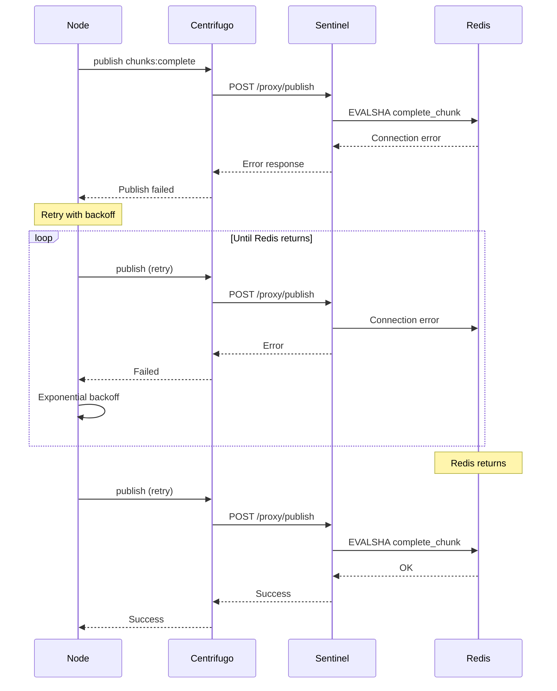

**Impact during outage:**

- All sentinel operations fail
- Centrifugo returns errors to all proxy requests
- Nodes see publish failures, retry with backoff
- Portal sees stale progress (no updates published)

**Recovery:**

- When Redis returns, retries succeed
- No data loss (nothing was committed during outage)
- Progress catches up quickly

## Node Disconnects Mid-Chunk

**Scenario:** Node working on chunk, network dies.

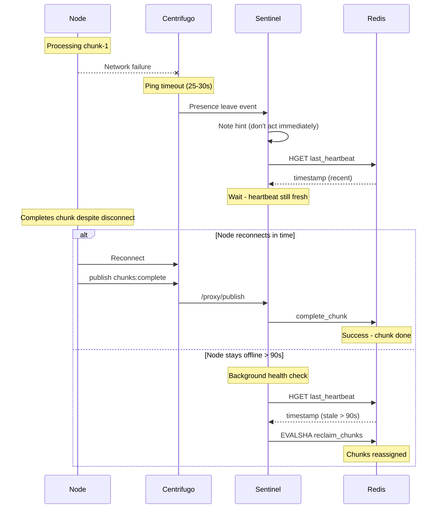

**Race condition handled:**

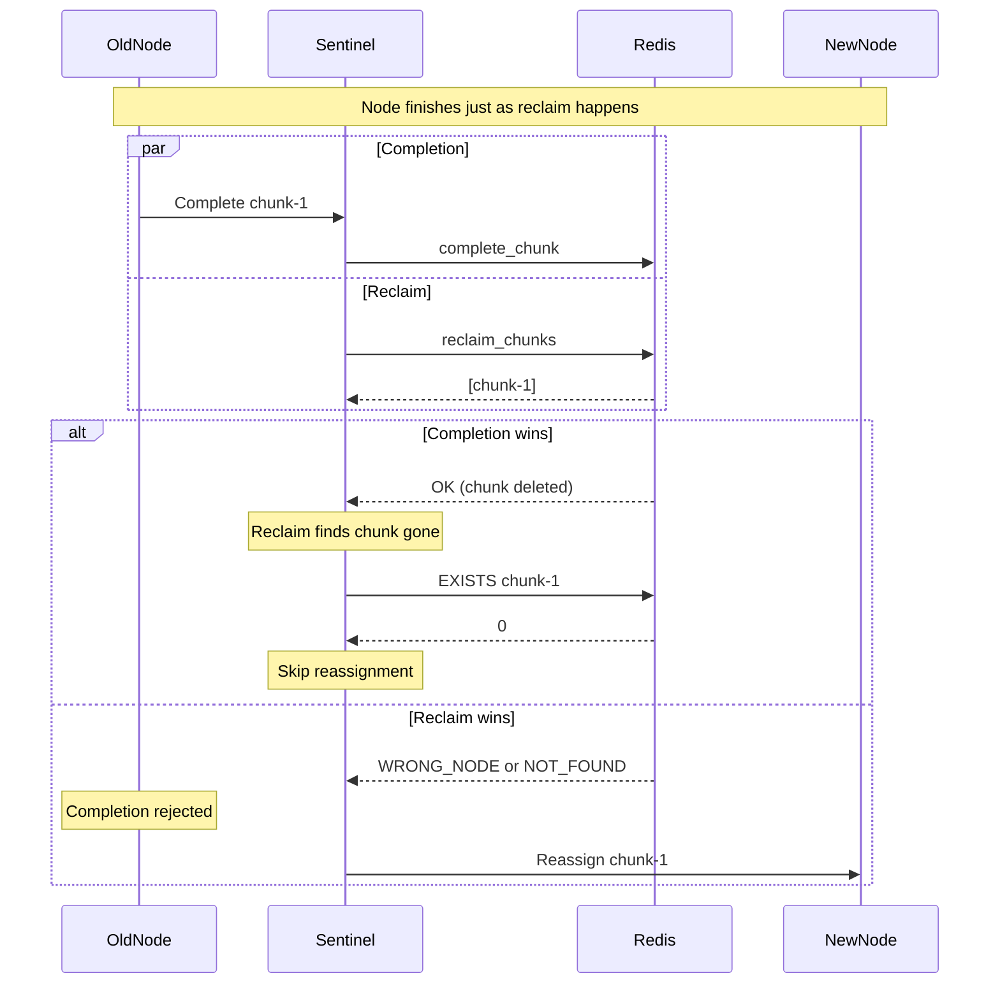

## Duplicate Chunk Completion

### Scenario 1: Network retry

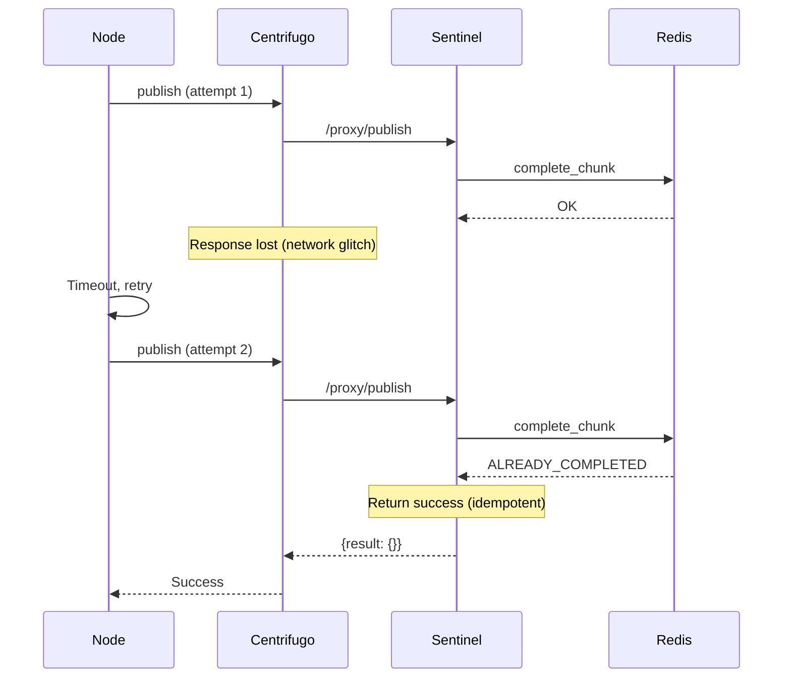

### Scenario 2: Reclaimed chunk, both nodes complete

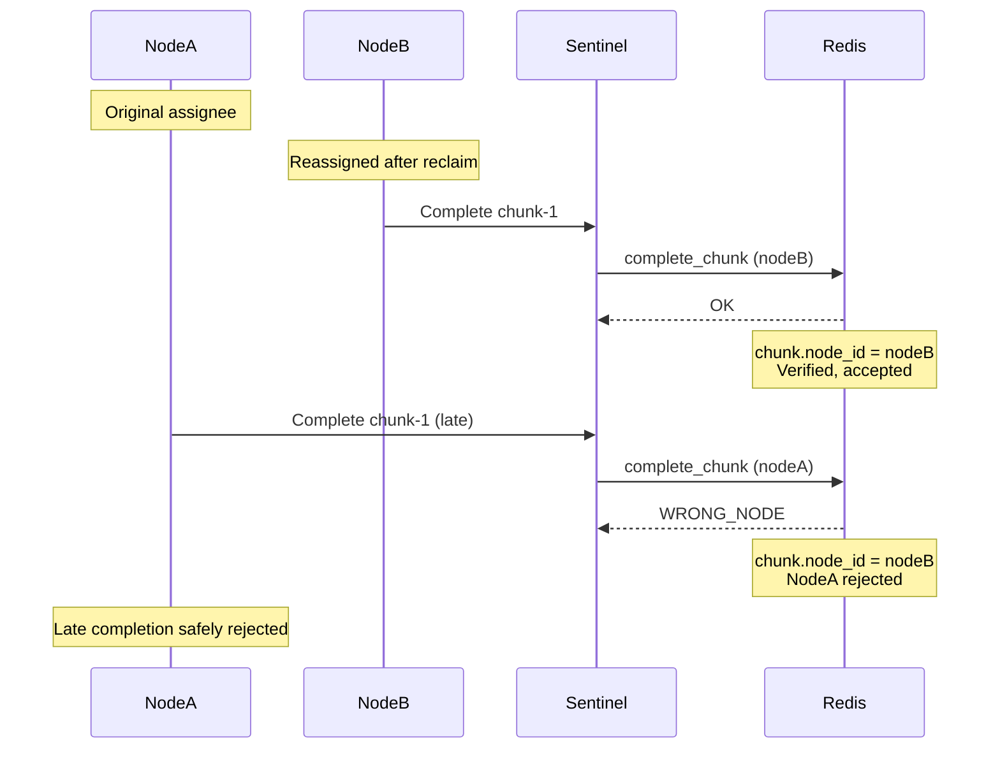

## Job Takes Longer Than Expected

**Scenario:** Job runs for 20 hours (complex simulation).

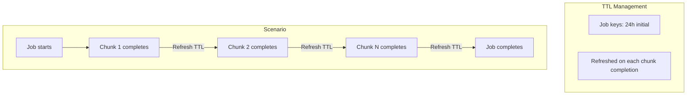

- Job keys have 24h TTL
- Each chunk completion refreshes TTL
- As long as chunks keep completing, job stays alive
- If no completions for 24h, job data expires (job was abandoned)

## Supabase Write Fails During Aggregation

**Scenario:** Network error writing final result to Supabase.

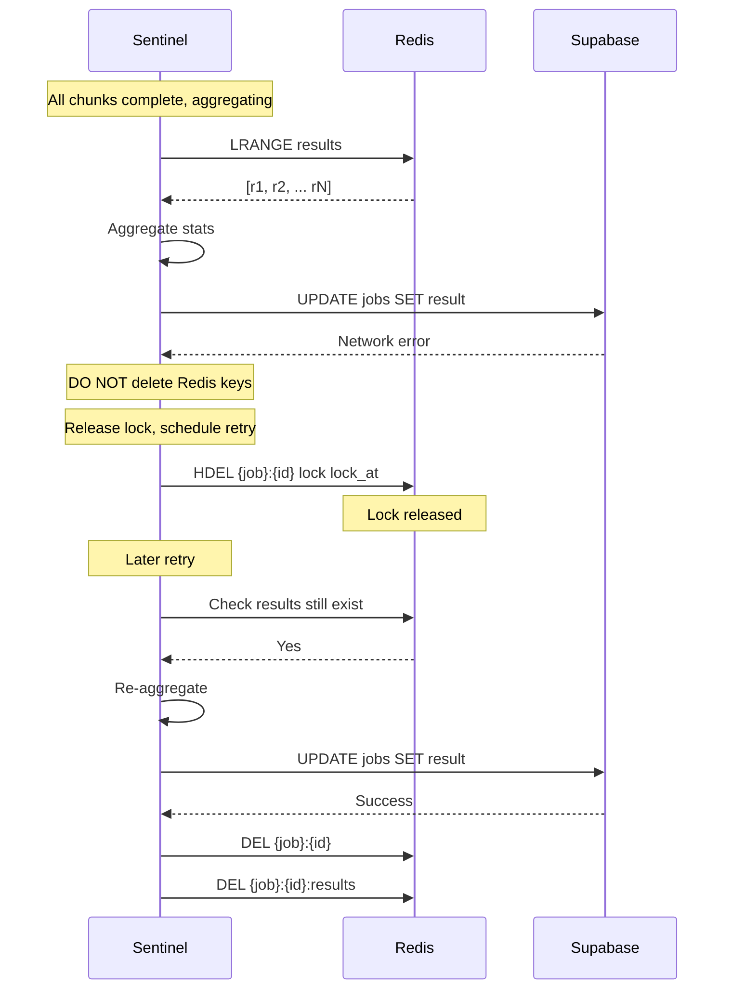

**Critical:** Only delete Redis keys AFTER Supabase confirms the write.

## Multiple Sentinels Detect Job Completion

**Scenario:** Two chunks complete simultaneously, both see `completed == total`.

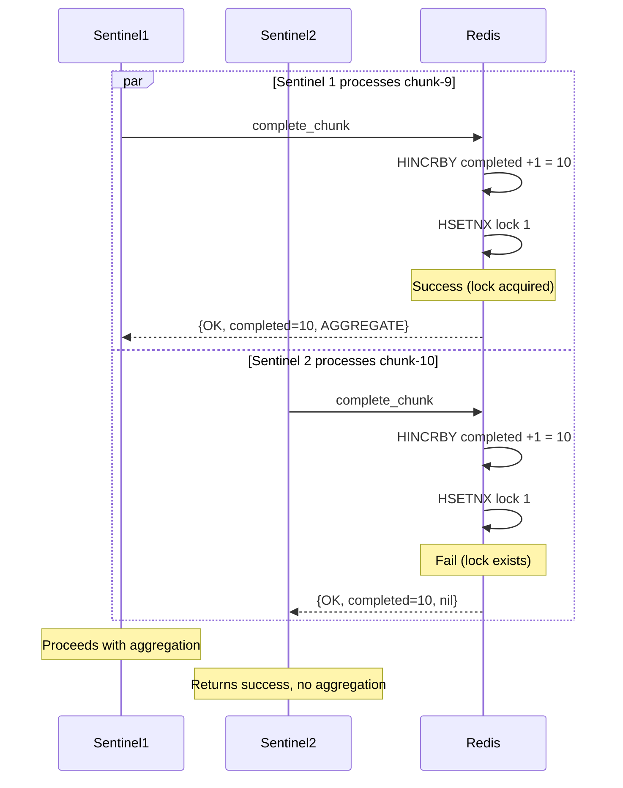

The lock is acquired atomically via `HSETNX` - only one wins.

## Aggregation Lock Gets Stuck

**Scenario:** Sentinel acquires aggregation lock, then crashes before completing.

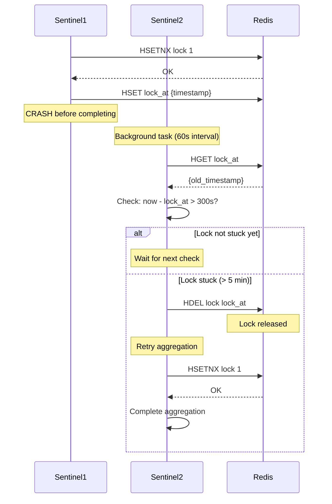

## Recovery Summary

| Failure               | Recovery Mechanism                 |
| --------------------- | ---------------------------------- |
| Sentinel crash        | Stateless - any instance continues |
| Redis unavailable     | Retry with backoff, no data loss   |
| Node disconnect       | Heartbeat-based reclamation        |
| Duplicate completion  | Idempotency keys                   |
| Supabase write fail   | Keep Redis data, retry             |
| Concurrent completion | Redis atomic lock                  |
| Stuck lock            | Background cleanup                 |
