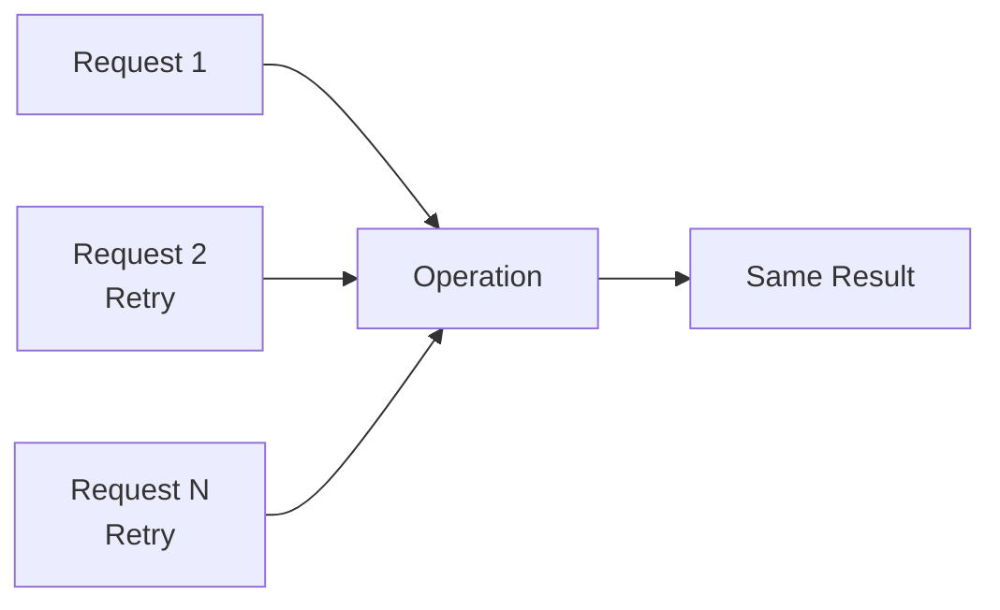
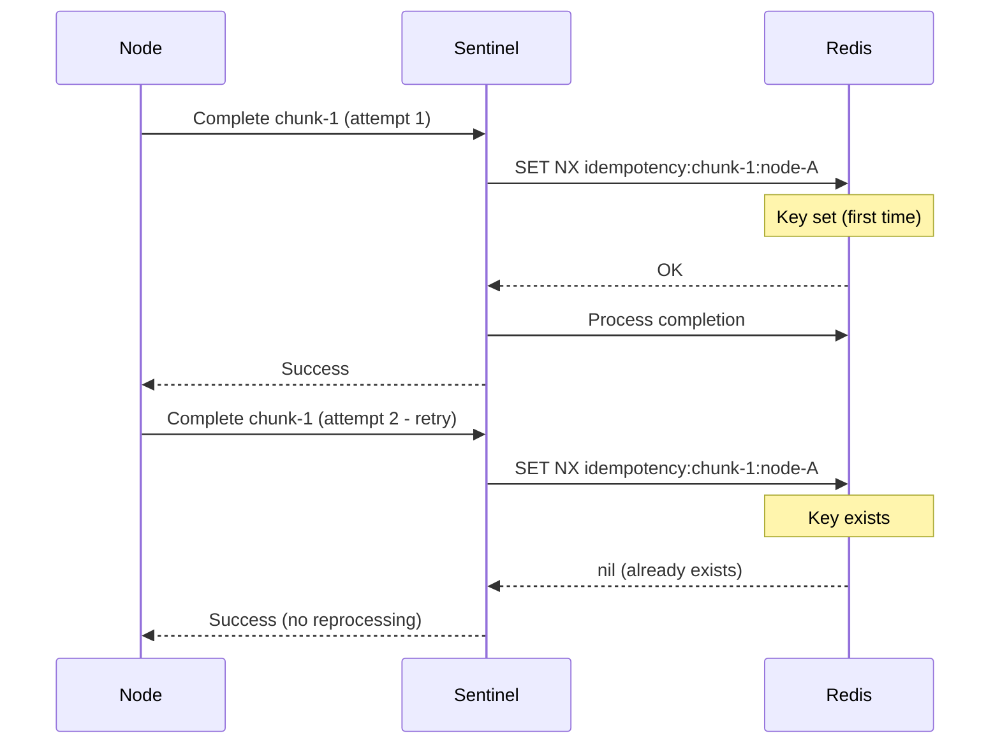
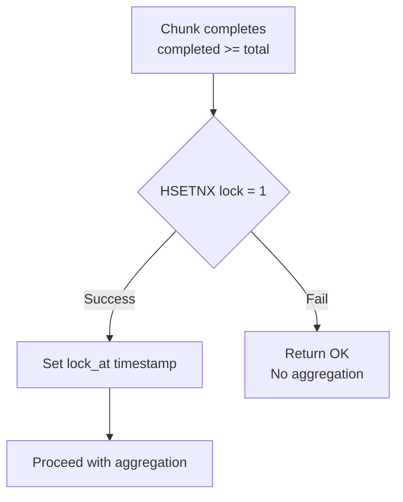
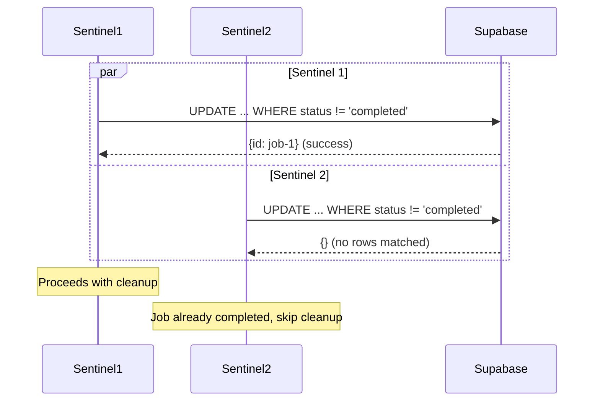
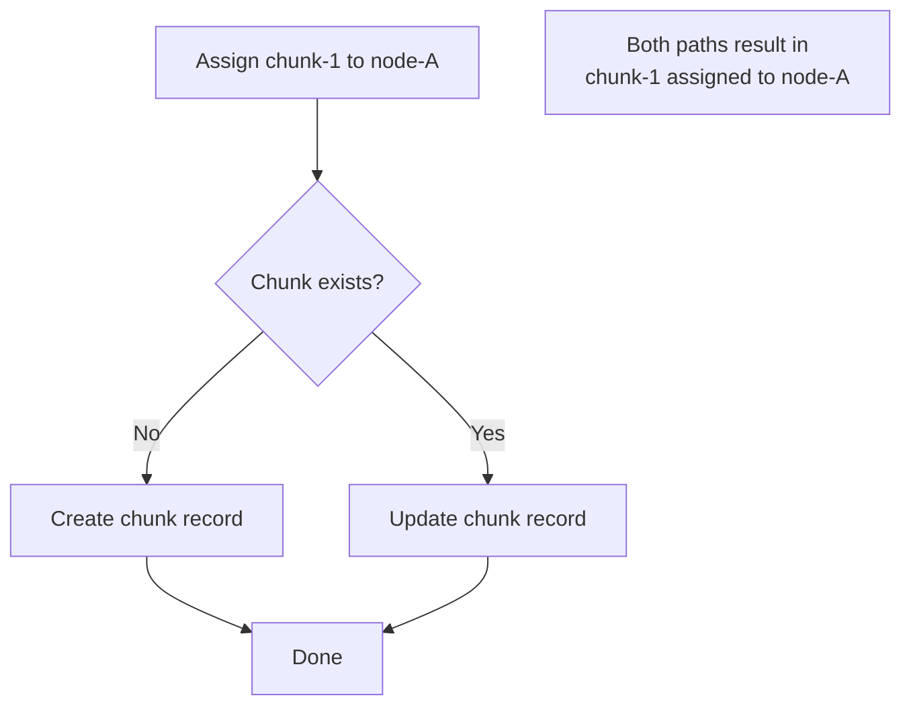
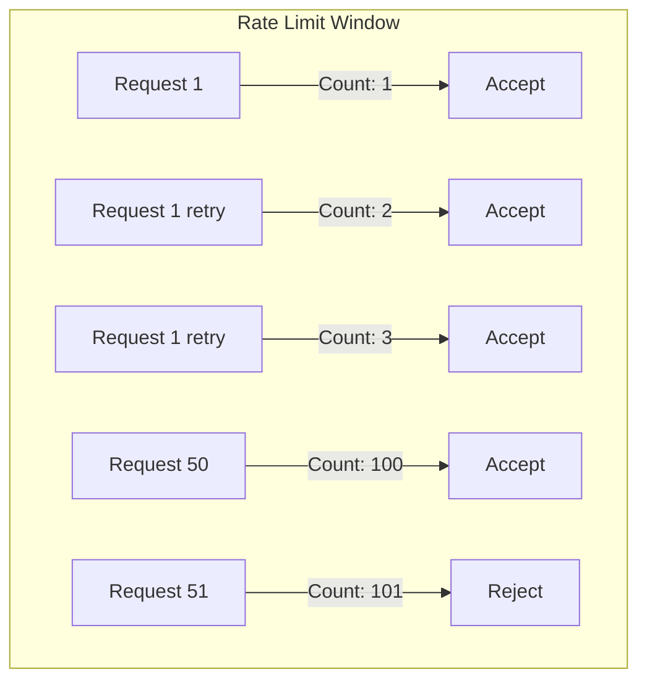

# Idempotency

Every operation in the system must be safe to retry. This document covers the idempotency patterns used.

## Idempotency Principle



An operation is idempotent if executing it multiple times produces the same result as executing it once.

## Chunk Completion Idempotency

The most critical idempotency pattern prevents double-counting chunk results.

### Idempotency Key Pattern



### Lua Script Implementation

```lua
-- CRITICAL: Acquire idempotency lock FIRST using SET NX
-- This prevents partial work if script errors midway
local lock_acquired = redis.call('SET', idempotency_key, '1', 'NX', 'EX', 600)
if not lock_acquired then
    return {'ALREADY_COMPLETED', nil, nil, nil}
end

-- Only proceed if we acquired the lock
-- ... rest of completion logic
```

### Key Characteristics

| Property     | Value                        | Purpose                    |
| ------------ | ---------------------------- | -------------------------- |
| Key format   | `idempotency:{chunk}:{node}` | Unique per chunk-node pair |
| TTL          | 10 minutes                   | Covers retry window        |
| Check timing | Before any state changes     | Prevents partial work      |

## Job Aggregation Idempotency

Aggregation uses Redis atomic operations and Supabase conditional updates.

### Lock Acquisition



`HSETNX` is atomic - only one sentinel can acquire the lock.

### Supabase Write

```sql
UPDATE jobs
SET result = $1, status = 'completed', completed_at = now()
WHERE id = $2 AND status != 'completed'
RETURNING id
```

The `WHERE status != 'completed'` ensures:

- First write succeeds and returns the row
- Subsequent writes match zero rows
- Safe for concurrent attempts



## Chunk Assignment Idempotency

Chunk assignments are inherently safe to retry:



The chunk record is either created or updated - result is the same.

## Node Registration Idempotency

Registration uses public key as natural idempotency key:

```sql
INSERT INTO nodes (pubkey, pubkey_hash, name, created_at)
VALUES ($1, $2, $3, now())
ON CONFLICT (pubkey_hash) DO NOTHING
RETURNING id, claim_code
```

- First registration: Creates node, returns ID
- Retry: Conflict detected, returns existing data

## Heartbeat Idempotency

Heartbeats are naturally idempotent:

```lua
-- Setting timestamp is idempotent
redis.call('HSET', node_state_key, 'last_heartbeat', now)

-- HSETNX for backlog initialization is idempotent
redis.call('HSETNX', node_state_key, 'backlog', 0)

-- ZADD with same score is idempotent
redis.call('ZADD', backlog_zset, backlog, node_id)
```

Multiple heartbeats just update the same timestamp.

## Rate Limiting Considerations

Rate limits must allow for retries:



The 100/second limit is high enough that normal retries don't trigger it, but abuse is still prevented.

## Idempotency Key Cleanup

Keys auto-expire via TTL:

```mermaid
gantt
    title Idempotency Key Lifecycle
    dateFormat X
    axisFormat %s

    section Key Lifecycle
    Created (retry window)     :0, 600
    Expired (auto-cleanup)     :600, 601
```



No manual cleanup needed - Redis handles expiration.

## Testing Idempotency

Every idempotent operation should pass these tests:

```rust
#[test]
fn test_chunk_completion_idempotent() {
    let chunk_id = create_chunk();

    // First completion
    let result1 = complete_chunk(chunk_id, result.clone());
    assert!(result1.is_ok());

    // Second completion (retry)
    let result2 = complete_chunk(chunk_id, result.clone());
    assert!(result2.is_ok());

    // Job should only have one result
    let job_results = get_job_results(job_id);
    assert_eq!(job_results.len(), 1);
}

#[test]
fn test_aggregation_idempotent() {
    let job_id = create_job_with_completed_chunks();

    // First aggregation attempt
    let result1 = aggregate_job(job_id);
    assert!(result1.is_ok());

    // Second aggregation attempt
    let result2 = aggregate_job(job_id);
    assert!(result2.is_ok()); // Should succeed (no-op)

    // Job should have result set once
    let job = get_job(job_id);
    assert_eq!(job.status, "completed");
}
```

## Summary

| Operation         | Idempotency Mechanism                     |
| ----------------- | ----------------------------------------- |
| Chunk completion  | `idempotency:{chunk}:{node}` key with TTL |
| Job aggregation   | `HSETNX lock` + conditional SQL update    |
| Chunk assignment  | Upsert semantics                          |
| Node registration | `ON CONFLICT DO NOTHING`                  |
| Heartbeat         | Overwrites same fields                    |
| Rate limiting     | Allows headroom for retries               |
