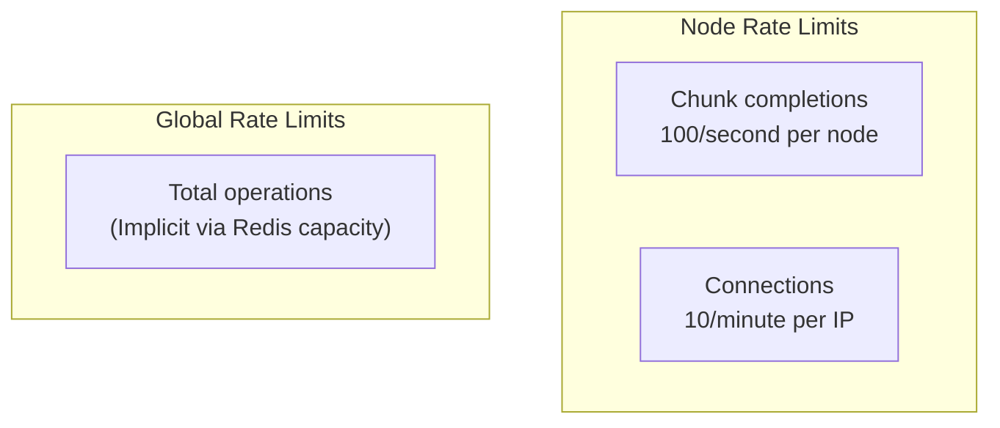
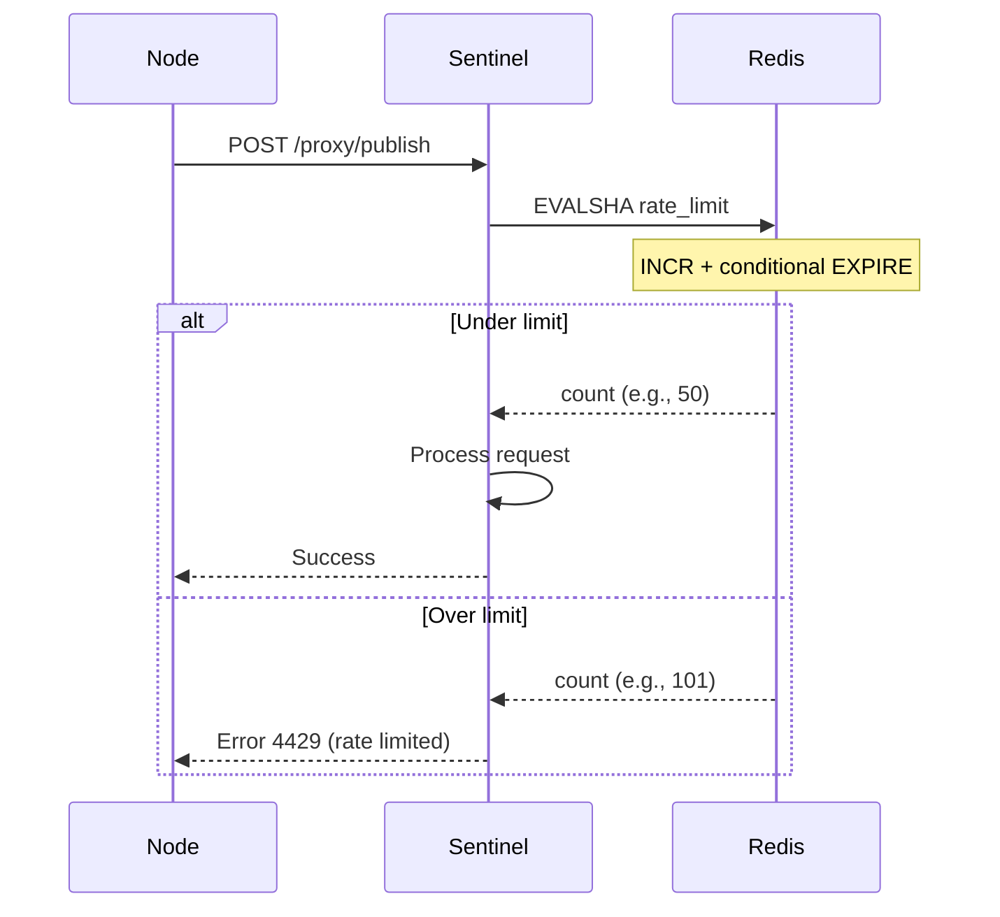
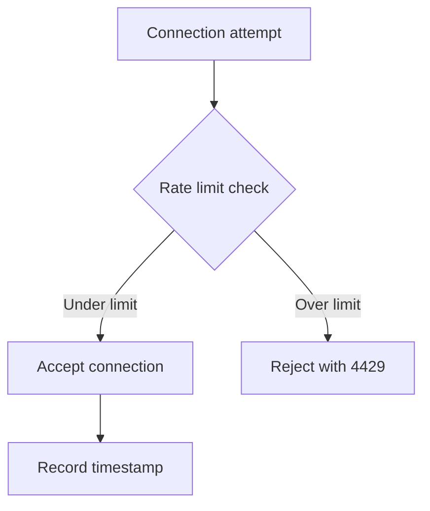
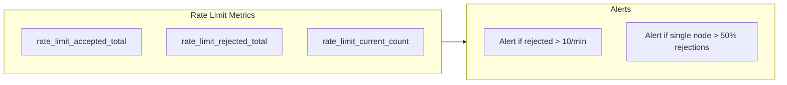
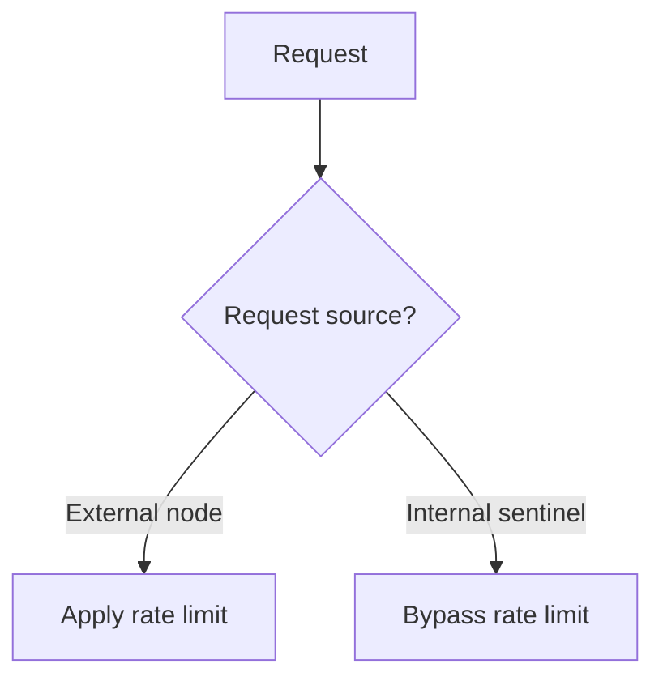

# Rate Limiting

Rate limiting protects the system from abuse and ensures fair resource allocation.

## Rate Limits Overview



## Chunk Completion Rate Limit

### Configuration

| Parameter | Value                 | Rationale                     |
| --------- | --------------------- | ----------------------------- |
| Limit     | 100 requests/second   | Handles normal load + retries |
| Window    | Fixed 2-second window | Simple, predictable           |
| Scope     | Per node              | Isolates misbehaving nodes    |

### Implementation



### Lua Script

```lua
-- Atomic rate limit check
-- KEYS[1] = ratelimit:publish:{node_id}:{second}
-- ARGV[1] = TTL (2 seconds)
-- ARGV[2] = max requests (100)

local count = redis.call('INCR', KEYS[1])
if count == 1 then
    redis.call('EXPIRE', KEYS[1], tonumber(ARGV[1]))
end
return count
```

**Why Lua script?** Ensures atomicity. A separate INCR + EXPIRE pattern has a race condition where EXPIRE could fail after INCR succeeds, causing keys to persist indefinitely.

### Burst Handling

Fixed window allows a 2x burst at window boundaries:

```mermaid
gantt
    title Worst-Case Burst Pattern
    dateFormat X
    axisFormat %sms

    section Window 1
    100 requests :0, 20
    section Window 2
    100 requests :20, 40
```



200 requests in ~20ms is acceptable - nodes process chunks serially and can't legitimately burst this high.

## Connection Rate Limit

### Configuration

| Parameter | Value                    | Rationale                     |
| --------- | ------------------------ | ----------------------------- |
| Limit     | 10 connections/minute    | Prevents reconnect storms     |
| Window    | Sliding 60-second window | Smoother than fixed window    |
| Scope     | Per IP address           | Handles multiple nodes per IP |

### Implementation



## Error Responses

### Reconnectable Errors (4000-4499)

```json
{
  "error": {
    "code": 4429,
    "message": "rate limit exceeded"
  },
  "disconnect": {
    "code": 4429,
    "reason": "rate limited - retry with backoff"
  }
}
```

Node SDK should:

1. Implement exponential backoff
2. Add jitter to prevent thundering herd
3. Retry after delay

### Terminal Errors (4500-4999)

```json
{
  "error": {
    "code": 4501,
    "message": "authentication failed"
  },
  "disconnect": {
    "code": 4501,
    "reason": "invalid credentials"
  }
}
```

Node SDK should:

1. NOT retry
2. Log error
3. Alert operator

## Client-Side Rate Limit Handling

```typescript
class NodeClient {
  private retryConfig = {
    maxRetries: 5,
    baseDelayMs: 1000,
    maxDelayMs: 30000,
  };

  async publishWithRetry(data: any): Promise<void> {
    for (let attempt = 0; attempt < this.retryConfig.maxRetries; attempt++) {
      try {
        await this.centrifuge.publish("chunks:complete", data);
        return;
      } catch (error) {
        if (error.code === 4429) {
          // Rate limited - use exponential backoff with jitter
          const baseDelay = Math.min(
            this.retryConfig.baseDelayMs * Math.pow(2, attempt),
            this.retryConfig.maxDelayMs,
          );
          const jitter = Math.random() * baseDelay * 0.25;
          await this.sleep(baseDelay + jitter);
          continue;
        }
        throw error;
      }
    }
    throw new Error("Max retries exceeded");
  }
}
```

## Monitoring Rate Limits

### Metrics



### Dashboard Queries

```promql
# Rejection rate by node
rate(rate_limit_rejected_total[5m]) by (node_id)

# Top rate-limited nodes
topk(10, sum by (node_id) (rate_limit_rejected_total))

# Overall acceptance rate
sum(rate_limit_accepted_total) /
(sum(rate_limit_accepted_total) + sum(rate_limit_rejected_total))
```

## Rate Limit Bypass

For trusted operations, rate limits can be bypassed:



Internal sentinel-to-sentinel communication (e.g., health checks, aggregation) is not rate limited.

## Scaling Considerations

### Current: Single Redis Instance

```
Per-node limit: 100/s
With 1000 nodes: 100,000 potential requests/s
Redis capacity: ~100,000+ ops/s (single instance)
```

### Future: High Scale

If needed:

1. Local rate limiting (in-memory) with periodic Redis sync
2. Token bucket algorithm for smoother limiting
3. Adaptive limits based on system load
