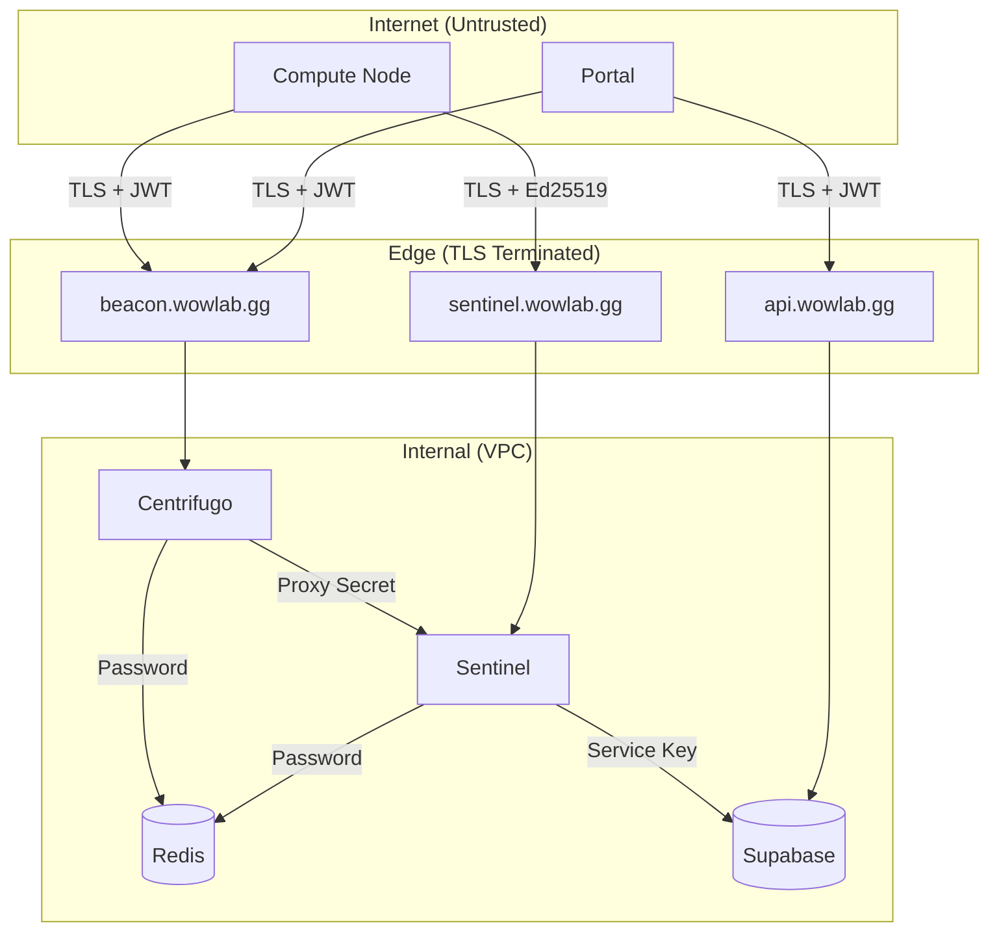
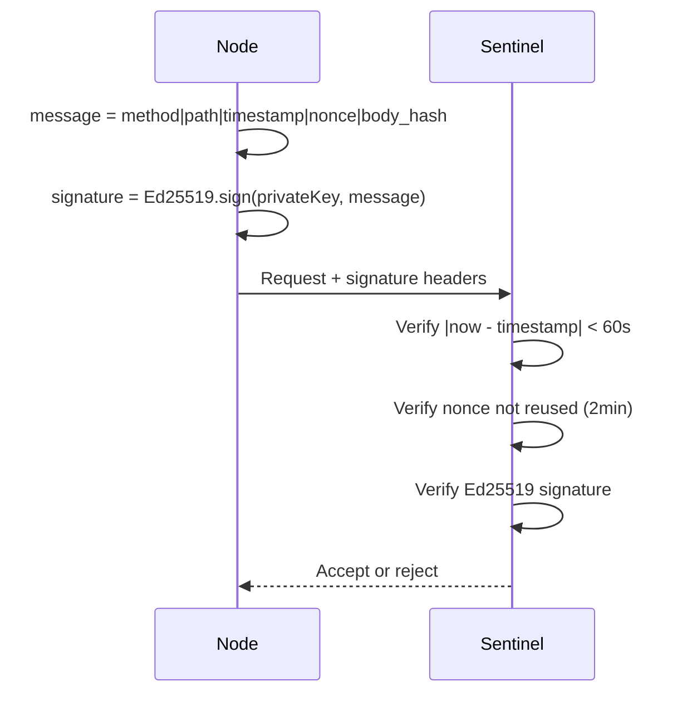
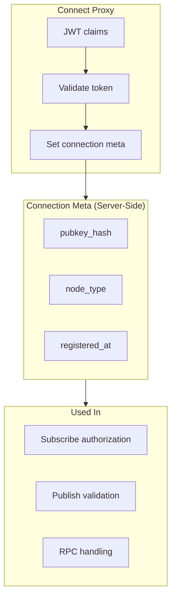
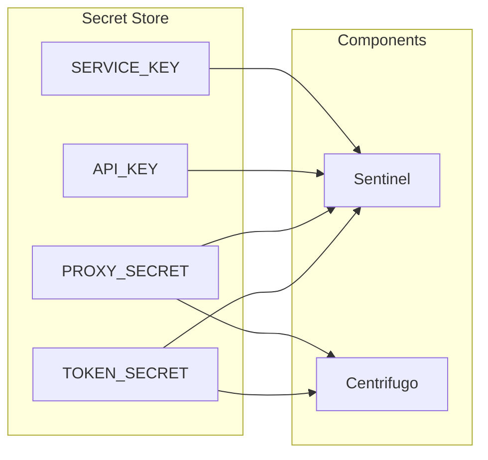

# Security Model

This document describes the security architecture protecting the realtime infrastructure.

## Security Boundaries



## Authentication Layers

### Layer 1: External (Internet → Edge)

| Connection              | Auth Method       | Verification        |
| ----------------------- | ----------------- | ------------------- |
| Node WSS → Centrifugo   | JWT (15min)       | On connect, refresh |
| Portal WSS → Centrifugo | JWT (1hr)         | On connect          |
| Node HTTP → Sentinel    | Ed25519 signature | Per request         |
| Portal HTTP → Supabase  | Supabase JWT      | RLS policies        |

### Layer 2: Internal (VPC)

| Connection                | Auth Method              |
| ------------------------- | ------------------------ |
| Centrifugo → Sentinel     | Proxy Secret header      |
| Sentinel → Redis          | Password (if configured) |
| Sentinel → Supabase       | Service role key         |
| Sentinel → Centrifugo API | API key                  |

## Ed25519 Node Authentication

Nodes authenticate HTTP requests using cryptographic signatures:



### Replay Attack Prevention

| Protection           | How                                 |
| -------------------- | ----------------------------------- | --------------- | ------ |
| Timestamp validation | Reject if `                         | now - timestamp | > 60s` |
| Nonce tracking       | Track used nonces for 2 minutes     |
| Body hash            | Prevent tampering with request body |

### Public Key Hash

The `pubkey_hash` (SHA-256 of raw public key bytes) provides:

- Consistent identifier regardless of encoding
- Stored in JWT and connection meta
- Used for audit correlation

## JWT Token Security

### Node JWT Claims

```json
{
  "sub": "node-uuid",
  "exp": 1234567890, // 15 minutes
  "iat": 1234567800,
  "nbf": 1234567800,
  "jti": "unique-token-id",
  "channels": ["nodes:node-uuid"],
  "info": {
    "type": "node",
    "pubkey_hash": "sha256..."
  }
}
```

### Token Lifetime Strategy

| Client | Lifetime   | Refresh                |
| ------ | ---------- | ---------------------- |
| Node   | 15 minutes | Via refresh proxy      |
| Portal | 1 hour     | Via standard auth flow |

Short node lifetime limits damage from compromised tokens.

## Connection Meta Security

Connection meta is server-controlled data attached during connect:



**Security properties:**

- Not exposed to client
- Cannot be tampered with
- Set once, used everywhere
- Enables audit trail

## Proxy Secret

Internal communication uses shared secrets:

```
X-Centrifugo-Proxy-Secret: ${CENTRIFUGO_PROXY_SECRET}
```

This prevents:

- Direct HTTP access to proxy endpoints
- Spoofing the `user` field
- Bypassing Centrifugo

### Verification

```rust
fn verify_proxy_secret(req: &Request) -> Result<()> {
    let secret = req.headers()
        .get("X-Centrifugo-Proxy-Secret")
        .ok_or(AuthError::MissingSecret)?;

    // Constant-time comparison to prevent timing attacks
    if !constant_time_eq(secret.as_bytes(),
                         env::var("CENTRIFUGO_PROXY_SECRET")?.as_bytes()) {
        return Err(AuthError::InvalidSecret);
    }
    Ok(())
}
```

## Channel Authorization

All channel access is authorized via subscribe/publish proxy:

```mermaid
flowchart TD
    Request[Channel Request] --> Type{Request Type}

    Type -->|Subscribe| SubAuth[Subscribe Proxy]
    Type -->|Publish| PubAuth[Publish Proxy]

    SubAuth --> SubCheck{Check Authorization}
    SubCheck -->|nodes:{id}| NodeCheck[User == node ID?]
    SubCheck -->|jobs:{id}| JobCheck[User owns job?]
    SubCheck -->|Other| Deny[Deny]

    PubAuth --> PubCheck{Check Authorization}
    PubCheck -->|chunks:complete| ChunkCheck[Node assigned chunk?]
    PubCheck -->|Other| Deny

    NodeCheck -->|Yes| Allow[Allow]
    NodeCheck -->|No| Deny
    JobCheck -->|Yes| Allow
    JobCheck -->|No| Deny
    ChunkCheck -->|Yes| Allow
    ChunkCheck -->|No| Deny
```

### Authorization Matrix

| Channel           | Subscribe         | Publish                |
| ----------------- | ----------------- | ---------------------- |
| `nodes:{id}`      | Only that node    | Only Sentinel          |
| `jobs:{id}`       | Job owner only    | Only Sentinel          |
| `nodes:online`    | All authenticated | Nobody (presence only) |
| `chunks:complete` | Nobody            | Assigned node only     |

## Secret Management

### Required Secrets

| Secret                    | Purpose      | Rotation      |
| ------------------------- | ------------ | ------------- |
| `CENTRIFUGO_TOKEN_SECRET` | JWT signing  | Quarterly     |
| `CENTRIFUGO_PROXY_SECRET` | Proxy auth   | Quarterly     |
| `CENTRIFUGO_API_KEY`      | HTTP API     | Quarterly     |
| `SUPABASE_SERVICE_KEY`    | Admin access | On compromise |
| `REDIS_PASSWORD`          | Redis auth   | On compromise |

### Secret Access



## Data Isolation

### Node Isolation

Nodes cannot:

- Access Supabase directly
- Access Redis directly
- See other nodes' channels
- Complete chunks assigned to other nodes
- Access job data or results

### Job Isolation

Users cannot:

- See other users' jobs
- Subscribe to other users' job channels
- Access other users' simulation configs

## Audit Trail

All sensitive operations are logged:

```json
{
  "timestamp": "2024-01-15T10:30:00Z",
  "event": "chunk_completion",
  "node_id": "node-uuid",
  "pubkey_hash": "sha256...",
  "chunk_id": "chunk-uuid",
  "job_id": "job-uuid",
  "client_ip": "192.168.1.1",
  "result": "success"
}
```

Logged events:

- Node registration
- Token issuance
- Connection events
- Channel subscriptions
- Chunk completions
- Job aggregations
- Rate limit violations
