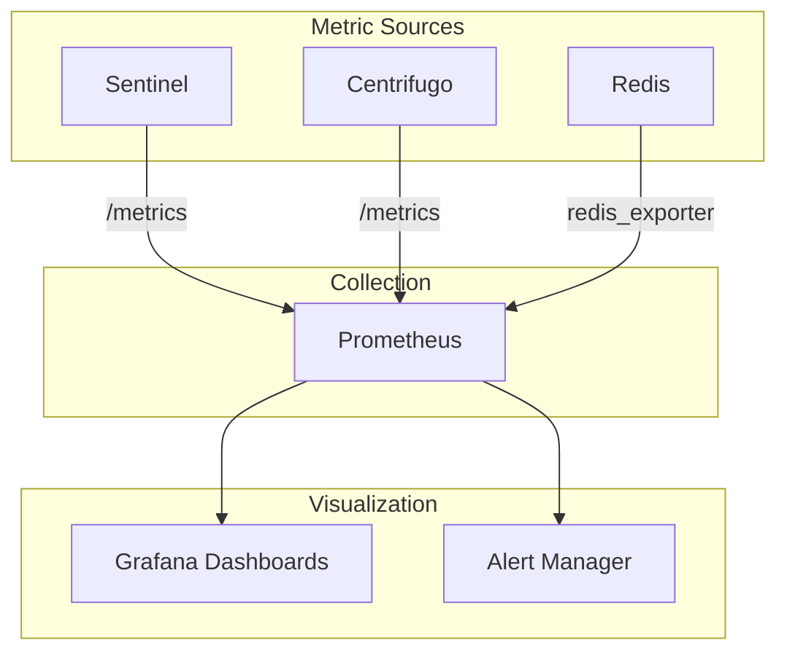
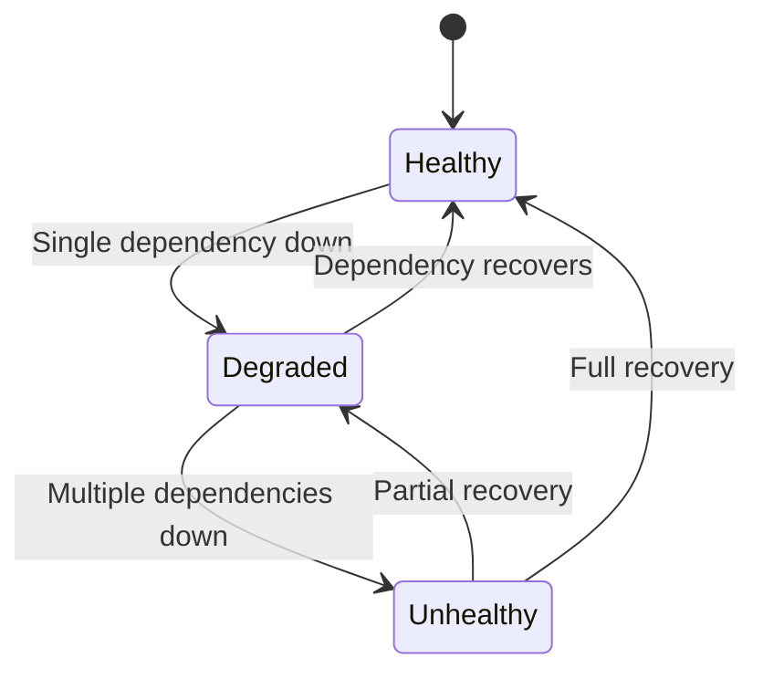
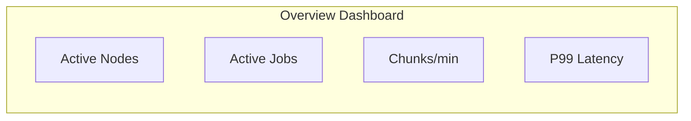
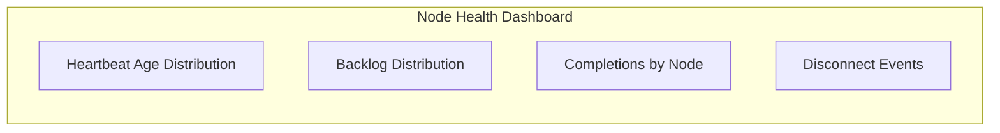
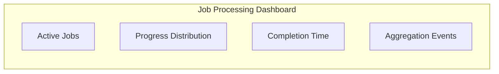
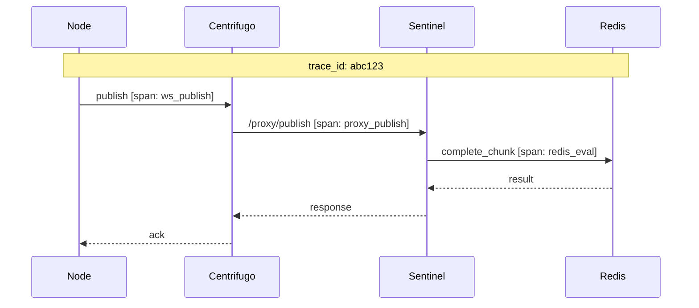

# Monitoring

Comprehensive monitoring ensures system health and rapid incident response.

## Metrics Architecture



## Sentinel Metrics

### Endpoint: `GET /metrics`

| Metric                                | Type      | Description                  |
| ------------------------------------- | --------- | ---------------------------- |
| `sentinel_proxy_requests_total`       | Counter   | Total proxy requests by type |
| `sentinel_proxy_latency_seconds`      | Histogram | Proxy request latency        |
| `sentinel_redis_operations_total`     | Counter   | Redis operations by script   |
| `sentinel_redis_errors_total`         | Counter   | Redis operation failures     |
| `sentinel_chunk_completions_total`    | Counter   | Chunks completed             |
| `sentinel_jobs_completed_total`       | Counter   | Jobs aggregated              |
| `sentinel_active_nodes`               | Gauge     | Currently healthy nodes      |
| `sentinel_active_jobs`                | Gauge     | Jobs in progress             |
| `sentinel_node_heartbeat_age_seconds` | Histogram | Time since last heartbeat    |

### Example Queries

```promql
# Proxy latency P99
histogram_quantile(0.99,
    rate(sentinel_proxy_latency_seconds_bucket[5m]))

# Chunk completion rate
rate(sentinel_chunk_completions_total[5m])

# Redis error rate
rate(sentinel_redis_errors_total[5m])
```

## Centrifugo Metrics

Built-in Prometheus metrics:

| Metric                                         | Description                 |
| ---------------------------------------------- | --------------------------- |
| `centrifugo_node_num_clients`                  | Connected clients           |
| `centrifugo_node_num_channels`                 | Active channels             |
| `centrifugo_proxy_duration_seconds`            | Proxy call duration by type |
| `centrifugo_proxy_errors_total`                | Proxy errors by type        |
| `centrifugo_transport_messages_sent_total`     | Messages sent               |
| `centrifugo_transport_messages_received_total` | Messages received           |
| `centrifugo_broker_redis_pub_sub_errors_total` | Redis pub/sub errors        |
| `centrifugo_node_pub_sub_lag_seconds`          | Message delivery lag        |

## Health Check Endpoint

### Endpoint: `GET /status`

```json
{
  "status": "healthy",
  "redis": "connected",
  "centrifugo": "connected",
  "supabase": "connected",
  "metrics": {
    "active_nodes": 42,
    "active_jobs": 5,
    "chunks_per_minute": 1200
  }
}
```

### Health States



| Status      | Meaning                 | Action          |
| ----------- | ----------------------- | --------------- |
| `healthy`   | All systems operational | None            |
| `degraded`  | Partial functionality   | Monitor closely |
| `unhealthy` | Service cannot function | Page on-call    |

## Alert Rules

### Critical Alerts (Page)

```yaml
groups:
  - name: realtime-critical
    rules:
      - alert: RedisDown
        expr: sentinel_redis_errors_total > 100
        for: 1m
        labels:
          severity: critical
        annotations:
          summary: Redis connection failures

      - alert: HighProxyLatency
        expr: histogram_quantile(0.99, rate(sentinel_proxy_latency_seconds_bucket[5m])) > 5
        for: 5m
        labels:
          severity: critical
        annotations:
          summary: Proxy latency P99 > 5s

      - alert: MassNodeDisconnect
        expr: (centrifugo_node_num_clients - centrifugo_node_num_clients offset 5m) / centrifugo_node_num_clients offset 5m < -0.2
        for: 2m
        labels:
          severity: critical
        annotations:
          summary: >20% nodes disconnected in 5 minutes
```

### Warning Alerts (Notify)

```yaml
groups:
  - name: realtime-warning
    rules:
      - alert: StaleNodeHeartbeats
        expr: sentinel_node_heartbeat_age_seconds > 120
        for: 5m
        labels:
          severity: warning
        annotations:
          summary: Nodes with stale heartbeats

      - alert: HighRateLimitRejections
        expr: rate(sentinel_rate_limit_rejected_total[5m]) > 10
        for: 5m
        labels:
          severity: warning
        annotations:
          summary: High rate limit rejections

      - alert: JobCompletionSlow
        expr: histogram_quantile(0.99, rate(sentinel_job_completion_seconds_bucket[1h])) > 3600
        for: 30m
        labels:
          severity: warning
        annotations:
          summary: Job completion P99 > 1 hour
```

## Dashboards

### System Overview



Key panels:

- Active nodes over time
- Active jobs over time
- Chunk completion rate
- Proxy latency percentiles
- Error rates by type

### Node Health



Key panels:

- Heartbeat age histogram
- Node backlog distribution
- Top completing nodes
- Recent disconnect events

### Job Processing



Key panels:

- Jobs by state (pending, running, complete)
- Chunk progress distribution
- Job completion time histogram
- Aggregation success/failure

## Logging

### Structured Log Format

```json
{
  "timestamp": "2024-01-15T10:30:00.000Z",
  "level": "info",
  "service": "sentinel",
  "instance": "sentinel-1",
  "event": "chunk_completed",
  "trace_id": "abc123",
  "node_id": "node-uuid",
  "chunk_id": "chunk-uuid",
  "job_id": "job-uuid",
  "duration_ms": 45
}
```

### Log Levels

| Level   | Use Case                                     |
| ------- | -------------------------------------------- |
| `error` | Failures requiring attention                 |
| `warn`  | Unusual but handled situations               |
| `info`  | Normal operations (chunk complete, job done) |
| `debug` | Detailed debugging (disabled in prod)        |

### Key Log Events

```
chunk_completed    - Node completed a chunk
job_aggregated     - Job results aggregated
node_registered    - New node registered
node_disconnected  - Node went offline
chunks_reclaimed   - Dead node chunks reassigned
lock_released      - Stuck lock cleanup
rate_limited       - Request rate limited
auth_failed        - Authentication failure
```

## Tracing

Distributed tracing through the request flow:



Trace context propagated via headers/metadata.

## Runbooks

### Redis Connection Failures

1. Check Redis instance status
2. Verify network connectivity from sentinels
3. Check Redis memory usage
4. Review Redis slow log
5. If Redis Sentinel: check master election

### High Proxy Latency

1. Check Redis latency (`redis-cli --latency`)
2. Check Sentinel CPU usage
3. Review recent deployments
4. Check for hot keys in Redis
5. Scale sentinel instances if needed

### Mass Node Disconnect

1. Check Centrifugo health
2. Check network connectivity
3. Review Centrifugo logs for errors
4. Check if token refresh is working
5. Verify DNS resolution
