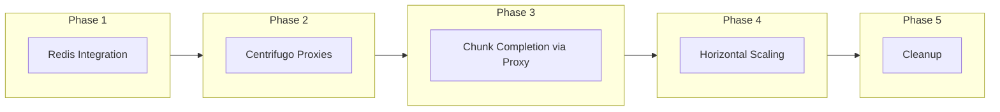
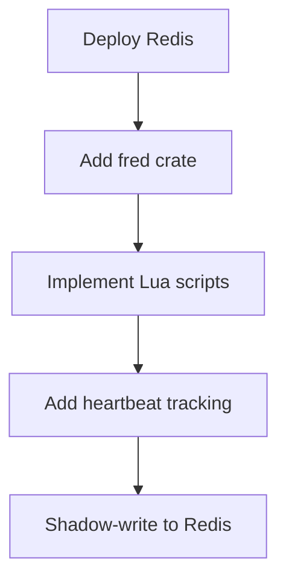
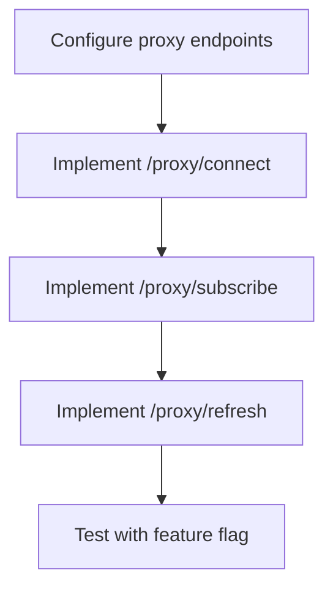
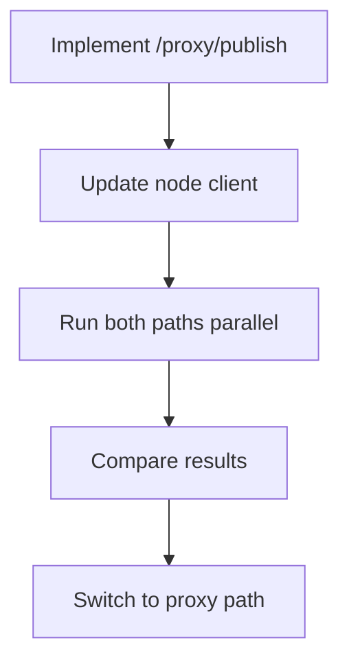
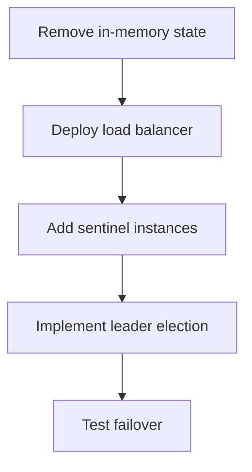
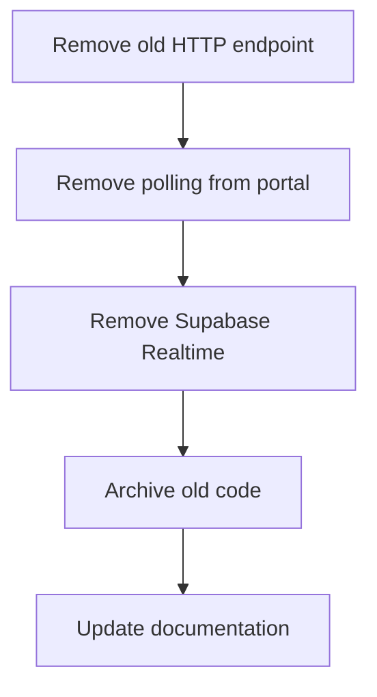
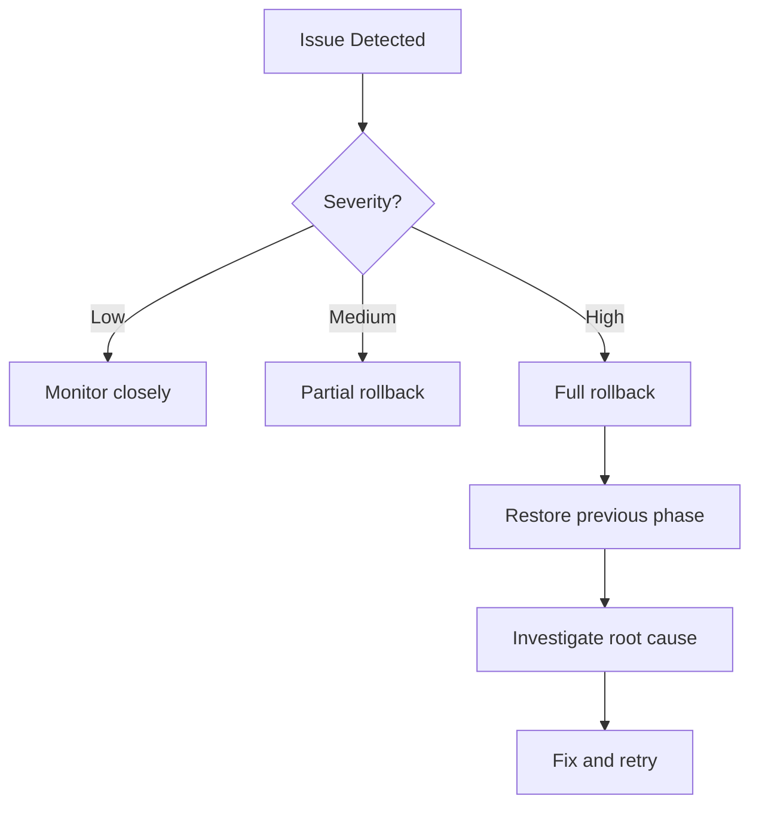

# Migration Path

This document outlines the phased approach to migrating from the current architecture to the realtime v2 system.

## Migration Overview



## Phase 1: Redis Integration

**Goal:** Introduce Redis for state coordination without changing external interfaces.

### Tasks



1. **Deploy Redis (single instance with persistence)**
   - Configure AOF persistence
   - Set up monitoring
   - Plan for Sentinel HA later

2. **Add `fred` crate to sentinel**
   - Connection pooling
   - Lua script loading
   - Error handling

3. **Implement Lua scripts**
   - `assign_chunk.lua`
   - `complete_chunk.lua`
   - `heartbeat.lua`
   - `reclaim_chunks.lua`
   - `select_nodes.lua`
   - `rate_limit.lua`

4. **Add heartbeat tracking**
   - Track heartbeats in Redis alongside existing system
   - Don't use for decisions yet

5. **Shadow-write to Redis**
   - Write all state changes to both old system and Redis
   - Compare results
   - Fix discrepancies

### Success Criteria

- [ ] Redis deployed and monitored
- [ ] All Lua scripts implemented and tested
- [ ] Shadow writes matching 100%
- [ ] No increase in latency

## Phase 2: Centrifugo Proxies

**Goal:** Configure Centrifugo to use proxy endpoints for authorization.

### Tasks



1. **Configure Centrifugo proxy endpoints**
   - Update Centrifugo config
   - Set up proxy secret
   - Configure timeouts

2. **Implement `/proxy/connect`**
   - Validate JWT claims
   - Set connection meta
   - Update heartbeat in Redis

3. **Implement `/proxy/subscribe`**
   - Channel authorization logic
   - Node can only subscribe to own channel
   - Portal users can only subscribe to own jobs

4. **Implement `/proxy/refresh`**
   - Token refresh handling
   - Heartbeat update
   - New JWT issuance

5. **Test with feature flag**
   - Enable for subset of nodes
   - Monitor for issues
   - Gradually increase coverage

### Success Criteria

- [ ] All proxy endpoints implemented
- [ ] Authorization working correctly
- [ ] Token refresh functioning
- [ ] No auth regressions

## Phase 3: Chunk Completion via Proxy

**Goal:** Move chunk completion from HTTP endpoint to publish proxy.

### Tasks



1. **Implement `/proxy/publish`**
   - Full validation
   - Rate limiting
   - Result processing
   - Progress publishing

2. **Update node client**
   - Add publish-based completion
   - Feature flag for path selection
   - Retry logic

3. **Run both paths in parallel**
   - Old HTTP endpoint still works
   - New proxy path enabled for test nodes
   - Compare results

4. **Compare results**
   - Ensure identical behavior
   - Monitor latency differences
   - Check error rates

5. **Switch to proxy path**
   - Gradually migrate all nodes
   - Monitor closely
   - Keep old endpoint as fallback

### Success Criteria

- [ ] Proxy publish working correctly
- [ ] Results match between paths
- [ ] Latency acceptable
- [ ] All nodes migrated

## Phase 4: Horizontal Scaling

**Goal:** Enable multiple sentinel instances.

### Tasks



1. **Remove in-memory state**
   - Audit all stateful code
   - Move remaining state to Redis
   - Verify statelessness

2. **Deploy load balancer**
   - Configure health checks
   - Set up sticky sessions (if needed)
   - Monitor distribution

3. **Add sentinel instances**
   - Start with 2 instances
   - Gradually increase
   - Monitor resource usage

4. **Implement leader election**
   - Background task coordination
   - Health monitoring
   - Lock recovery

5. **Test failover scenarios**
   - Kill instances randomly
   - Verify no data loss
   - Check recovery time

### Success Criteria

- [ ] Sentinels fully stateless
- [ ] Multiple instances running
- [ ] Failover works correctly
- [ ] No duplicate work

## Phase 5: Cleanup

**Goal:** Remove old code and infrastructure.

### Tasks



1. **Remove old `/chunks/complete` endpoint**
   - Verify no clients using it
   - Remove code
   - Update API docs

2. **Remove polling from portal**
   - Portal now fully real-time
   - Remove polling code
   - Update UI components

3. **Remove Supabase Realtime integration**
   - No longer needed
   - Remove subscriptions
   - Clean up triggers

4. **Archive old code**
   - Move to separate branch
   - Document what was removed
   - Keep for reference

5. **Update documentation**
   - Architecture docs
   - API docs
   - Runbooks

### Success Criteria

- [ ] All old code removed
- [ ] No unused infrastructure
- [ ] Documentation current
- [ ] Clean codebase

## Rollback Plan

Each phase has a rollback strategy:

| Phase   | Rollback Strategy                         |
| ------- | ----------------------------------------- |
| Phase 1 | Disable Redis writes, use existing system |
| Phase 2 | Disable proxy, use direct JWT validation  |
| Phase 3 | Switch back to HTTP endpoint              |
| Phase 4 | Scale back to single instance             |
| Phase 5 | N/A (point of no return)                  |



## Timeline Considerations

Each phase should be deployed incrementally:

1. **Dev environment** - Full validation
2. **Staging environment** - Load testing
3. **Production canary** - 5% of traffic
4. **Production gradual** - 25% → 50% → 100%

Allow sufficient bake time between phases:

- Phase 1 → 2: 1 week in production
- Phase 2 → 3: 1 week in production
- Phase 3 → 4: 2 weeks in production
- Phase 4 → 5: 1 week in production

## Feature Flags

Use feature flags to control rollout:

```typescript
const features = {
  REDIS_WRITE: true, // Phase 1
  PROXY_CONNECT: true, // Phase 2
  PROXY_SUBSCRIBE: true, // Phase 2
  PROXY_REFRESH: true, // Phase 2
  PROXY_PUBLISH: false, // Phase 3
  MULTI_SENTINEL: false, // Phase 4
};
```

Flags enable:

- Gradual rollout
- Quick rollback
- A/B testing
- Per-node configuration
