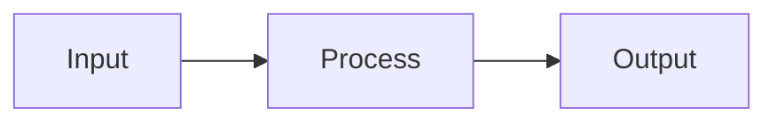

# MDX Components

Components available in MDX files. Use sparingly. Prefer native markdown.

## When to use components

| Component   | Use for                     | Not for            |
| ----------- | --------------------------- | ------------------ |
| Alert       | Warnings, breaking changes  | General info       |
| Badge       | Version numbers, status     | Decoration         |
| Card        | Grouped info with title     | Single paragraphs  |
| CardGrid    | 2-3 feature cards           | More than 3 cards  |
| Collapsible | Optional deep-dive          | Required reading   |
| Kbd         | Keyboard shortcuts          | Code or commands   |
| Mermaid     | Process flows, diagrams     | Simple lists       |
| Steps       | Multi-step procedures       | Single actions     |
| Tabs        | Alternative implementations | Sequential content |

## Alert

Warnings and important notices:

```mdx
<Alert title="Breaking Change">This API changed in v2.0.</Alert>
```

<Alert title="Breaking Change">This API changed in v2.0.</Alert>

## Badge

Status labels:

```mdx
<Badge color="green">Stable</Badge>
<Badge color="amber">Beta</Badge>
<Badge color="red">Deprecated</Badge>
```

<Badge color="green">Stable</Badge> <Badge color="amber">Beta</Badge>
<Badge color="red">Deprecated</Badge>

Colors: `green`, `amber`, `red`, `gray`

## Card

Grouped content:

```mdx
<Card title="Quick Start">Get up and running in 5 minutes.</Card>
```

<Card title="Quick Start">Get up and running in 5 minutes.</Card>

## CardGrid

Side-by-side cards (2-3 max):

```mdx
<CardGrid>
  <Card title="Users">For users</Card>
  <Card title="Devs">For developers</Card>
</CardGrid>
```

<CardGrid>
  <Card title="Users">For users</Card>
  <Card title="Devs">For developers</Card>
</CardGrid>

## Collapsible

Optional detail:

```mdx
<Collapsible title="Advanced options">
  Additional configuration details...
</Collapsible>
```

<Collapsible title="Advanced options">
  Additional configuration details here.
</Collapsible>

## Kbd

Keyboard shortcuts only:

```mdx
Press <Kbd>Ctrl</Kbd> + <Kbd>S</Kbd> to save.
```

Press <Kbd>Ctrl</Kbd> + <Kbd>S</Kbd> to save.

## Mermaid

Diagrams with tabs showing both the rendered output and source code. Use standard markdown code blocks:

````mdx

````


Supported: flowchart, sequenceDiagram, stateDiagram-v2

## Steps

Multi-step procedures:

```mdx
<Steps>
  <Step step={1} title="Install">
    Run npm install.
  </Step>
  <Step step={2} title="Configure">
    Edit the config file.
  </Step>
  <Step step={3} title="Run">
    Start the server.
  </Step>
</Steps>
```

<Steps>
  <Step step={1} title="Install">
    Run npm install.
  </Step>
  <Step step={2} title="Configure">
    Edit the config file.
  </Step>
  <Step step={3} title="Run">
    Start the server.
  </Step>
</Steps>

## Tabs

Alternative implementations:

```mdx
<Tabs>
  <TabList>
    <TabTrigger value="npm">npm</TabTrigger>
    <TabTrigger value="pnpm">pnpm</TabTrigger>
  </TabList>
  <TabContent value="npm">npm install wowlab</TabContent>
  <TabContent value="pnpm">pnpm add wowlab</TabContent>
</Tabs>
```

<Tabs>
  <TabList>
    <TabTrigger value="npm">npm</TabTrigger>
    <TabTrigger value="pnpm">pnpm</TabTrigger>
  </TabList>
  <TabContent value="npm">`npm install wowlab`</TabContent>
  <TabContent value="pnpm">`pnpm add wowlab`</TabContent>
</Tabs>
