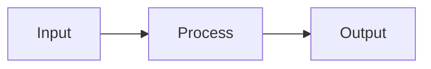

# MDX Components

Components available in MDX files. Use sparingly. Prefer native markdown.

## When to use components

| Component   | Use for                     | Not for            |
| ----------- | --------------------------- | ------------------ |
| Alert       | Warnings, breaking changes  | General info       |
| Badge       | Version numbers, status     | Decoration         |
| Card        | Grouped info with title     | Single paragraphs  |
| CardGrid    | 2-3 feature cards           | More than 3 cards  |
| Cite        | Academic-style references   | Inline links       |
| Collapsible | Optional deep-dive          | Required reading   |
| Kbd         | Keyboard shortcuts          | Code or commands   |
| Mermaid     | Process flows, diagrams     | Simple lists       |
| Steps       | Multi-step procedures       | Single actions     |
| Tabs        | Alternative implementations | Sequential content |

## Alert

Warnings and important notices:

```mdx
<Alert title="Breaking Change">This API changed in v2.0.</Alert>
```

<Alert title="Breaking Change">This API changed in v2.0.</Alert>

## Badge

Status labels:

```mdx
<Badge color="green">Stable</Badge>
<Badge color="amber">Beta</Badge>
<Badge color="red">Deprecated</Badge>
```

<Badge color="green">Stable</Badge> <Badge color="amber">Beta</Badge>
<Badge color="red">Deprecated</Badge>

Colors: `green`, `amber`, `red`, `gray`

## Card

Grouped content:

```mdx
<Card title="Quick Start">Get up and running in 5 minutes.</Card>
```

<Card title="Quick Start">Get up and running in 5 minutes.</Card>

## CardGrid

Side-by-side cards (2-3 max):

```mdx
<CardGrid>
  <Card title="Users">For users</Card>
  <Card title="Devs">For developers</Card>
</CardGrid>
```

<CardGrid>
  <Card title="Users">For users</Card>
  <Card title="Devs">For developers</Card>
</CardGrid>

## Cite

Academic-style citations that link to the references page:

```mdx
The <Cite id="websocket">WebSocket protocol</Cite> enables real-time communication.
The framing spec is in <Cite id="websocket" s="5.2">section 5.2</Cite>.
```

The <Cite id="websocket">WebSocket protocol</Cite> enables real-time communication.
The framing spec is in <Cite id="websocket" s="5.2">section 5.2</Cite>.

### Location props

Cite specific sections, pages, or lines. Shown in hover card only:

| Prop   | Renders as   | Example                                   |
| ------ | ------------ | ----------------------------------------- |
| `s`    | §4.1         | `<Cite id="rfc" s="4.1">...</Cite>`       |
| `p`    | p. 42        | `<Cite id="book" p="42-45">...</Cite>`    |
| `line` | line 23      | `<Cite id="code" line="23">...</Cite>`    |
| `loc`  | (raw string) | `<Cite id="x" loc="Chapter 3">...</Cite>` |

Combine multiple: `<Cite id="paper" s="3.2" p="15">...</Cite>` renders as "§3.2, p. 15"

### Archived references

References can have screenshots shown in hover cards and on the References page.
Use `.withArchive()` in `src/content/references.ts` and place images in `src/content/docs/images/references/`:

```ts
import { websocketImg } from "./docs/images/references";

websocket: ref("I. Fette, A. Melnikov", "The WebSocket Protocol", "RFC 6455, IETF", 2011)
  .url("https://datatracker.ietf.org/doc/html/rfc6455")
  .withArchive(websocketImg, "2024-12-15"),
```

Citations must have a corresponding entry in `src/content/references.ts`.

## Collapsible

Optional detail:

```mdx
<Collapsible title="Advanced options">
  Additional configuration details...
</Collapsible>
```

<Collapsible title="Advanced options">
  Additional configuration details here.
</Collapsible>

## Kbd

Keyboard shortcuts only:

```mdx
Press <Kbd>Ctrl</Kbd> + <Kbd>S</Kbd> to save.
```

Press <Kbd>Ctrl</Kbd> + <Kbd>S</Kbd> to save.

## Mermaid

Diagrams with tabs showing both the rendered output and source code. Use standard markdown code blocks:

````mdx

````


Supported: flowchart, sequenceDiagram, stateDiagram-v2

## Steps

Multi-step procedures:

```mdx
<Steps>
  <Step step={1} title="Install">
    Run npm install.
  </Step>
  <Step step={2} title="Configure">
    Edit the config file.
  </Step>
  <Step step={3} title="Run">
    Start the server.
  </Step>
</Steps>
```

<Steps>
  <Step step={1} title="Install">
    Run npm install.
  </Step>
  <Step step={2} title="Configure">
    Edit the config file.
  </Step>
  <Step step={3} title="Run">
    Start the server.
  </Step>
</Steps>

## Tabs

Alternative implementations:

```mdx
<Tabs>
  <TabList>
    <TabTrigger value="npm">npm</TabTrigger>
    <TabTrigger value="pnpm">pnpm</TabTrigger>
  </TabList>
  <TabContent value="npm">npm install wowlab</TabContent>
  <TabContent value="pnpm">pnpm add wowlab</TabContent>
</Tabs>
```

<Tabs>
  <TabList>
    <TabTrigger value="npm">npm</TabTrigger>
    <TabTrigger value="pnpm">pnpm</TabTrigger>
  </TabList>
  <TabContent value="npm">`npm install wowlab`</TabContent>
  <TabContent value="pnpm">`pnpm add wowlab`</TabContent>
</Tabs>
