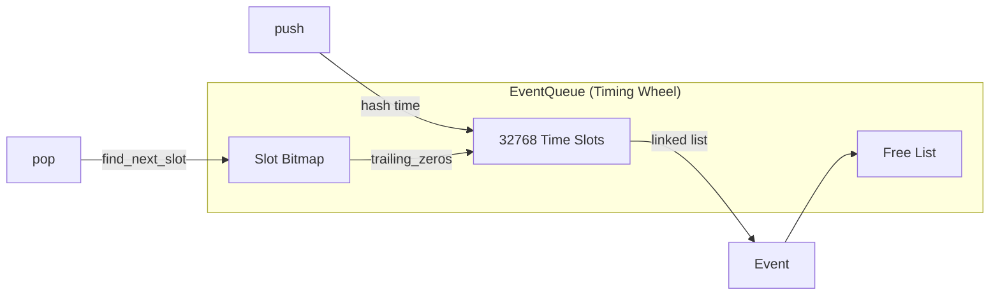

# Event System

The engine uses a timing wheel event queue for O(1) amortized event operations.

## Timing wheel structure



## How it works

The queue divides time into slots (32768 by default). Each slot holds a linked list of events scheduled for that time.

**Push**: Hash the event time to find its slot, prepend to that slot's list.

**Pop**: Use a bitmap to find the next non-empty slot. Pop the first event from that slot's list.

The bitmap makes finding the next event O(1) - just count trailing zeros to find the first set bit.

## SimEvent variants

Events represent everything that can happen in the simulation:

```rust
SimEvent {
    time: SimTime,
    kind: EventKind,
}
```

| Event           | When it fires          | What happens                   |
| --------------- | ---------------------- | ------------------------------ |
| `SimEnd`        | Fight duration reached | Simulation terminates          |
| `GcdEnd`        | GCD expires            | Rotation evaluates next action |
| `CastComplete`  | Cast finishes          | Spell effects apply            |
| `SpellDamage`   | After travel time      | Damage recorded                |
| `AuraTick`      | DoT tick interval      | Periodic damage/healing        |
| `AuraExpire`    | Aura duration ends     | Aura removed                   |
| `AutoAttack`    | Auto-attack timer      | Melee swing damage             |
| `PetAttack`     | Pet auto timer         | Pet melee damage               |
| `ResourceTick`  | Every 100ms            | Resource regeneration          |
| `ChargeReady`   | Charge recharges       | Cooldown gains charge          |
| `CooldownReady` | Cooldown expires       | Informational only             |
| `ProcIcdEnd`    | ICD expires            | Proc can trigger again         |

## Event loop

The simulation loop is straightforward:

```rust
while let Some(event) = events.pop() {
    state.current_time = event.time;

    match event.kind {
        EventKind::GcdEnd => handler.on_gcd(&mut state),
        EventKind::CastComplete { spell, target } => {
            handler.on_cast_complete(&mut state, spell, target)
        }
        EventKind::SpellDamage { spell, target, snapshot } => {
            handler.on_spell_damage(&mut state, spell, target, snapshot)
        }
        // ... other event types
    }
}
```

Events create more events. A `GcdEnd` causes `on_gcd` which casts a spell, scheduling `CastComplete`, which schedules `SpellDamage`, and so on.

## Free list optimization

Instead of allocating/deallocating events, the queue maintains a free list. Popped events go to the free list; new events reuse freed slots when available.

This eliminates allocation overhead in the hot path.

## Stale event handling

When you refresh a DoT, both the old and new `AuraExpire` events exist in the queue. The handler checks whether the aura is still valid before acting:

```rust
EventKind::AuraExpire { aura_id, target } => {
    if let Some(aura) = state.auras.get(aura_id, target) {
        // Only remove if this event matches current expiration
        if aura.expires_at == event.time {
            state.auras.remove(aura_id, target);
        }
    }
}
```

This avoids the complexity of canceling scheduled events.

## Time resolution

`SimTime` uses millisecond precision stored as `u32`:

```rust
SimTime(u32)  // Milliseconds

SimTime::from_millis(1000)   // 1 second
SimTime::from_secs_f32(1.5)  // 1500ms
time.as_secs_f32()           // Convert back
```

32 bits gives ~49 days of simulation time - more than enough for any fight.

## Next steps

- [JIT Compiler](/docs/engine/02-jit-compiler) - How rotations become native code
- [Simulation Overview](/docs/reference/01-simulation-overview) - High-level flow
