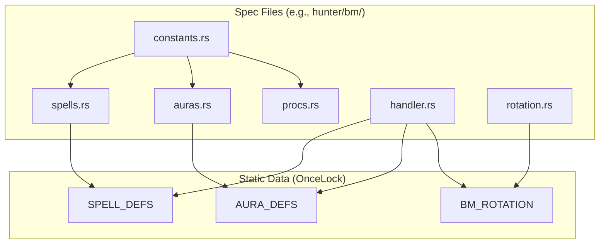

# Spec Handlers

Every spec implements the `SpecHandler` trait to define its spells, auras, and behavior.

## SpecHandler trait

```rust
trait SpecHandler: Send + Sync {
    // Identity
    fn spec_id(&self) -> SpecId;
    fn display_name(&self) -> &'static str;

    // Definitions
    fn spell_definitions(&self) -> &'static [SpellDef];
    fn aura_definitions(&self) -> &'static [AuraDef];

    // Initialization
    fn init(&self, state: &mut SimState);
    fn init_player(&self, player: &mut Player);

    // Event Handlers
    fn on_gcd(&self, state: &mut SimState);
    fn on_cast_complete(&self, state: &mut SimState, spell, target);
    fn on_spell_damage(&self, state: &mut SimState, spell, target);
    fn on_auto_attack(&self, state: &mut SimState, unit);
    fn on_pet_attack(&self, state: &mut SimState, pet);
    fn on_aura_tick(&self, state: &mut SimState, aura, target);

    // Actions
    fn cast_spell(&self, state: &mut SimState, spell, target);
    fn next_action(&self, state: &SimState) -> Action;

    // Lookups
    fn get_spell(&self, id: SpellIdx) -> Option<&SpellDef>;
    fn get_aura(&self, id: AuraIdx) -> Option<&AuraDef>;
}
```

## File organization

Each spec has a folder with these files:



### constants.rs

Spell and aura IDs as constants:

```rust
pub const KILL_COMMAND: SpellIdx = SpellIdx(34026);
pub const BESTIAL_WRATH: AuraIdx = AuraIdx(19574);
```

### spells.rs

Spell definitions using the builder pattern:

```rust
pub static SPELL_DEFS: OnceLock<Vec<SpellDef>> = OnceLock::new();

fn build_spells() -> Vec<SpellDef> {
    vec![
        SpellDef::builder(KILL_COMMAND, "Kill Command")
            .cooldown(7500)
            .cost(ResourceType::Focus, 30.0)
            .damage(DamageSchool::Physical, 2.0)  // AP coefficient
            .build(),
    ]
}
```

### auras.rs

Aura definitions:

```rust
pub static AURA_DEFS: OnceLock<Vec<AuraDef>> = OnceLock::new();

fn build_auras() -> Vec<AuraDef> {
    vec![
        AuraDef::builder(BESTIAL_WRATH, "Bestial Wrath")
            .duration(15000)
            .buff()
            .build(),
    ]
}
```

### procs.rs

Proc registrations:

```rust
pub fn register_procs(registry: &mut ProcRegistry) {
    registry.rppm(
        WILD_CALL,
        1.0,  // PPM
        ProcEffect::GainCharge { spell: BARBED_SHOT },
    );
}
```

### handler.rs

The actual `SpecHandler` implementation. Most methods delegate to shared utilities.

### rotation.rs

Default rotation compilation:

```rust
pub static BM_ROTATION: OnceLock<CompiledRotation> = OnceLock::new();

pub fn get_rotation() -> &'static CompiledRotation {
    BM_ROTATION.get_or_init(|| {
        compile_rotation(include_str!("default_rotation.json"))
    })
}
```

## Spell effects system

Spells can declare effects that execute automatically:

```rust
SpellEffect::ReduceCooldown { spell, amount }
SpellEffect::GainCharge { spell }
SpellEffect::TriggerSpell { spell }
SpellEffect::ApplyBuff { aura, stacks }
SpellEffect::ApplyDebuff { aura, stacks }
SpellEffect::ExtendAura { aura, amount }
SpellEffect::PetMirrorCast { damage_pct }
SpellEffect::Cleave { damage_pct, max_targets }
SpellEffect::Conditional { condition, effect }
SpellEffect::Multi(Vec<SpellEffect>)
```

### Effect conditions

Effects can be conditional:

```rust
EffectCondition::BuffActive(AuraIdx)
EffectCondition::DebuffActive(AuraIdx)
EffectCondition::TalentEnabled(String)
EffectCondition::TargetHealthBelow(f32)
EffectCondition::PetActive
EffectCondition::HasStacks { aura, min }
EffectCondition::And(Vec<EffectCondition>)
EffectCondition::Or(Vec<EffectCondition>)
EffectCondition::Not(Box<EffectCondition>)
```

Example conditional effect:

```rust
SpellDef::builder(KILL_SHOT, "Kill Shot")
    .effect(SpellEffect::Conditional {
        condition: EffectCondition::TargetHealthBelow(0.2),
        effect: Box::new(SpellEffect::TriggerSpell { spell: KILL_SHOT }),
    })
```

## BM Hunter example

The BM Hunter implementation includes:

- ~60 talent flags
- ~50 proc registrations
- 24 spell definitions
- 45+ aura definitions
- 3 hero talent trees (Pack Leader, Dark Ranger, Sentinel)
- 3 tier set seasons

## Next steps

- [Type System](/docs/engine/04-type-system) - Type-safe indices
- [Module Structure](/docs/engine/00-module-structure) - Code organization
