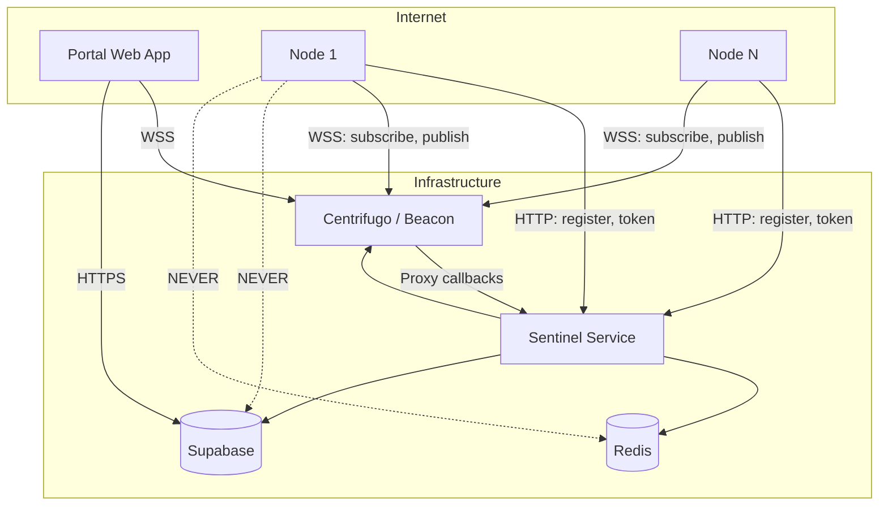

# Realtime Architecture v2

WowLab's realtime infrastructure is designed for horizontal scalability, fault tolerance, and efficient distributed simulation processing. This architecture enables thousands of compute nodes to process simulation chunks while providing real-time progress updates to users.

## Core Philosophy

The architecture follows several key principles:

1. **Stateless Sentinels** - Any sentinel instance can handle any request
2. **Redis as the Brain** - All coordination state lives in Redis
3. **Centrifugo Owns Connections** - WebSocket management, presence, message routing
4. **Ed25519 for Node Auth** - Cryptographic signatures prevent replay attacks
5. **Supabase for Durability** - Final results and user data only
6. **Idempotency Everywhere** - Every operation must be safe to retry
7. **Heartbeats over Presence** - Active health checks, presence as optimization

## Domain Services

| Domain               | Service    | Purpose                                   |
| -------------------- | ---------- | ----------------------------------------- |
| `api.wowlab.gg`      | Supabase   | Portal database, auth, user data          |
| `sentinel.wowlab.gg` | Sentinel   | Node HTTP API (register, token)           |
| `beacon.wowlab.gg`   | Centrifugo | WebSocket connections, realtime messaging |

## Connection Rules

**Nodes connect to:**

- `sentinel.wowlab.gg` (HTTP) - Registration, token acquisition
- `beacon.wowlab.gg` (WebSocket) - Real-time messaging

**Nodes NEVER connect to:**

- `api.wowlab.gg` (Supabase)
- Redis directly

## Documentation Structure

- **[Overview](/docs/00-overview/00-design-principles)** - Architecture principles and topology
- **[Infrastructure](/docs/01-infrastructure/00-sentinel)** - Component deep-dives
- **[Protocols](/docs/02-protocols/00-authentication)** - Authentication, channels, and APIs
- **[Data Flows](/docs/03-data-flows/00-node-registration)** - End-to-end request flows
- **[Reliability](/docs/04-reliability/00-failure-scenarios)** - Fault tolerance and recovery
- **[Security](/docs/05-security/00-security-model)** - Security boundaries and authorization
- **[Operations](/docs/06-operations/00-monitoring)** - Monitoring and deployment
