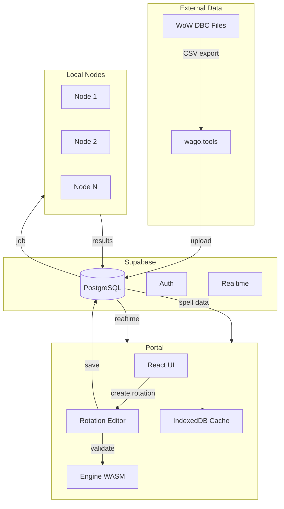
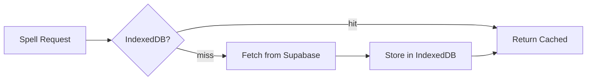
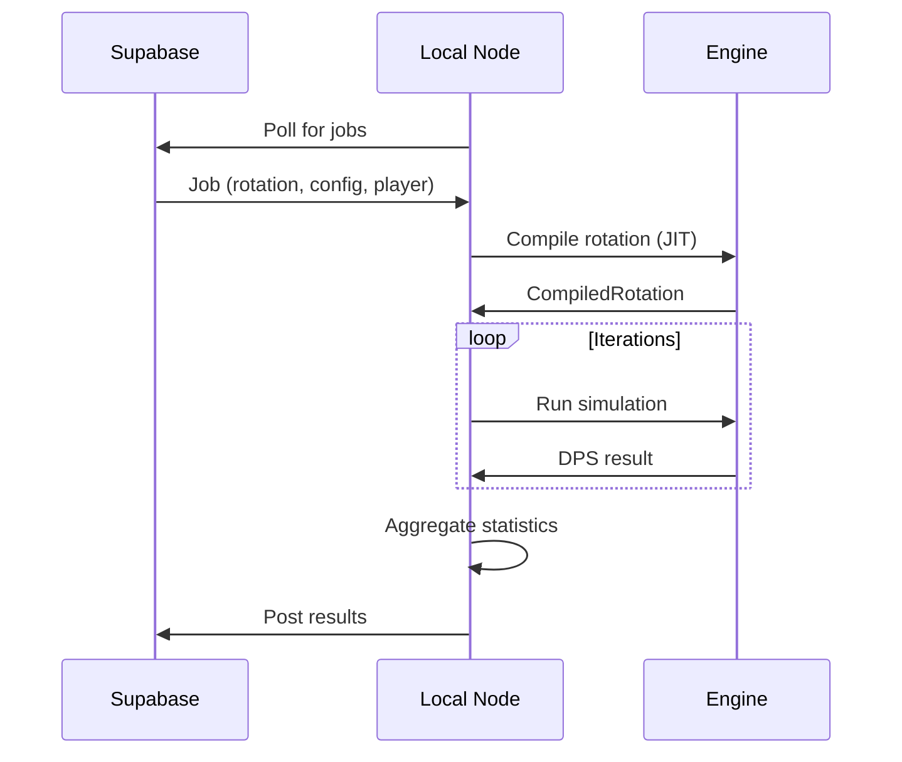
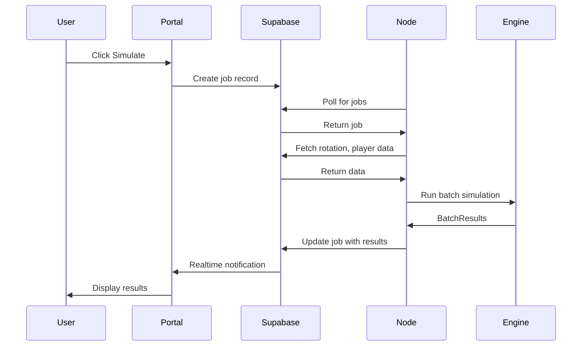
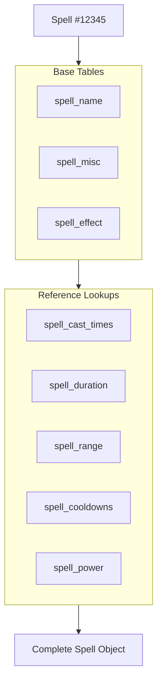

# System Architecture

WoW Lab is a distributed system. The portal handles UI and data, Supabase stores everything, and local nodes run simulations.

## Overview



## Data sources

### WoW DBC files

Game data originates from WoW's client data files (DBC/DB2). These contain spell definitions, item stats, class abilities, and everything else the game knows about itself.

We don't parse these directly. [wago.tools](https://wago.tools) exports them as CSV, which we upload to Supabase.

### Supabase (PostgreSQL)

All persistent data lives in Supabase:

| Data            | Source             | Purpose                         |
| --------------- | ------------------ | ------------------------------- |
| Spell tables    | DBC via wago.tools | Spell definitions, coefficients |
| Item tables     | DBC via wago.tools | Item stats, effects             |
| Rotations       | User-created       | Priority lists                  |
| Simulation jobs | Portal             | Work queue                      |
| Results         | Local nodes        | DPS, breakdowns                 |
| Users           | Auth               | Accounts, settings              |

### Tuning data

Spec-specific tuning (coefficients, proc rates) lives in TOML files in the engine crate. This data supplements DBC when game data is incomplete or needs adjustment.

```toml
# data/tuning/bm_hunter.toml
[spell.kill_command]
cooldown = 7.5
cost_focus = 30.0
ap_coefficient = 2.0
```

## Portal

The web application at [wowlab.gg](https://wowlab.gg).

### What it does

- **Rotation editor** - Visual interface for building rotations
- **Simulation UI** - Configure and launch sim jobs
- **Results viewer** - Display DPS, breakdowns, charts
- **Spell browser** - Look up game data
- **User accounts** - Settings, saved rotations

### WASM engine

The portal imports the Rust engine compiled to WebAssembly, but only for:

- **Type sharing** - TypeScript gets Rust types via wasm-bindgen
- **Rotation validation** - Check syntax and spell names before saving
- **Spell lookups** - Resolve IDs to names in the editor

It cannot run simulations because browsers don't support JIT compilation.

### Spell data caching

The portal caches spell data in IndexedDB:



Once fetched, spell data stays local until a new patch drops. This makes repeated lookups instant and reduces database load.

## Local nodes

Nodes are instances of the engine running on user hardware.

### Where they run

- Your local machine (development, personal use)
- Docker containers (reproducible environments)
- Cloud VMs (scalable compute)

### What they do



1. **Poll** - Check Supabase for pending jobs
2. **Compile** - JIT compile the rotation to native code
3. **Simulate** - Run thousands of iterations in parallel
4. **Aggregate** - Calculate mean, std dev, percentiles
5. **Report** - Post results back to Supabase

### Why local?

Simulations need JIT compilation for acceptable performance. Browsers can't JIT. Running on local hardware also means:

- Users control their compute resources
- No server costs for CPU-intensive work
- Results scale with user hardware
- Privacy—simulation runs locally

## Job flow

Complete flow from clicking "Simulate" to seeing results:



### Realtime updates

Supabase Realtime pushes updates to the portal. When a node posts results, the portal receives them immediately without polling.

## Data assembly

Spell data is normalized across ~50 tables in Supabase. The portal assembles complete spell objects on demand.



This keeps storage normalized (no redundancy) while delivering complete objects to the UI. See [Data Model](/docs/reference/06-data-model) for details.

## Security boundaries

| Boundary        | What's protected                              |
| --------------- | --------------------------------------------- |
| Supabase RLS    | Users can only access their own rotations     |
| Auth tokens     | Node authentication for job access            |
| WASM sandbox    | Portal can't execute arbitrary code           |
| Local execution | Simulation runs on user hardware, not servers |

## Next steps

- [Simulation Overview](/docs/reference/01-simulation-overview) - How the engine processes combat
- [Data Model](/docs/reference/06-data-model) - How spell data is assembled
- [Design Decisions](/docs/engine/06-design-decisions) - Why the architecture is this way
