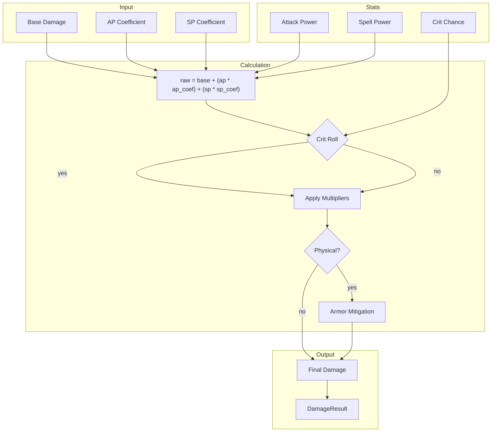
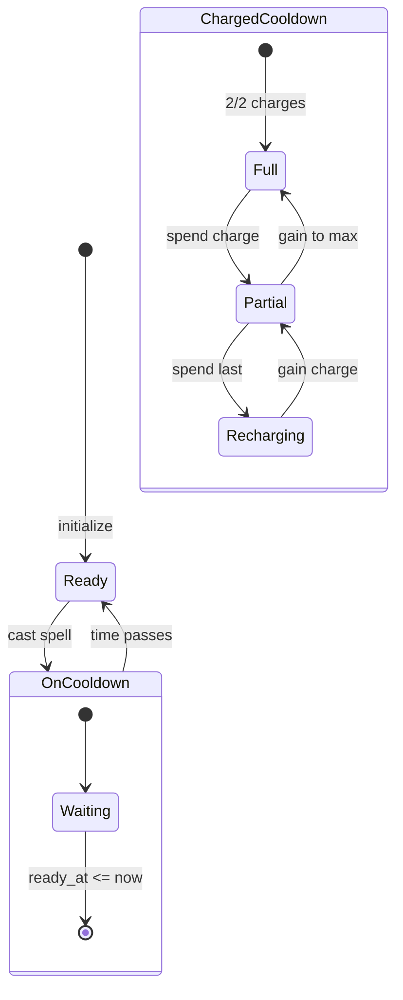

# Damage System

How the engine calculates damage, applies multipliers, and handles critical strikes.

## Damage pipeline



## Damage multipliers

Multipliers stack multiplicatively across different layers:

```rust
DamageMultipliers {
    action: f32,        // Spell-specific (+10% Kill Command)
    da: f32,            // Direct ability (vs ta for periodic)
    ta: f32,            // Tick/periodic ability
    persistent: f32,    // Snapshotted at cast
    player: f32,        // Player-wide buffs
    target: f32,        // Target debuffs
    versatility: f32,   // Secondary stat
    pet: f32,           // Pet scaling
    crit: f32,          // Crit multiplier (default 2.0)
}
```

**Final calculation:**

```
total = action * da * persistent * player * target * (1 + vers) * pet
if crit: total *= crit_multiplier
```

### Layer purposes

| Layer         | Purpose                  | Example                    |
| ------------- | ------------------------ | -------------------------- |
| `action`      | Spell-specific bonuses   | +10% Kill Command damage   |
| `da`          | Direct ability bonuses   | +5% to all direct damage   |
| `ta`          | Periodic ability bonuses | +5% to all DoT damage      |
| `persistent`  | Snapshotted at cast time | Bloodlust captured by DoT  |
| `player`      | Player-wide effects      | +10% damage from trinket   |
| `target`      | Target debuffs           | +5% damage taken           |
| `versatility` | Secondary stat           | +8% from vers rating       |
| `pet`         | Pet scaling factor       | Pet inherits player damage |
| `crit`        | Critical strike bonus    | 2.0x default               |

## Snapshotting

DoTs capture stats at cast time. The damage they deal uses the stats from when you cast them, not current stats.

```rust
ActionState {
    attack_power: f32,      // Snapshotted AP
    spell_power: f32,       // Snapshotted SP
    crit_chance: f32,       // Snapshotted crit
    haste: f32,             // Snapshotted haste
    // ... multipliers
}
```

**Snapshot flags control what gets captured:**

```rust
SnapshotFlags::DOT_PHYSICAL = ATTACK_POWER | PERSISTENT_MULT
SnapshotFlags::DOT_MAGIC = SPELL_POWER | PERSISTENT_MULT
```

When you refresh a DoT, the engine checks whether to keep the old snapshot or apply a new one based on which would result in more damage.

## Cooldown system



**Regular cooldowns** track `ready_at` time. When current time exceeds `ready_at`, the spell is castable.

**Charged cooldowns** track current charges and recharge progress. Spending a charge starts the recharge timer. Multiple charges can accumulate up to the maximum.

## Armor mitigation

Physical damage is reduced by target armor:

```
mitigation = armor / (armor + armor_constant)
damage_after = damage * (1 - mitigation)
```

The armor constant is level-dependent (7390 for level 80 targets).

## Damage result

Each damage event produces a result:

```rust
DamageResult {
    amount: f64,        // Final damage dealt
    is_crit: bool,      // Was critical strike
    school: DamageSchool,
    spell_id: SpellIdx,
    target: TargetIdx,
}
```

The simulation accumulates all damage results to calculate total DPS at the end.

## Next steps

- [Stats & Resources](/docs/reference/04-stats-resources) - How stats are computed
- [Auras & Procs](/docs/reference/05-auras-procs) - Buff/debuff mechanics
