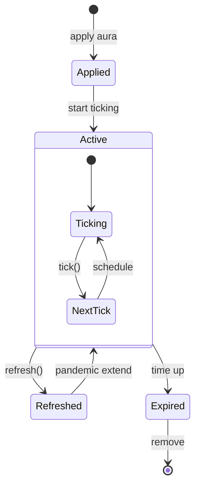
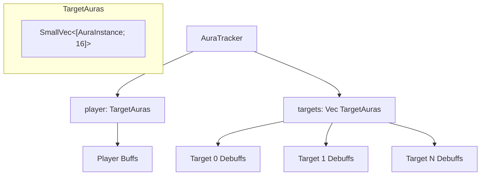
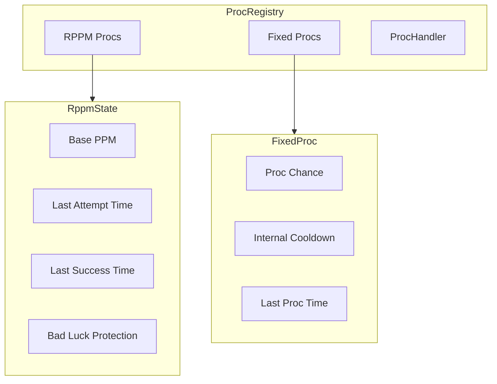

# Auras & Procs

How the engine tracks buffs and debuffs, and how proc effects trigger.

## Aura lifecycle



## AuraInstance structure

Each active aura is tracked as an instance:

```rust
AuraInstance {
    aura_id: AuraIdx,
    target: TargetIdx,
    expires_at: SimTime,
    base_duration: SimTime,
    stacks: u8,
    max_stacks: u8,
    snapshot: Option<ActionState>,  // For DoT snapshotting
    next_tick: Option<SimTime>,
    tick_interval: SimTime,
    remaining_ticks: u8,
}
```

## Aura flags

Flags control aura behavior:

```rust
AuraFlags {
    is_debuff: bool,
    is_periodic: bool,
    can_pandemic: bool,     // 30% extension cap
    snapshots: bool,        // Captures stats
    is_hidden: bool,
    refreshable: bool,
}
```

| Flag           | Effect                              |
| -------------- | ----------------------------------- |
| `is_debuff`    | Applied to enemies, not player      |
| `is_periodic`  | Has tick damage/healing             |
| `can_pandemic` | Refresh extends up to 130% duration |
| `snapshots`    | Captures stats at application       |
| `refreshable`  | Can be refreshed before expiring    |

## Pandemic refresh

When refreshing a DoT, remaining duration adds to the new duration up to 30% of base:

```
max_extension = base_duration * 0.3
new_duration = base_duration + min(remaining, max_extension)
```

Example: A 15s DoT with 5s remaining refreshes to 15 + 4.5 = 19.5s (capped at 130%).

## AuraTracker organization



Buffs live on the player. Debuffs live on each target. The tracker provides fast lookups by aura ID and target.

## Proc system

Procs trigger effects when conditions are met. Two main types:

### RPPM (Real PPM)

Procs per minute scaled by haste, with bad luck protection:

```rust
RppmState {
    base_ppm: f32,
    last_attempt: SimTime,
    last_success: SimTime,
}
```

**Proc chance calculation:**

```
base_chance = ppm * haste / 60
time_since_last = now - last_attempt
blp_bonus = max(0, time_since_last - 1.5) / 100
final_chance = base_chance * (1 + blp_bonus)
```

Bad luck protection increases proc chance the longer you go without proccing.

### Fixed chance

Simple percentage chance with optional internal cooldown:

```rust
FixedProc {
    chance: f32,        // 0.0 - 1.0
    icd: SimTime,       // Internal cooldown
    last_proc: SimTime,
}
```

## Proc registry



## Proc effects

When a proc triggers, it executes one or more effects:

```rust
ProcEffect::ReduceCooldown { spell, amount }
ProcEffect::AddStacks { aura, stacks }
ProcEffect::ApplyAura { aura }
ProcEffect::CastSpell { spell }
ProcEffect::ExtendAura { aura, amount }
ProcEffect::Resource { resource, amount }
```

| Effect           | Description                        |
| ---------------- | ---------------------------------- |
| `ReduceCooldown` | Lower a spell's remaining cooldown |
| `AddStacks`      | Add stacks to an existing aura     |
| `ApplyAura`      | Apply a new aura                   |
| `CastSpell`      | Cast a spell (like trinket procs)  |
| `ExtendAura`     | Extend an aura's duration          |
| `Resource`       | Grant or consume resources         |

## Next steps

- [Damage System](/docs/reference/03-damage-system) - How auras affect damage
- [Spec Handlers](/docs/engine/03-spec-handlers) - Implementing spec-specific procs
