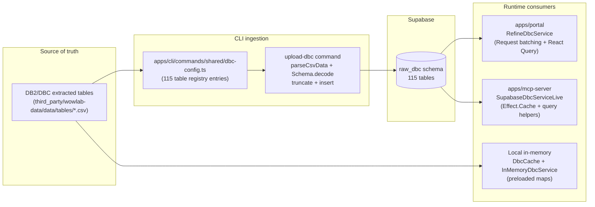
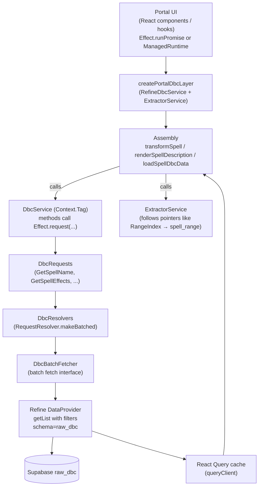
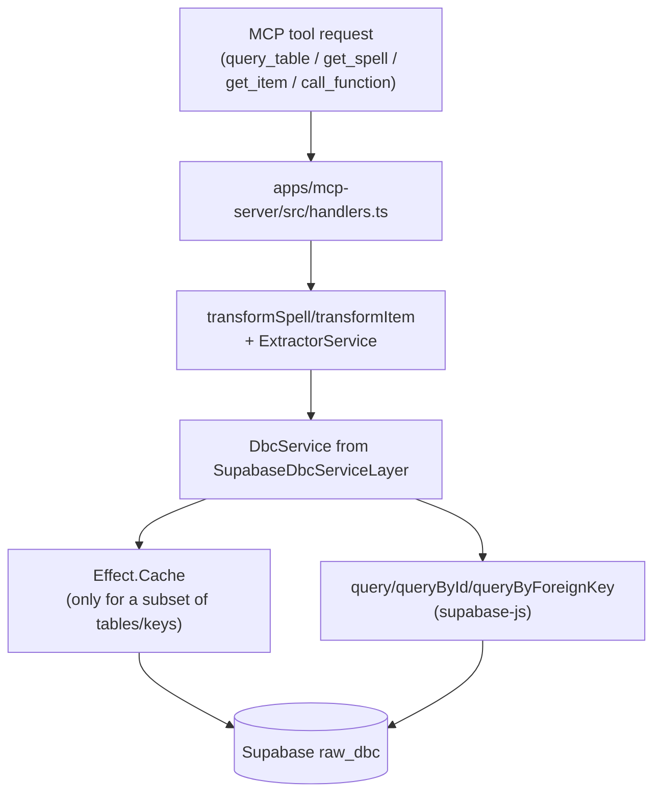
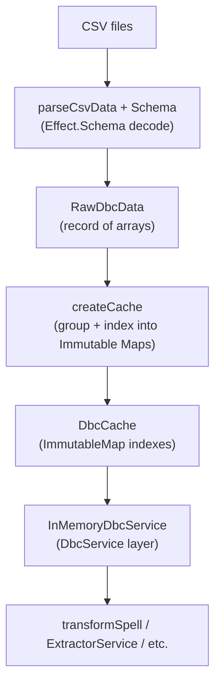

# DBC Data Flow Architecture (Supabase → Services → Assembly → UI)

Updated: 2025-12-18

This document describes how DBC/DB2-derived data moves through this monorepo (CSV mirror → Supabase → Effect services → runtime assembly → portal UI / MCP API), and pinpoints every place table metadata is duplicated today.

---

## Scope and key files read

**Schemas**

- `packages/wowlab-core/src/internal/schemas/dbc/*.ts` (115 schema files; examples: `SpellNameSchema.ts`, `SpellEffectSchema.ts`, `ChrClassesSchema.ts`)
- `packages/wowlab-core/src/internal/schemas/dbc/index.ts` (manual export list)

**Upload / registry**

- `apps/cli/commands/shared/dbc-config.ts` (115 table entries mapping `file → schema → tableName`)
- `apps/cli/commands/upload-dbc/index.ts` (CSV → parse → truncate → insert)

**In-memory cache path**

- `packages/wowlab-services/src/internal/data/DbcCache.ts` (`DbcCache`, `RawDbcData`, `createCache`)
- `packages/wowlab-services/src/internal/data/dbc/InMemoryDbcService.ts`

**Service API + batching**

- `packages/wowlab-services/src/internal/data/dbc/DbcService.ts` (`DbcServiceInterface`, tag)
- `packages/wowlab-services/src/internal/data/dbc/DbcRequests.ts` (request classes)
- `packages/wowlab-services/src/internal/data/dbc/DbcResolvers.ts` (batched request resolvers)

**Supabase implementations**

- `apps/mcp-server/src/supabase.ts` (Supabase client + `SupabaseDbcServiceLive`, ~40 manual `Effect.Cache`s)
- `apps/portal/src/lib/services/RefineDbcService.ts` (Portal `DbcService` via Refine + React Query + Request batching)

**Assembly (spell example)**

- `packages/wowlab-services/src/internal/data/transformer/spell.ts`
- `packages/wowlab-services/src/internal/data/transformer/spell-impl.ts`
- `packages/wowlab-services/src/internal/data/transformer/extractors.ts` (`ExtractorService`)
- `apps/portal/src/lib/spell-description/dbc.ts` (spell description assembly)
- `apps/portal/src/lib/spell-description/render.ts` (multi-spell assembly + batching)

**MCP exposure**

- `apps/mcp-server/src/schemas.ts` (allowed tables/functions list; 39 tables)
- `apps/mcp-server/src/handlers.ts` (table allowlist enforcement + tool routing)
- `apps/mcp-server/src/index.ts` (layers wired: Supabase client → DbcService → ExtractorService → tools)

**Existing conceptual doc**

- `apps/portal/src/content/docs/reference/01-data-model.md`

---

## High-level mental model

There are _three_ “raw DBC access” implementations in this repo, all conforming to the same `DbcServiceInterface` (or a close superset), but each wired differently:

1. **Portal (Next.js)**: `DbcService` built on **Effect Request batching** + **Refine DataProvider** + **React Query caching**
   - Implementation: `apps/portal/src/lib/services/RefineDbcService.ts`
2. **MCP server**: `DbcService` built on **manual `Effect.Cache`** + direct Supabase queries
   - Implementation: `apps/mcp-server/src/supabase.ts`
3. **In-memory**: `DbcService` built on **preloaded Immutable Maps** (`DbcCache`)
   - Implementation: `packages/wowlab-services/src/internal/data/DbcCache.ts` + `.../InMemoryDbcService.ts`

The **assembly layer** (e.g. `transformSpell`, `ExtractorService`, spell-description renderer) depends only on `DbcService` + `ExtractorService` and uses:

- `Effect.all(..., { batching: true })`
- `Effect.forEach(..., { batching: true, concurrency: "unbounded" })`

That batching is “real” in Portal because `DbcService` uses `Effect.request(...)` backed by batched resolvers; it is **not** currently “request-batched” in the MCP server implementation (it relies on `Effect.Cache` + per-call queries instead).

---

## End-to-end data flow (CSV mirror → Supabase → consumers)

Key observation: the same “table metadata” (file name, schema, table name, keying/indexing strategy) is currently encoded separately for upload (CLI), portal reads (Refine), MCP reads (Supabase service), and in-memory reads (DbcCache).

---

## Portal runtime flow (Supabase → services → assembly → UI)

### What happens on a real page load

When the UI needs a spell (or a rendered spell description), the data flow looks like this:

### Where batching actually occurs

In Portal, batching has two stacked layers:

1. **Effect Request batching**: `Effect.request(...)` calls within `Effect.all(..., { batching: true })` are grouped into batched resolver invocations.
   - Wiring: `RefineDbcService.ts` builds `DbcService` methods using `Effect.request(new GetX(...), resolvers.xResolver)`.
2. **Refine/React Query caching**: repeated requests for the same resource + ID or filter set are memoized via `queryClient.fetchQuery()` and explicit `setQueryData()` (for ID fetches).

This is why the architecture performs well even when assembly fans out across many DBC tables.

---

## MCP server flow (Supabase → services → assembly → MCP tools)

The MCP server uses the same _assembly layer_ (`transformSpell`, `transformItem`, extractor functions), but its `DbcService` implementation is different:

Important differences vs Portal:

- No `Effect.request` batching in this implementation (methods call `query(...)` or `cache.get(...)` directly).
- There is a **second table allowlist** (see “Duplication points”) restricting which raw tables can be queried via `query_table`.

---

## In-memory flow (CSV → DbcCache → InMemoryDbcService → assembly)

This path is optimized for “load everything once”:

Notable: `DbcCache` / `RawDbcData` covers only a **subset** of tables compared to the full 115-table CLI registry. This is a major source of drift (some tables exist in Supabase and schemas but have no in-memory representation, and vice versa).

---

## Duplication map (all known duplication points)

The root cause of the boilerplate is that “table metadata” is not represented once; it is _copied_ into multiple derived artifacts, usually with different naming conventions (camelCase key vs snake_case table name vs PascalCase schema file).

### The canonical metadata you repeatedly encode

For each table, the system needs (at minimum):

- **Source file name** (CSV): e.g. `SpellName.csv`
- **Supabase table name**: e.g. `spell_name`
- **Row schema** (Effect Schema): e.g. `Dbc.SpellNameRowSchema`
- **Lookup shape**: by `ID`, by foreign key (single row), by foreign key (many rows), full-table scan, or custom query
- **Indexing strategy** (for in-memory): map by ID vs group by FK
- **Client allowlist** membership (MCP’s `ALLOWED_TABLES`)

### Duplication points (by artifact)

|   # | Duplication point                 | Where                                                                                 | What is duplicated                                                                                   | Typical drift / failure mode                                                                                                              |
| --: | --------------------------------- | ------------------------------------------------------------------------------------- | ---------------------------------------------------------------------------------------------------- | ----------------------------------------------------------------------------------------------------------------------------------------- |
|   1 | Per-table schema file             | `packages/wowlab-core/src/internal/schemas/dbc/*Schema.ts`                            | Column names + decode rules (`Schema.NumberFromString`, `NullOr`, branded IDs, etc.)                 | Schema exists but not wired into any loader/service; schema changes don’t propagate to consumers without manual edits                     |
|   2 | Schema export list                | `packages/wowlab-core/src/internal/schemas/dbc/index.ts`                              | One export per table schema file                                                                     | Forgetting to export breaks downstream imports (`Dbc.XRowSchema` missing)                                                                 |
|   3 | Upload registry                   | `apps/cli/commands/shared/dbc-config.ts`                                              | `file → schema → tableName` mapping (115 entries)                                                    | File/schema/tableName mismatch; new table added but never uploaded; table renamed in Supabase but CLI keeps old name                      |
|   4 | Upload logic references registry  | `apps/cli/commands/upload-dbc/index.ts`                                               | Assumes `ID` column for truncation + insert shape; uses `DBC_TABLES[tableKey]`                       | Table without `ID` semantics or special primary key requirements needs custom handling (currently not modeled)                            |
|   5 | Raw data shape (in-memory)        | `packages/wowlab-services/src/internal/data/DbcCache.ts` (`RawDbcData`)               | One field per table (68 fields currently)                                                            | Supabase table exists but not present in `RawDbcData`, making it impossible to build an in-memory service without additional edits        |
|   6 | Indexed cache shape (in-memory)   | `packages/wowlab-services/src/internal/data/DbcCache.ts` (`DbcCache` + `createCache`) | One field per table + manual grouping/keying logic (70 fields currently)                             | Wrong key chosen (e.g. keyed by `ID` vs `SpellID`), array-vs-single mismatch, missing groupings, and subtle runtime bugs                  |
|   7 | Service API surface               | `packages/wowlab-services/src/internal/data/dbc/DbcService.ts`                        | One method per supported access pattern (82 methods currently)                                       | Table added to Supabase/CLI but no `DbcService` method → assembly can’t access it; signatures drift from actual key columns               |
|   8 | In-memory service implementation  | `packages/wowlab-services/src/internal/data/dbc/InMemoryDbcService.ts`                | One method implementation per `DbcServiceInterface` method                                           | Method added to interface but not implemented; inconsistent semantics vs Supabase impl (e.g. filtering vs SQL)                            |
|   9 | Portal request classes            | `packages/wowlab-services/src/internal/data/dbc/DbcRequests.ts`                       | One `Request.TaggedClass` per batchable `DbcService` method (72 request classes currently)           | Interface grows but requests aren’t added, causing portal batching path to lag behind                                                     |
|  10 | Portal resolver wiring            | `packages/wowlab-services/src/internal/data/dbc/DbcResolvers.ts`                      | One resolver per request + a large `DbcBatchFetcherInterface` describing batch fetch functions       | Mismatch between request payload, resolver, and fetcher; adding a table can require edits in multiple blocks of the file                  |
|  11 | Portal batch fetch implementation | `apps/portal/src/lib/services/RefineDbcService.ts`                                    | One `fetchXByIds` / `fetchXByFk` mapping per table + one `DbcService` method wrapper per request     | Manual mapping between resource string and row type; easy to break by typos in `"spell_name"` etc.; multiple fetch patterns reimplemented |
|  12 | MCP server service implementation | `apps/mcp-server/src/supabase.ts`                                                     | One `Effect.Cache` per selected table and one `DbcServiceInterface` method implementation per method | Cache coverage is manual/inconsistent; keying strategy duplicated; table name strings duplicated                                          |
|  13 | MCP raw table allowlist           | `apps/mcp-server/src/schemas.ts`                                                      | `ALLOWED_TABLES` string literal list (39 tables currently)                                           | Table exists in Supabase but blocked in MCP; allowlist drifts from actual needs or from the CLI registry                                  |

### Naming duplication (one table, many names)

Example: Spell name appears under several identities:

- **CSV file**: `SpellName.csv`
- **Schema file**: `SpellNameSchema.ts` exporting `SpellNameRowSchema`
- **Schema symbol**: `Dbc.SpellNameRowSchema`
- **CLI registry key**: `spellName` (camelCase)
- **Supabase table**: `spell_name` (snake_case)
- **Service method**: `getSpellName(spellId)`
- **Request class**: `GetSpellName`
- **Resolver name**: `spellNameResolver`

Each of these layers must be updated consistently today.

---

## Why the current setup becomes unmaintainable

The project is doing the right thing architecturally (normalized tables + runtime assembly + batching), but the _metadata fan-out_ is uncontrolled:

- A single new DBC table requires edits across **core schemas**, **CLI registry**, **service interface**, **at least one service implementation**, and often **portal batching infrastructure** and **MCP allowlists**.
- The same “table name string” is repeated in multiple runtime-specific implementations.
- Different consumers support different subsets (115 uploaded vs 82 service methods vs 70 in-memory cache fields vs 39 MCP allowlisted), so drift is inevitable.

This drift then manifests as:

- “Table exists but can’t be reached” (missing service methods / requests / resolvers)
- “Table reachable but slow” (missing cache/batch configuration in one consumer)
- “Table reachable but wrong” (incorrect keying/grouping assumptions in in-memory cache or FK lookups)

---

## Consolidation recommendations (reduce table boilerplate to one source of truth)

### Recommendation A (strong): Introduce a single `DbcTableRegistry` and generate everything else

Create a single registry (in a shared package, ideally `@wowlab/core` or a new small package) that is the authoritative metadata source.

**Registry should encode**, for each table:

- `table`: Supabase table name (snake_case, canonical)
- `file`: CSV filename
- `rowSchema`: Effect schema
- `primaryKey`: usually `"ID"` but modeled, not assumed
- `access`: one of:
  - `byId` (ID → row)
  - `byFkSingle` (FK → row)
  - `byFkMany` (FK → rows[])
  - `all` (full table)
  - `custom` (escape hatch)
- Optional `indexes` for in-memory: e.g. `groupBy: "SpellID"`, `groupBy: "ItemID"`, etc.
- Optional `expose` flags: `portal`, `mcp`, `inMemory`

Then **generate**:

- CLI table list: `DBC_TABLES` + `DBC_TABLE_KEYS`
- Core DBC schema exports: `packages/wowlab-core/.../dbc/index.ts` (or at least validate it matches)
- `RawDbcData` / `DbcCache` interfaces + `createCache` implementation (for the in-memory-supported subset)
- `DbcServiceInterface` (or at minimum: a generated “raw access” sub-interface)
- `DbcRequests` (request classes for every batchable accessor)
- `DbcResolvers` (resolver wiring derived from `access` kind)
- Portal `DbcBatchFetcherInterface` + a thin adapter layer to map registry entries to Refine fetch calls
- MCP `ALLOWED_TABLES` (derived from `expose.mcp`)

This shifts the problem from “edit 8 files per table” to “edit 1 registry entry per table, run generator”.

### Recommendation B (medium): Keep handwritten code, but add compile-time list parity checks

If codegen is undesirable right now, add guardrails so drift becomes an obvious error:

- Assert **CLI registry tables** ⊇ **Supabase service table strings** ⊇ **MCP allowlist**.
- Assert **DbcServiceInterface methods** ⊇ **InMemoryDbcService keys** for in-memory supported tables.
- Assert **Portal Request classes** match the subset of `DbcServiceInterface` methods that portal expects to batch.

This can be done via TypeScript types plus small runtime checks in tests/CI (e.g. compare string literal unions).

### Recommendation C (narrow win): Standardize canonical naming on `snake_case tableName`

Right now the canonical identity is unclear (sometimes camelCase key is primary, sometimes tableName string is primary).

Pick _one_ canonical key for everything—ideally the Supabase `tableName` (snake_case)—and derive the rest:

- Schema file names and symbols can remain as-is, but the registry key should be the table name.
- Portal resource strings, MCP allowlist entries, and Supabase query strings should then become “use the registry key”, not “hand type a string”.

This alone removes a large class of typo/rename bugs.

---

## Suggested phased migration plan

1. Add `DbcTableRegistry` with a small subset (e.g. the spell tables used by `transformSpell`).
2. Generate + adopt `ALLOWED_TABLES` from the registry (cheap, high-confidence win).
3. Generate + adopt Portal batching wiring (`DbcRequests`/`DbcResolvers`/`RefineDbcService`) for the same subset.
4. Expand registry coverage iteratively (items, traits, etc.).
5. Optional: generate CLI `dbc-config.ts` (or replace it entirely with registry-driven upload).
6. Optional: generate `DbcCache` / `InMemoryDbcService` for the in-memory subset.

The key is to keep **one** source of truth and only expand it when you can delete existing boilerplate.

---

## Quick “where to look” map (by layer)

- **Upload definition**: `apps/cli/commands/shared/dbc-config.ts`
- **Supabase query runtime (MCP)**: `apps/mcp-server/src/supabase.ts`
- **Portal Supabase access**: `apps/portal/src/lib/services/RefineDbcService.ts`
- **Batching glue**: `packages/wowlab-services/src/internal/data/dbc/DbcRequests.ts`, `.../DbcResolvers.ts`
- **Assembly / domain objects**: `packages/wowlab-services/src/internal/data/transformer/*`
- **Spell description assembly**: `apps/portal/src/lib/spell-description/dbc.ts`, `apps/portal/src/lib/spell-description/render.ts`
