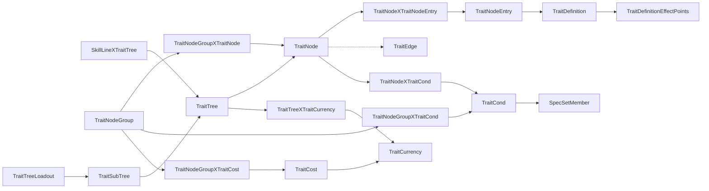
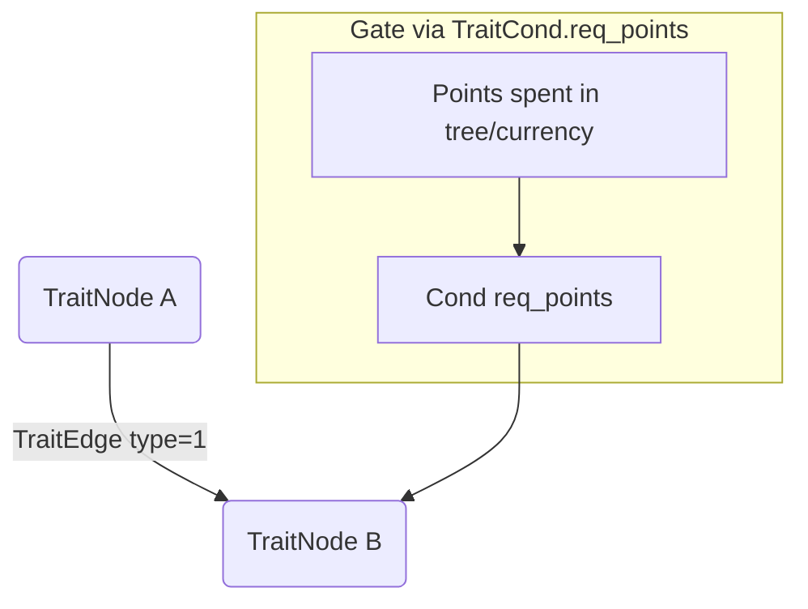

# WoW Talent / Trait System Deep Dive (full, repo‑independent)

Audience: engineers building a modern web talent calculator from Blizzard game data. This document is **self-contained**; you do not need the repo to follow the data model. All table/field names and examples come from the 11.2.7.63642 build.

---

## 1) Where the data comes from (repo inventory)

- `dbc_extract3/` – Python data miner that reads Blizzard DB2/ADB files; contains table schemas under `formats/*.json`, extraction logic in `dbc/filter.py` (class `TraitSet`), and codegen in `dbc/generator.py` (`TraitGenerator`).
- `engine/dbc/generated/trait_data.inc` (and `_ptr`) – compiled C++ arrays produced by `TraitGenerator`; these are the only talent records used at runtime.
- `engine/dbc/trait_data.[hpp,cpp]` – lightweight query helpers around the generated arrays (find by id/spell, hero tree helpers, free-starter detection).
- `engine/player/player.cpp` – all loadout import/export logic (`parse_traits_hash`, `generate_traits_hash`, `generate_tree_nodes`, `sort_node_entries`), plus conversion from talent ranks to spell effect overrides.
- `doc/wow_talent_loadout_code_parsing.md` – bit-level format of the Blizzard loadout string (already detailed).

If you need a field that is **not** in `trait_data_t`, pull it from the extractor tables listed in §2; SimC doesn’t emit edges/gates today.

---

## 2) DB tables that describe the talent graph (field lists included)

Below are the DB2 tables you must ingest. Field names are exactly as shipped by Blizzard; `ref` means a foreign key to that table.

- **TraitTree**
  - `id`, `unk_2`, `unk_3`, `unk_4`, `unk_5`, `unk_6`, `unk_7 (float)`, `unk_8 (float)`
- **SkillLineXTraitTree** (binds a tree to a playable class)
  - `id_skill_line` (class skill line), `id_trait_tree` (ref TraitTree), `unk_3`
- **TraitNode** (one graph node)
  - `id`, `id_trait_tree` (ref TraitTree), `pos_x`, `pos_y`, `type` (1=normal, 2=choice, 3=selection), `flags`, `id_trait_sub_tree` (ref TraitSubTree, non‑zero for hero)
- **TraitNodeEntry**
  - `id`, `id_trait_definition` (ref TraitDefinition), `max_ranks`, `type`, `id_trait_sub_tree`
- **TraitDefinition**
  - `override_name`, `override_subtext`, `override_description`, `id`, `id_spell` (ref SpellName), `id_override_icon`, `id_replace_spell`, `id_override_spell`
- **TraitDefinitionEffectPoints**
  - `id_trait_definition`, `effect_index`, `operation` (-1 none, 0 set, 1 mul), `id_curve`
- **TraitNodeXTraitNodeEntry** (entries inside a node, with ordering)
  - `id`, `id_trait_node` (ref TraitNode), `id_trait_node_entry` (ref TraitNodeEntry), `index` (choice ordering)
- **TraitEdge** (graph lines)
  - `id`, `visual_style`, `id_left_trait_node`, `id_right_trait_node`, `type` (use 1 as “requires”, 0 as decorative; verify per build)
- **TraitNodeGroup** / **TraitNodeGroupXTraitNode**
  - Group: `id`, `id_trait_tree`, `flags`
  - Link: `id`, `id_trait_node_group`, `id_trait_node`, `index`
- **TraitCond** (conditions / gates)
  - `id`, `type`, `id_trait_tree`, `granted_ranks`, `id_quest`, `id_achievement`, `id_spec_set`, `id_trait_node_group`, `id_trait_node`, `unk_9`, `id_trait_currency`, `req_points`, `flags`, `required_level`, `id_free_shared_string`, `id_spend_more_shared_string`, `id_trait_cond_account_element`
- **TraitNodeGroupXTraitCond** / **TraitNodeXTraitCond**
  - Link a condition to a group or node: `id`, `id_trait_node_group|node`, `id_trait_cond`
- **TraitCurrency**
  - `id`, `type`, `id_currency_types`, `flags`, `icon`, `unk_1`, `unk_2`
- **TraitCost**
  - `name`, `id`, `amount`, `id_trait_currency` (ref TraitCurrency), `unk_1`
- **TraitTreeXTraitCurrency**
  - `id`, `index`, `id_trait_tree`, `id_trait_currency`
- **TraitNodeGroupXTraitCost**
  - `id`, `id_trait_node_group`, `id_trait_cost`
- **SpecSetMember** (maps condition spec sets to real specs)
  - `id_spec` (ref ChrSpecialization)
- **TraitSubTree** (hero trees)
  - `name`, `desc`, `id`, `id_texture`, `id_trait_tree`
- **TraitTreeLoadout** (which specs can pick a hero tree)
  - contains `id_trait_tree` and `id_spec` (ref)
- **CharacterLoadout / TraitLoadout** (default starter talents)
  - TraitLoadout fields: `id_spec`, `id_trait_node_entry`, `rank`, `order`

Relationship diagram (mermaid):



- `TraitTree` – logical tree id (class/spec/hero); linked to classes via `SkillLineXTraitTree`.
- `TraitNode` – a graph node; fields: `id`, `id_trait_tree`, `pos_x`, `pos_y`, `type` (1 normal, 2 choice, 3 tree-selection), `id_trait_sub_tree` (non‑zero → hero tree).
- `TraitNodeEntry` – an entry inside a node; fields: `id`, `id_trait_definition`, `max_ranks`, `type`, `id_trait_sub_tree`.
- `TraitDefinition` – points to the spell shown/cast: `id_spell`, optional `id_replace_spell`, `id_override_spell`, and text/icon overrides.
- `TraitDefinitionEffectPoints` – per-rank effect modifications; fields: `id_trait_definition`, `effect_index`, `operation` (-1 none, 0 set, 1 mul), `id_curve`.
- `TraitNodeXTraitNodeEntry` – links entries to nodes; carries `index` used as `selection_index` for choice nodes.
- `TraitEdge` – connects two nodes: `id_left_trait_node`, `id_right_trait_node`, `type`, `visual_style`. Use this to draw lines and to derive hard prereqs.
- `TraitNodeGroup`, `TraitNodeGroupXTraitNode` – clusters of nodes that share currency/conditions (gates).
- `TraitCond`, `TraitNodeXTraitCond`, `TraitNodeGroupXTraitCond` – conditions on nodes/groups. Important fields: `type` (1 = spec availability, 2 = starter/free, others encode gating), `req_points` (points required in that tree/branch), `id_spec_set`.
- `SpecSetMember` – maps `id_spec_set` → actual spec ids (ChrSpecialization).
- `TraitCurrency`, `TraitCost`, `TraitTreeXTraitCurrency`, `TraitNodeGroupXTraitCost` – define which currency (class vs spec vs hero points) a group uses; the extractor infers tree index from `TraitCurrency.flags` (0x4 → class, 0x8 → spec).
- `TraitSubTree`, `TraitTreeLoadout` – hero trees and which specs can select them.

---

## 3) What `trait_data_t` contains (runtime model)

Column order in `generated/trait_data.inc`:
`tree_index, id_class, id_trait_node_entry, id_node, max_ranks, req_points, id_trait_definition, id_spell, id_replace_spell, id_override_spell, row, col, selection_index, name, id_spec[4], id_spec_starter[4], id_sub_tree, node_type`

Key meanings:

- `tree_index`: 1=CLASS, 2=SPEC, 3=HERO, 4=SELECTION (hero picker).
- `id_node`: graph node id (joins to `TraitNode`). `node_type`: 1 normal, 2 choice, 3 selection.
- `row/col`: UI grid coords derived from rounded `pos_y/pos_x` (see extractor). Negative/zero → hidden/invalid.
- `req_points`: max `TraitCond.req_points` from node/group (gate threshold).
- `id_spec[]`: specs allowed; empty→all. `id_spec_starter[]`: specs that get the node for free.
- `id_sub_tree`: hero tree id for hero nodes/selection nodes.
- `selection_index`: ordering of entries inside a choice node (derived from `TraitNodeXTraitNodeEntry.index`, with a manual override in `sort_node_entries` for known clashes).

`trait_definition_effect_entry_t` stores the per-rank operations that later tweak spell effect base values.

### Concrete row examples (from 11.2.7.63642)

- Normal single-entry node (Warrior class tree):
  ```
  tree=1 (CLASS), class=1 (Warrior), entry=112112, node=90261,
  max_ranks=1, req_points=0, def=117117, spell=386164 ("Battle Stance"),
  row=1, col=1, selection_index=-1, id_spec={73,0,0,0}, id_sub_tree=0, node_type=1
  ```
- Choice node entry (selection_index present):
  ```
  tree=1, entry=112201, node=90340, max_ranks=1, selection_index=0,
  spell=383082 ("Barbaric Training"), row=7, col=2, node_type=1
  ```
- Hero-linked entry (has id_sub_tree):
  ```
  tree=1, class=11 (Druid), entry=103278, node=82200,
  spell=197626 ("Starsurge"), id_sub_tree=?? (hero), node_type=1
  ```

---

## 4) Building the node list & ordering (import/export critical)

Code: `generate_tree_nodes()` and `sort_node_entries()` in `engine/player/player.cpp`.

1. Build `tree_nodes : map<id_node, vector<(trait*, rank)>>` by reading **all** entries for the player’s class across tree_index CLASS/SPEC/HERO/SELECTION.
2. Iterate the map in ascending `id_node` order; this defines the record order in the bitstream.
3. For multi-entry nodes, sort entries with `sort_node_entries()`:
   - primary: `selection_index` if both are set;
   - fallback: higher `id_trait_node_entry` first (plus a hardcoded fix for Voidweaver 117271/117298).
4. Choice nodes are detected by `node_type` 2 or 3; non-choice multi-entry nodes are assumed to pick the first (highest id) unless a conflict override is added.

If your calculator emits a loadout string, you **must** replicate this ordering exactly or the bitstream desynchronizes.

---

## 5) Decoding the loadout string → nodes/entries/ranks

Reference doc: `doc/wow_talent_loadout_code_parsing.md`.
Runtime parser: `parse_traits_hash()`:

- Bit packing: 6‑bit alphabet, LSB-first inside each char. Header = 8b version, 16b specID, 128b treeHash (ignored in SimC).
  - Alphabet: `ABCDEFGHIJKLMNOPQRSTUVWXYZabcdefghijklmnopqrstuvwxyz0123456789+/`
- For each node in the order from §4:
  1. `selected` (1b). If 0, skip.
  2. `purchased` (1b). If 0 → granted rank 1.
  3. `partial` (1b). If 1 → read `rank` (6b), else rank = max_ranks.
  4. `hasChoice` (1b). If 1 → read `choiceIndex` (2b) and pick that entry.
- Spec/hero validation: parser throws if chosen entry’s `id_spec` doesn’t include the player’s spec (except HERO/SELECTION nodes).
- Grants: after parsing, free starters (`id_spec_starter`) are auto-added.
- Export uses the same ordering and bit widths (`generate_traits_hash()`).

Header decode example (string from Blizzard):

```
C0PAAAAAAAAAAAAAAAAAAAAAAYMbDMgBMbsFyYBAAAAAAzM2mxYmBmZYmlZmZmBzYmMjZMDzMMzYGGDzMMLDz2yMYDAAAAAAmB
```

Bits (LSB-first 6-bit chars):

- version = 2
- specID = 253 (Beast Mastery)
- treeHash = 16 bytes of 0

Per-node record example (first selected node, fully ranked, no choice):

```
selected=1, purchased=1, partial=0, hasChoice=0  => bit pattern 1 1 0 0
```

Per-node record example (choice, partial rank=2, choiceIndex=1):

```
selected=1, purchased=1, partial=1, rank=000010 (LSB-first => value 2), hasChoice=1, choiceIndex=01
```

Value cheat-sheet:

- `TraitNode.type`: 1 = normal, 2 = choice (multiple entries), 3 = selection/hero picker.
- `TraitEdge.type`: 0 = cosmetic, 1 = prerequisite (common convention; verify per build).
- `TraitCond.type`: 1 = spec availability, 2 = starter/free; other values are gating variants (check live data alongside `req_points` / `id_trait_currency`).
- `TraitCurrency.flags`: 0x4 = class points, 0x8 = spec points (others possible for hero/other currencies).

---

## 6) Connecting nodes (edges) – how to filter “what connects to what”

The runtime doesn’t ship edges, but the extractor has everything:

1. Load `TraitNode` for the tree you care about (filter by `id_trait_tree` linked from `SkillLineXTraitTree`).
2. Load all `TraitEdge` rows where both `id_left_trait_node` and `id_right_trait_node` belong to that tree.
3. Keep `type`/`visual_style`:
   - Typical convention: `type=0` visual, `type=1` required (the game enforces spend/order). Verify per build.
4. Attach edges to your in-memory nodes; also store `pos_x/pos_y` (or derived `row/col`) for rendering.

Example edge row (schema):  
`{ id=12345, visual_style=0, id_left_trait_node=90322, id_right_trait_node=90340, type=1 }`

Edge/gate relationship sketch:



---

## 7) Gate / requirement checks (up- & downstream)

Use `TraitCond` attached to nodes or groups:

- `TraitNodeXTraitCond` → node-level; `TraitNodeGroupXTraitCond` → shared gate for multiple nodes.
- Relevant fields:
  - `type=1`: spec availability (maps via `SpecSetMember.id_spec`).
  - `type=2`: starter/free (these become `id_spec_starter` in `trait_data_t`).
  - Other types: gate based on points spent; use `req_points` and possibly `id_trait_currency` to know which currency pool to count (class vs spec vs hero).
- Algorithm:
  1. When evaluating availability, gather all conds for the node and its group.
  2. Enforce spec match (type 1).
  3. Enforce `req_points`: count spent points in the same tree/currency up to the gate; compare against the max `req_points` found.
  4. Starter nodes (type 2) are always granted rank 1.
- Downstream locking is implicit: edges give direction; gates give thresholds.

Mini algorithm (currency-aware):

```pseudo
function can_activate(node, spent):
  conds = node.conds ∪ node.group.conds
  if exists type=1 and spec not in SpecSetMember(id_spec_set): return false
  if exists type=2: return true  // starter
  req = max(req_points of conds)
  cur = conds’ id_trait_currency if set else tree default
  if spent[cur] < req: return false
  return true
```

---

## 8) Currency / tree assignment

- `TraitTreeXTraitCurrency` + `TraitCurrency.flags` decide whether a node spends class points (flag 0x4) or spec points (0x8). The extractor maps these to `tree_index` 1 and 2, respectively.
- Hero trees (`id_trait_sub_tree != 0`) map to `tree_index` 3 and use hero currency.
- Selection nodes (`node_type=3`, `tree_index` 4) are free; picking an entry activates the hero subtree for the rest of the parsing.

---

## 9) Spells ↔ specs mapping

- Each entry’s `TraitDefinition.id_spell` is the display/cast spell for that node entry; `id_replace_spell` and `id_override_spell` define replacement/override behavior.
- `trait_data_t::find_by_spell(tree, spell_id, class_id, spec)` uses a generated index (`__trait_spell_id_index`) to find which entries point at a spell, honoring spec-filtering (`id_spec`).
- `trait_definition_effect_entry_t` rows modify spell effect base values per rank via curves (`CurvePoint` table), applied in `player.cpp` after parsing.
- If you only have an import string and want the spells it contains:
  1. Decode per §5 to get `id_trait_node_entry` + ranks.
  2. Join to `TraitDefinition` via `id_trait_definition`.
  3. Read `id_spell` (plus replace/override) for the playable spell list; filter by rank > 0.

---

## 10) Hero trees

- Hero selection node: `tree_index=SELECTION`, `node_type=3`, `id_sub_tree` set; entries correspond to hero tree choices.
- Hero talents: `tree_index=HERO`, `id_sub_tree` matches the chosen hero tree.
- Valid hero trees for a spec come from `TraitSubTree` + `TraitTreeLoadout` (exported via `trait_data_t::get_valid_hero_tree_ids`).

---

## 11) Minimal plan to build a calculator (from these sources)

1. **Ingest DB2 tables** listed in §2 (or reuse the extractor output). Build in-memory maps:
   - Trees → nodes (`TraitNode`), entries (`TraitNodeXTraitNodeEntry`), definitions, effects, edges, conditions.
   - Specs/classes via `SkillLineXTraitTree` and `SpecSetMember`.
2. **Derive layout**: for each spec-specific tree, round `pos_x/pos_y` to nearest 100, enumerate unique `pos_y` to rows and `pos_x` per row to columns (mirrors SimC/Blizzard ordering).
3. **Derive ordering**: sort nodes by `id_node`; sort entries per node by `selection_index` (or descending id if missing), with any known manual fixes.
4. **Decode/encode loadout strings** per §5 using that ordering.
5. **Apply gating**: for UI enable/disable, evaluate `TraitCond` per node/group and edge prerequisites, tracking currency pools.
6. **Show spells/effects**: attach `id_spell`, replacement/override info, and per-rank effect deltas from `TraitDefinitionEffectPoints`.
7. **Hero flow**: expose selection nodes, activate a subtree on pick, then show its hero nodes filtered by spec.
8. **Layout**: round `pos_x/pos_y` to nearest 100; row index = order of unique `pos_y`; col index = order of `pos_x` within that row (Blizzard/SimC rule).

---

## 12) Practical notes / gotchas

- Node ids are **absent** from the loadout string; both producer and consumer must share identical node ordering.
- Bits are **LSB-first** inside each 6-bit character; using base64 decode-to-bytes will fail.
- Choice entry ordering is fragile; Blizzard occasionally reorders without changing ids. Keep `sort_node_entries()` overrides up to date per build.
- `req_points` in `trait_data_t` is already the max across node/group conditions, but if you need per-currency gating, read `TraitCond.id_trait_currency` directly.
- SimC does not enforce edges or spend requirements during manual `class_talents`/`spec_talents` strings; it assumes the import string was valid. A calculator must enforce them explicitly.

---

## 13) File pointers for quick reference

- `doc/wow_talent_loadout_code_parsing.md`
- `engine/player/player.cpp` (functions: `parse_traits_hash`, `generate_traits_hash`, `generate_tree_nodes`, `sort_node_entries`)
- `engine/dbc/trait_data.hpp`, `engine/dbc/trait_data.cpp`
- `engine/dbc/generated/trait_data.inc`, `trait_data_ptr.inc`
- `dbc_extract3/dbc/filter.py` (`TraitSet`), `dbc/generator.py` (`TraitGenerator`)
- `dbc_extract3/formats/11.2.7.63642.json` (table schemas for latest build in repo)

---

If you keep these pieces aligned with Blizzard’s build (spec ids, tree hashes, selection order), you have everything required to parse, validate, render, and emit modern talent loadouts.
